# Circuit Symbol Gallery

The same 100 circuit symbols as the [List of Circuit Symbols](../list-of-symbols/index.md), laid out five across so you can find a shape by eye. Select any symbol's name to jump to its full description.

-   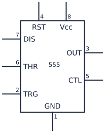

    **[555 timer](../list-of-symbols/index.md#555-timer)**

    A 555 timer is used to generate delays, pulses, and oscillating signals.

-   

    **[AC current source](../list-of-symbols/index.md#ac-current-source)**

    An AC current source supplies a current that periodically reverses direction.

-   

    **[AC voltage source](../list-of-symbols/index.md#ac-voltage-source)**

    An AC voltage source supplies a voltage that periodically reverses polarity.

-   

    **[Ammeter](../list-of-symbols/index.md#ammeter)**

    An ammeter is connected in series to measure electric current.

-   

    **[Analog meter](../list-of-symbols/index.md#analog-meter)**

    An analog meter uses a moving pointer to display an electrical measurement.

-   

    **[AND gate](../list-of-symbols/index.md#and-gate)**

    An AND gate produces a high output only when all of its inputs are high.

-   

    **[Antenna](../list-of-symbols/index.md#antenna)**

    An antenna transmits or receives electromagnetic radio-frequency signals.

-   

    **[Audio jack](../list-of-symbols/index.md#audio-jack)**

    An audio jack provides a detachable connection for analog audio signals.

-   

    **[Battery](../list-of-symbols/index.md#battery)**

    A battery supplies DC electrical energy from two or more cells.

-   

    **[Battery cell](../list-of-symbols/index.md#battery-cell)**

    A battery cell represents a single electrochemical source of DC voltage.

-   

    **[Bipolar transistor (NPN)](../list-of-symbols/index.md#bipolar-transistor-npn)**

    An NPN bipolar transistor is used for current-controlled switching and amplification.

-   

    **[Bipolar transistor (PNP)](../list-of-symbols/index.md#bipolar-transistor-pnp)**

    A PNP bipolar transistor is used for high-side switching and current-controlled amplification.

-   

    **[Bridge rectifier](../list-of-symbols/index.md#bridge-rectifier)**

    A bridge rectifier converts both halves of an AC waveform into pulsating DC.

-   

    **[Buffer gate](../list-of-symbols/index.md#buffer-gate)**

    A buffer gate strengthens or isolates a digital signal without inverting it.

-   

    **[Bus connection](../list-of-symbols/index.md#bus-connection)**

    A bus connection shows a group of related conductors joining a circuit bus.

-   

    **[Capacitor](../list-of-symbols/index.md#capacitor)**

    A capacitor stores electric charge and is used for filtering, timing, coupling, and energy storage.

-   

    **[Chassis ground](../list-of-symbols/index.md#chassis-ground)**

    Chassis ground marks a connection to a device's conductive frame or enclosure.

-   

    **[Circuit breaker](../list-of-symbols/index.md#circuit-breaker)**

    A circuit breaker automatically opens a circuit during an overload and can be reset.

-   

    **[Coaxial connector](../list-of-symbols/index.md#coaxial-connector)**

    A coaxial connector joins a shielded cable while preserving its center conductor and outer shield.

-   

    **[Controlled current source](../list-of-symbols/index.md#controlled-current-source)**

    A controlled current source produces current determined by another circuit voltage or current.

-   

    **[Controlled voltage source](../list-of-symbols/index.md#controlled-voltage-source)**

    A controlled voltage source produces voltage determined by another circuit voltage or current.

-   

    **[Crystal](../list-of-symbols/index.md#crystal)**

    A crystal provides a highly stable resonant frequency for oscillators and clocks.

-   

    **[Current source](../list-of-symbols/index.md#current-source)**

    A current source supplies a specified current largely independent of its load voltage.

-   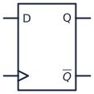

    **[D flip-flop](../list-of-symbols/index.md#d-flip-flop)**

    A D flip-flop stores one bit by capturing its data input on a clock transition.

-   

    **[DC voltage source](../list-of-symbols/index.md#dc-voltage-source)**

    A DC voltage source maintains a fixed-polarity potential difference.

-   

    **[DIAC](../list-of-symbols/index.md#diac)**

    A DIAC conducts in either direction after its breakover voltage is reached and commonly triggers TRIACs.

-   

    **[Diode](../list-of-symbols/index.md#diode)**

    A diode conducts primarily in one direction and is used for rectification and protection.

-   

    **[DIP switch](../list-of-symbols/index.md#dip-switch)**

    A DIP switch provides a compact bank of manual configuration switches.

-   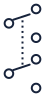

    **[DPDT switch](../list-of-symbols/index.md#dpdt-switch)**

    A double-pole double-throw switch changes two separate circuits between two paths.

-   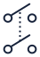

    **[DPST switch](../list-of-symbols/index.md#dpst-switch)**

    A double-pole single-throw switch opens or closes two separate circuits together.

-   

    **[Earth ground](../list-of-symbols/index.md#earth-ground)**

    Earth ground marks a conductive connection to the physical earth for safety or reference.

-   

    **[Female connector](../list-of-symbols/index.md#female-connector)**

    A female connector or jack accepts a mating plug to make a removable connection.

-   

    **[Fuse](../list-of-symbols/index.md#fuse)**

    A fuse melts and permanently opens a circuit when excessive current flows.

-   

    **[Galvanometer](../list-of-symbols/index.md#galvanometer)**

    A galvanometer detects or measures small electric currents with a sensitive moving coil.

-   

    **[Header connector](../list-of-symbols/index.md#header-connector)**

    A header connector provides an organized row or grid of removable signal and power connections.

-   

    **[IGBT (N-channel)](../list-of-symbols/index.md#igbt-n-channel)**

    An N-channel IGBT provides gate-controlled switching for high-voltage or high-current loads.

-   

    **[IGBT (P-channel)](../list-of-symbols/index.md#igbt-p-channel)**

    A P-channel IGBT represents a complementary insulated-gate bipolar power switch.

-   

    **[Inductor](../list-of-symbols/index.md#inductor)**

    An inductor stores energy in a magnetic field and is used in filters and power converters.

-   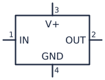

    **[Integrated circuit](../list-of-symbols/index.md#integrated-circuit)**

    An integrated-circuit symbol represents a packaged electronic function with multiple pins.

-   

    **[Inverter (NOT gate)](../list-of-symbols/index.md#inverter-not-gate)**

    A NOT gate produces the opposite logical state from its input.

-   

    **[JFET (N-channel)](../list-of-symbols/index.md#jfet-n-channel)**

    An N-channel JFET controls current through an N-type channel with a reverse-biased gate.

-   

    **[JFET (P-channel)](../list-of-symbols/index.md#jfet-p-channel)**

    A P-channel JFET controls current through a P-type channel with a reverse-biased gate.

-   

    **[Junction](../list-of-symbols/index.md#junction)**

    A junction dot marks conductors that are electrically connected at the same node.

-   

    **[Lamp](../list-of-symbols/index.md#lamp)**

    A lamp converts electrical energy into light and may also serve as an indicator or load.

-   

    **[LED](../list-of-symbols/index.md#led)**

    A light-emitting diode produces light when forward biased and is used for indication or illumination.

-   

    **[Microphone](../list-of-symbols/index.md#microphone)**

    A microphone converts sound into an electrical signal.

-   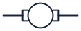

    **[Motor](../list-of-symbols/index.md#motor)**

    A motor converts electrical energy into rotational mechanical motion.

-   

    **[Multiplexer](../list-of-symbols/index.md#multiplexer)**

    A multiplexer selects one of several inputs and connects it to a single output.

-   

    **[NAND gate](../list-of-symbols/index.md#nand-gate)**

    A NAND gate produces a low output only when all of its inputs are high.

-   

    **[Neon lamp](../list-of-symbols/index.md#neon-lamp)**

    A neon lamp glows when its gas ionizes and is commonly used as a high-voltage indicator.

-   

    **[NMOS transistor](../list-of-symbols/index.md#nmos-transistor)**

    An NMOS transistor is a voltage-controlled device widely used for low-side switching and digital logic.

-   

    **[No connection](../list-of-symbols/index.md#no-connection)**

    A no-connection mark identifies a pin or wire end that is intentionally left unconnected.

-   

    **[NOR gate](../list-of-symbols/index.md#nor-gate)**

    A NOR gate produces a high output only when all of its inputs are low.

-   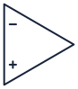

    **[Operational amplifier](../list-of-symbols/index.md#operational-amplifier)**

    An operational amplifier amplifies the voltage difference between its two inputs.

-   

    **[Optocoupler](../list-of-symbols/index.md#optocoupler)**

    An optocoupler transfers a signal with light to provide electrical isolation.

-   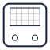

    **[Oscilloscope](../list-of-symbols/index.md#oscilloscope)**

    An oscilloscope displays how an electrical signal changes over time.

-   

    **[Outlet](../list-of-symbols/index.md#outlet)**

    An outlet represents a mains receptacle that supplies power to a connected load.

-   

    **[Photodiode](../list-of-symbols/index.md#photodiode)**

    A photodiode converts incident light into current and is used as a light sensor.

-   

    **[Photoresistor](../list-of-symbols/index.md#photoresistor)**

    A photoresistor changes resistance with light level and is used for simple light sensing.

-   

    **[Phototransistor (NPN)](../list-of-symbols/index.md#phototransistor-npn)**

    An NPN phototransistor uses light to control collector current for sensitive optical detection.

-   

    **[Phototransistor (PNP)](../list-of-symbols/index.md#phototransistor-pnp)**

    A PNP phototransistor uses light to control a complementary transistor current path.

-   

    **[Plug](../list-of-symbols/index.md#plug)**

    A plug is the male half of a removable electrical connector.

-   

    **[PMOS transistor](../list-of-symbols/index.md#pmos-transistor)**

    A PMOS transistor is a voltage-controlled device commonly used for high-side switching and CMOS logic.

-   

    **[Potentiometer](../list-of-symbols/index.md#potentiometer)**

    A potentiometer is an adjustable three-terminal resistor used as a voltage divider.

-   

    **[Pulse source](../list-of-symbols/index.md#pulse-source)**

    A pulse source produces timed voltage transitions for testing switching and digital circuits.

-   

    **[Push button (normally closed)](../list-of-symbols/index.md#push-button-normally-closed)**

    A normally closed push button opens its contacts only while it is pressed.

-   

    **[Push button (normally open)](../list-of-symbols/index.md#push-button-normally-open)**

    A normally open push button closes its contacts only while it is pressed.

-   

    **[Reed switch](../list-of-symbols/index.md#reed-switch)**

    A reed switch changes state in response to a nearby magnetic field.

-   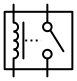

    **[Relay](../list-of-symbols/index.md#relay)**

    A relay uses an energized coil to operate electrically isolated switch contacts.

-   

    **[Resistor](../list-of-symbols/index.md#resistor)**

    A resistor limits current, divides voltage, and sets operating conditions in a circuit.

-   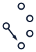

    **[Rotary switch](../list-of-symbols/index.md#rotary-switch)**

    A rotary switch selects one of several circuit connections by turning a shaft.

-   

    **[Sawtooth source](../list-of-symbols/index.md#sawtooth-source)**

    A sawtooth source generates a ramp waveform with a rapid return for timing and sweep circuits.

-   

    **[Schmitt trigger](../list-of-symbols/index.md#schmitt-trigger)**

    A Schmitt trigger adds hysteresis so a noisy or slowly changing input becomes a clean digital signal.

-   

    **[Schottky diode](../list-of-symbols/index.md#schottky-diode)**

    A Schottky diode provides fast switching and a low forward-voltage drop.

-   

    **[SCR](../list-of-symbols/index.md#scr)**

    A silicon-controlled rectifier latches on after a gate trigger and controls high-power current.

-   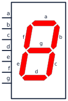

    **[Seven-segment display](../list-of-symbols/index.md#seven-segment-display)**

    A seven-segment display combines illuminated bars to show decimal digits.

-   

    **[Signal ground](../list-of-symbols/index.md#signal-ground)**

    Signal ground marks the common reference node used by low-level circuit signals.

-   

    **[Solar cell](../list-of-symbols/index.md#solar-cell)**

    A solar cell converts light energy directly into electrical energy.

-   

    **[Spark gap](../list-of-symbols/index.md#spark-gap)**

    A spark gap conducts across an air gap when the voltage exceeds its breakdown level.

-   

    **[SPDT switch](../list-of-symbols/index.md#spdt-switch)**

    A single-pole double-throw switch connects one common terminal to either of two paths.

-   

    **[Speaker](../list-of-symbols/index.md#speaker)**

    A speaker converts an electrical audio signal into sound.

-   

    **[SPST switch](../list-of-symbols/index.md#spst-switch)**

    A single-pole single-throw switch simply opens or closes one circuit path.

-   

    **[Square-wave source](../list-of-symbols/index.md#square-wave-source)**

    A square-wave source alternates sharply between two levels for clocks and switching tests.

-   

    **[Terminal](../list-of-symbols/index.md#terminal)**

    A terminal marks a designated point for connecting a wire, lead, or external circuit.

-   

    **[Thermistor](../list-of-symbols/index.md#thermistor)**

    A thermistor changes resistance with temperature and is used for sensing or current limiting.

-   

    **[Transformer](../list-of-symbols/index.md#transformer)**

    A transformer transfers AC energy between windings for voltage conversion or isolation.

-   

    **[Tri-state buffer](../list-of-symbols/index.md#tri-state-buffer)**

    A tri-state buffer can drive high, drive low, or disconnect its output electrically.

-   

    **[TRIAC](../list-of-symbols/index.md#triac)**

    A TRIAC controls AC power by conducting in either direction after a gate trigger.

-   

    **[Tunnel diode](../list-of-symbols/index.md#tunnel-diode)**

    A tunnel diode uses negative differential resistance for very fast switching and oscillation.

-   

    **[Vacuum tube diode](../list-of-symbols/index.md#vacuum-tube-diode)**

    A vacuum tube diode permits electron flow from a heated cathode to an anode for rectification.

-   

    **[Varactor diode](../list-of-symbols/index.md#varactor-diode)**

    A varactor diode acts as a voltage-controlled capacitor in tuning and RF circuits.

-   

    **[Variable capacitor](../list-of-symbols/index.md#variable-capacitor)**

    A variable capacitor adjusts capacitance for tuning resonant and filter circuits.

-   

    **[Variable resistor](../list-of-symbols/index.md#variable-resistor)**

    A variable resistor provides an adjustable resistance for calibration or control.

-   

    **[VDD supply](../list-of-symbols/index.md#vdd-supply)**

    VDD marks the positive supply rail in MOS and digital circuits.

-   

    **[Voltmeter](../list-of-symbols/index.md#voltmeter)**

    A voltmeter is connected in parallel to measure potential difference.

-   

    **[VSS supply](../list-of-symbols/index.md#vss-supply)**

    VSS marks the lower or negative supply rail in MOS and digital circuits.

-   

    **[Wheatstone bridge](../list-of-symbols/index.md#wheatstone-bridge)**

    A Wheatstone bridge compares resistances and is used for precise sensing and measurement.

-   

    **[XNOR gate](../list-of-symbols/index.md#xnor-gate)**

    An XNOR gate produces a high output when its inputs have the same logical state.

-   

    **[XOR gate](../list-of-symbols/index.md#xor-gate)**

    An XOR gate produces a high output when its inputs have different logical states.

-   

    **[Zener diode](../list-of-symbols/index.md#zener-diode)**

    A Zener diode maintains a nearly constant reverse voltage for regulation and protection.

