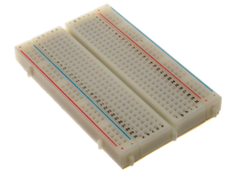
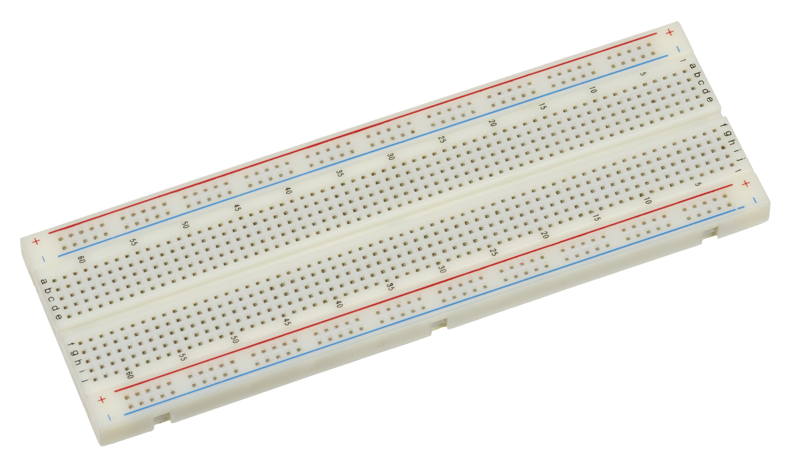

# Meet Your Breadboard

## Summary

Students' first hands-on chapter: how a solderless breadboard's internal rows, columns, and power rails connect components together, and how to safely connect a battery pack or USB power supply. This chapter is taught before any specific component so students can focus entirely on the breadboard mechanics.

## Concepts Covered

This chapter covers the following 19 concepts from the learning graph:

1. Solderless Breadboard
2. Full-Size Breadboard
3. Half-Size Breadboard
4. Breadboard Power Rails
5. Breadboard Tie Points
6. Breadboard Rows
7. Breadboard Columns
8. Breadboard Gutter
9. Breadboard Numbering
10. Breadboard Hole Spacing
11. Breadboard Adhesive Backing
12. Binding Post
13. Breadboard Internal Connections
14. Component Placement
15. Component Lead Forming
16. Wire Routing
17. Jumper Wire
18. Male-to-Male Jumper
19. Male-to-Female Jumper

## Prerequisites

This chapter builds on concepts from:

- [1. Electricity Basics: Voltage, Current, and Resistance](../01-electricity-basics/index.md)

---

Chapter 5 ended with a promise: the theory is done, and it's time to build. That promise starts right now. Every circuit you construct in this course — every glowing LED, every spinning motor, every beeping buzzer — starts on the exact same piece of gear: a rectangular plastic board full of tiny holes called a **solderless breadboard**. Today you meet it properly, learn what's hiding underneath its surface, and pick up the two skills every builder needs before touching a single component: reading a breadboard's layout, and connecting things together with jumper wires.

Here's the good news: a breadboard looks intimidating for about five minutes, and then it clicks. Once you understand which holes are secretly wired together, an entire universe of circuits opens up — and none of it requires a soldering iron, a burn ointment, or a single line of code. You plug a part in, you test it, and if something's wrong, you just pull it back out and try again. That's the whole appeal.

This chapter has no LEDs, no resistors, and no batteries connected yet — on purpose. Chapter 7 is where wires start carrying real current. Today is just about the board itself: its sizes, its hidden wiring, and the jumper wires you'll use to connect everything else.

!!! mascot-welcome "Welcome to the Workbench"
    { class="mascot-admonition-img" }
    Grab a breadboard, builder — this is the chapter where the reading stops and the *building* starts! I promise this board is friendlier than it looks; give it about five minutes and its whole hidden layout will click into place. Let's light it up!

## Meet the Solderless Breadboard

<figure markdown="span">
  { width="600" }
  <figcaption>400 tie-point solderless breadboard (1/2 size)</figcaption>
</figure>

A **solderless breadboard** is a reusable plastic board full of small holes that let you build and rewire electronic circuits by simply pushing component leads and wires into place — no melted metal, no permanent joints, no waiting for anything to cool down. Underneath its plastic surface, rows of tiny metal spring clips grab onto whatever you plug in and hold it firmly while also making an electrical connection, which is exactly why it's the tool this entire course is built around.

The name is a fun bit of electronics history. Decades ago, hobbyists really did build early radio circuits by nailing components straight onto a literal wooden bread-cutting board — bread board, two words. Modern versions ditched the wood and the nails for reusable plastic and spring clips, but the name stuck around. Every time you hear "breadboard" in this book, picture that same do-it-yourself spirit: fast, flexible, and endlessly reusable.

Because nothing is soldered down, a solderless breadboard is the perfect practice space. Wire a circuit wrong? Pull the part out and move it. Want to try a different resistor? Swap it in ten seconds. That single feature — instant, painless rewiring — is exactly what makes this course's entire hands-on approach possible.

## Full-Size and Half-Size Breadboards

<figure markdown="span">
  { width="600" }
  <figcaption>A full-size solderless breadboard with 830 tie points</figcaption>
</figure>

Not every breadboard is the same size, and this course mostly uses one of two standard options. A **full-size breadboard** is the larger of the two, built for bigger projects with lots of components at once, while a **half-size breadboard** is roughly half its length — smaller, lighter, and perfectly sized for the simpler circuits you'll build in this course's early chapters.

Here's how the two compare on the specs that matter most to a builder:

| Feature | Full-Size Breadboard | Half-Size Breadboard |
|---|---|---|
| Typical tie points | About 830 | About 400 |
| Typical length | About 6.5 inches (16.5 cm) | About 3.3 inches (8.5 cm) |
| Power rail pairs | Top and bottom (may be split at the midpoint) | One or two pairs, depending on the model |
| Best for | Multi-component projects, several chips at once | Single-circuit practice, portability, small kits |
| Common in this course | Larger, later capstone projects | Most early chapters, including this one |

No matter which size you pick, every hole lines up on the exact same grid: **breadboard hole spacing** — the fixed 0.1-inch (2.54 mm) distance between every hole on the board. That specific number isn't random; it's the industry-standard spacing used on nearly every resistor, LED, and chip leg you'll ever plug in, which is exactly why parts fit so cleanly no matter which brand of breadboard or component you're using.

!!! mascot-tip "A Universal Language"
    { class="mascot-admonition-img" }
    That 0.1-inch spacing shows up on almost every electronic component ever made for hobbyists, from resistors to sensor modules. Once you know it, you can eyeball how many holes a part needs before you even pick it up — handy for planning a circuit layout in your head.

Flip a breadboard over and you'll usually find a **breadboard adhesive backing** — a peel-off layer of foam tape on the underside that lets you stick the board firmly to a project box, a wooden base, or a tray so it doesn't slide around mid-build. Peeling it off is permanent, so most builders leave it in place until they're ready to mount a finished project for good.

## The Hidden Wiring Inside Your Board

Here's the single most important idea in this entire chapter: not every hole on a breadboard is its own island. Certain groups of holes are secretly wired together underneath the plastic, and learning exactly which ones is what turns a breadboard from a mystery into a tool you can read at a glance.

Every breadboard hides the same secret: a grid of metal spring clips sandwiched between two layers of plastic, invisible from the top. These are the board's **breadboard internal connections** — the actual metal pathways that decide which holes act like a single, shared point and which ones are completely separate. Nothing about them is visible just by looking at the board's surface, which is exactly why every builder needs a mental map of where those hidden connections run.

That map starts with two directions. A **breadboard row** is a short group of five holes running across the narrow width of the board — all five holes in one row are electrically tied together by a single internal metal clip, so anything plugged into any one of them connects to all the others in that same row. A **breadboard column** is the long numbered direction running the length of the board, used together with a row's letter to name one exact hole. Put those two together and you get **breadboard numbering** — a simple grid address, like "row c, column 12," that works exactly like a spreadsheet cell or a seat number at a movie theater, letting you (or a wiring diagram) point to one precise hole with zero confusion.

Down the center of the board runs the **breadboard gutter** — a narrow plastic channel splitting the terminal area into a left half and a right half that are never connected to each other, even at the same column number. Its main job is to give multi-legged chips a place to straddle, with legs plugged into both halves at once, without any risk of shorting one side of the chip to the other. Every individual hole on the board, meanwhile, has a name for what it actually is electrically: a **breadboard tie point** — one connection point in a larger, internally-wired group, whether that group is a five-hole row or a much longer power rail.

Explore a rendered breadboard below to see exactly which holes are secretly wired together.

#### Diagram: Breadboard Anatomy Explorer

<iframe src="../../sims/breadboard-anatomy-explorer/main.html" width="100%" height="562px" scrolling="no"></iframe>

Breadboard Anatomy Explorer

Type: microsim
**sim-id:** breadboard-anatomy-explorer 
**Library:** p5.js 
**Status:** Generated 
**Source:** docs/sims/breadboard-anatomy-explorer/ (built on the horizontal breadboard layout in `skills/breadboard-sim-generator/assets/breadboard-lib.js`)

Purpose: Help students identify and label every named region of a solderless breadboard — rows, columns, tie points, gutter, numbering, power rails — by clicking or hovering directly on a rendered breadboard graphic.

Bloom Taxonomy: Remember (L1) / Understand (L2). Bloom Verb: identify, explain.

Learning objective: Identify the power rails, terminal-strip rows, columns, tie points, gutter, and numbering system of a half-size solderless breadboard by clicking each labeled region on a rendered breadboard graphic and reading its definition and behavior in an infobox.

Reuse check: An embeddings search (find-similar-templates, mode=reuse) against the project's MicroSim library returned no strong reuse match — the closest results ("Breadboard," score 0.58; "Breadboard Layout Explorer," score 0.54) were both flagged "generate," not "reuse" or "template," meaning neither is a close enough fit to embed as-is.

**Template:** `docs/sims/breadboard/index.md` in this repository documents this book's own breadboard-drawing approach (a vector-drawn or photographed breadboard graphic with row labels, column numbers, and power-rail markings) and is the intended visual base for this sim, though its `main.html` does not yet exist and must be built. A future breadboard-based circuit simulator skill should extend that drawing approach with the click/hover label layer described below.

Breadboard region shown: One half-size (400 tie point) breadboard, matching the board referenced throughout this book, oriented landscape with power rails along the top and bottom edges.

Components/elements involved: No electronic components placed yet — this diagram is the bare board only, so every clickable region is a structural part of the breadboard itself (a power rail segment, one terminal-strip row, one column line, one tie point, the gutter, and a numbering label).

Labels/values that must be shown: Row letters (a–e, f–j), column numbers, "+" and "−" power rail markings, and the word "gutter" for the center channel — all visible on the board graphic itself, with an infobox adding the plain-language definition when a region is selected.

Required interactivity:
- Click or hover any power rail segment, terminal-strip row, column line, or the gutter to highlight every tie point in that group in one consistent color and open an infobox with its name, a one-sentence definition, and (for rows/rails) how many tie points it contains
- Click a single hole to see it identified as one tie point, plus its row-column numbering address (e.g., "row c, column 12")
- Toggle button: "Show/Hide Internal Wiring" overlays faint lines connecting every tie point in the currently-highlighted group, making the hidden metal-clip connections visible
- Reset button clears the current highlight and returns the infobox to a "Click a region to learn what it does" placeholder

Default state: No region selected; infobox shows the placeholder prompt; internal wiring overlay hidden.

Data Visibility Requirements:
  Stage 1 (default): Bare breadboard graphic with row letters and column numbers printed faintly, nothing highlighted
  Stage 2 (region clicked): Selected group highlighted in one color, infobox shows its name and definition, tie-point count shown for rows/rails
  Stage 3 (internal wiring toggled on): Faint connector lines drawn between every tie point in the highlighted group, making the "hidden metal clip" idea from the chapter text visible and concrete

Instructional Rationale: A Remember/Understand-level identification objective calls for a label-the-diagram, click-to-reveal pattern rather than an animation, letting learners build a mental map of the board region by region at their own pace. The internal-wiring overlay directly visualizes the chapter's "hidden wiring" concept, turning an abstract idea (metal clips under the plastic) into something the learner can toggle on and see.

Color scheme: Warm orange highlight for the currently selected region (matching the book's accent color), red/blue for the "+"/"−" power rail markings, light neutral gray for the unselected board.

Responsive behavior: Breadboard graphic scales to container width; infobox stacks below the graphic on narrow screens; all regions remain tappable at touch-target size on mobile.

Implementation: p5.js, with the breadboard drawn as a vector graphic (or the existing photographed asset) and every row, column, rail segment, and gutter region defined as a clickable/hoverable zone tied to a lookup table of names, definitions, and tie-point counts.

Reference: skills/breadboard-sim-generator/assets/breadboard-lib.js contains the vector drawing for
a horizontal half-height breadboard.

!!! mascot-thinking "X-Ray Vision, Unlocked"
    { class="mascot-admonition-img" }
    Once you can picture those hidden metal clips, you basically have X-ray vision for your breadboard. You'll start looking at an empty board and already seeing which holes are teammates before you plug in a single wire — that's exactly the skill Chapter 7 builds on.

## Power Rails and Binding Posts

Two special strips break the row-and-column pattern completely: the **breadboard power rails**, a pair of long lines running the full length of the board along the top and/or bottom edge, usually marked with a red "+" line and a blue or black "−" line. Unlike a five-hole row, every hole along an entire power rail line is connected together, end to end — which is exactly what makes it useful for distributing power to many components spread across a wide board at once.

Here's a wrinkle worth knowing before you build anything real: on many full-size breadboards, each power rail is actually split into two separate halves at the board's midpoint, with a small gap you can barely see. Plug power into the left end and the right end can stay completely dead — not a broken board, just a design detail. If a component on one end of a long board refuses to light up, checking for continuity across the power rail, exactly the multimeter skill Chapter 5 introduced, is often the very first thing to try.

Some breadboards, and many breadboard power-supply add-ons, include a **binding post** — a small screw terminal near the power rails that lets you clamp down a bare wire, a banana plug, or an alligator clip from an external power source, instead of relying only on jumper wires. If your kit includes one, it's simply another doorway into the same power rails you just read about — just built for a thicker, more permanent-feeling connection.

!!! mascot-warning "Never Bridge the Rails"
    { class="mascot-admonition-img" }
    Never let a wire or a component lead touch both the "+" rail and the "−" rail at the same time — that's a direct short circuit straight across your power source, with nothing to slow the current down. It's one of the fastest ways to trigger Chapter 1's infamous magic smoke. Always double-check both ends of a wire before you connect power.

## Placing Components the Right Way

Reading the board is only half the job — the other half is **component placement**: choosing exactly which rows and columns a part's leads go into so the circuit connects the way you intended. Two-legged parts, like a resistor or an LED, usually just need their legs in two different rows (never the same row, or they'd short themselves out); multi-legged chips need to straddle the gutter so their legs land in two separate, unconnected row groups on purpose.

Parts fresh out of a kit's bag rarely have leads bent at exactly the right angle for a breadboard's 0.1-inch grid. **Component lead forming** is the simple act of bending a part's wire leads — usually with your fingers or a small pair of pliers — so they line up with the holes you're aiming for, without cramming them in at an angle that stresses the part's body or blocks a neighboring hole.

Before pushing any component into place, run through this quick checklist:

1. Check the part's leads and gently straighten or bend them to match the spacing between your target holes
2. Line up each lead over its intended hole before pressing down
3. Push straight down, firmly but gently — a good tie point holds a lead snugly without much force
4. Leave a little room around the part so neighboring holes stay free for jumper wires
5. Double-check that no single lead is sharing a row with a lead it isn't supposed to touch

!!! mascot-warning "Nothing Lives in the Gutter"
    { class="mascot-admonition-img" }
    Some breadboards even have a few small holes running down the center gutter — but those exist only to physically steady a wide chip's legs. They aren't wired to anything at all, so a component lead or jumper wire plugged in there connects to exactly nothing. If a part seems dead the moment you plug it in, checking whether a lead accidentally landed in the gutter is always worth a look.

## Jumper Wires: Making the Connections

A breadboard's rows and power rails only get you so far — sooner or later, you need to connect a hole on one side of the board to a hole somewhere else entirely. That's the job of a **jumper wire**: a short length of wire, usually with rigid, easy-to-insert ends, used to carry a connection from one breadboard tie point to another. Jumper wires are the roads of your circuit — every one of them is a deliberate decision about where current should travel next.

The type you'll reach for most often is a **male-to-male jumper**, built with a solid metal pin at both ends so it plugs directly into any two breadboard holes. If a jumper wire came pre-made in your kit and both ends look like little pins, it's a male-to-male.

Some components — especially small sensor or module boards — come with their own row of solid pins sticking up, instead of holes to plug into. For those, you'll want a **male-to-female jumper**: a solid pin on one end for the breadboard, and a hollow socket on the other end that slides right over the module's pin. Later chapters that introduce sensor modules will lean on this exact wire type.

| Jumper Wire Type | Ends | Best For |
|---|---|---|
| Male-to-Male | Pin, Pin | Breadboard hole to breadboard hole — the everyday workhorse |
| Male-to-Female | Pin, Socket | Breadboard hole to a component's own pin header |

Once you know which wire to grab, there's still a choice to make about how it gets there. **Wire routing** is the plan for the physical path a jumper wire takes across the board — short and direct instead of looping the long way around, and laid flat instead of crossing over other wires whenever a cleaner path exists. Messy routing doesn't stop a circuit from working, but it makes the next skill this course teaches — troubleshooting — dramatically harder, since a tangle of crisscrossed wires hides exactly the connections you need to check first.

Practice choosing the right jumper wire and routing it cleanly in the sim below.

#### Diagram: Jumper Wire Routing Practice

<iframe src="../../sims/jumper-wire-routing-practice/main.html" width="100%" height="500px" scrolling="no"></iframe>

Jumper Wire Routing Practice

Type: microsim
**sim-id:** jumper-wire-routing-practice 
**Library:** p5.js 
**Status:** Specified

Purpose: Let students practice choosing the right jumper wire type and a clean physical path to connect two given tie points on a breadboard, reinforcing jumper wire, male-to-male/male-to-female, and wire-routing concepts before any real current is involved.

Bloom Taxonomy: Apply (L3). Bloom Verb: construct, demonstrate.

Learning objective: Construct a valid connection between two highlighted breadboard tie points by selecting the correct jumper wire type (male-to-male or male-to-female) for the situation and routing a wire between them without crossing the gutter incorrectly or bridging the power rails.

Reuse check: An embeddings search (find-similar-templates, mode=reuse) found no strong match for a jumper-wire or wire-routing sim specifically; the closest hits were general breadboard-anatomy sims ("Breadboard Layout Explorer," score 0.54) flagged "generate." A keyword grep of the project's 3,764-entry MicroSim index for "jumper" returned zero existing entries. This is a new specification.

Breadboard region shown: The same half-size breadboard graphic as the Breadboard Anatomy Explorer above (reuse that rendering approach for visual consistency within the chapter), pre-populated each round with two highlighted target tie points — sometimes on the same side of the gutter, sometimes on opposite sides, sometimes one target on a power rail.

Components/elements involved: No electronic components — only the bare board, two highlighted target tie points per round, and a supply tray showing one male-to-male jumper icon and one male-to-female jumper icon (with a small pin-header module icon shown only when a male-to-female connection is the correct choice).

Labels/values that must be shown: The two target tie points' row-column addresses (e.g., "connect row b, column 5 to the + power rail"), the wire type currently selected, and a running "connections completed" counter.

Required interactivity:
- Click one of the two jumper wire icons (male-to-male or male-to-female) to select it before routing
- Drag from the first highlighted tie point to the second to draw a routed wire; the path snaps along the board's row/column grid rather than a diagonal straight line, visualizing real wire routing
- On a completed connection, immediate feedback: a green confirmation and a one-sentence explanation if correct ("Nice — male-to-male is right for two breadboard holes"); a red explanation if the wrong wire type was chosen or the wire bridges the power rails incorrectly ("That bridges the + and − rails — check Chapter 6's warning about shorting the rails")
- Button: "New Round" generates a fresh pair of target tie points, occasionally including a simulated sensor-module pin header, which requires a male-to-female jumper
- Toggle: "Show Neat vs. Messy Routing" swaps between a tidy, grid-aligned example path and a tangled diagonal path between the same two points, reinforcing the wire-routing concept from the text

Default parameters: Round 1 always uses two ordinary breadboard-hole targets on the same side of the gutter, so the first successful connection is a straightforward male-to-male placement.

Data Visibility Requirements:
  Stage 1 (round starts): Two target tie points highlighted on the board, jumper wire tray shown, no wire drawn yet
  Stage 2 (wire type selected): Chosen wire icon highlighted, ready to route
  Stage 3 (wire routed and released): Completed connection shown snapped to the grid, with immediate correct/incorrect feedback and explanation

Instructional Rationale: An Apply-level "construct a connection" objective calls for a hands-on select-then-act pattern with immediate feedback, rather than passive viewing, so learners rehearse the actual decision (which wire type?) and the routing habit they'll need moments before their first real breadboard build in Chapter 7.

Color scheme: Warm orange for the currently selected jumper wire type, green/red for correct/incorrect feedback, light neutral gray for the unselected board, matching the Breadboard Anatomy Explorer's palette for visual consistency within the chapter.

Responsive behavior: Board and supply tray stack vertically on narrow screens; drag-to-route also supports tap-tap (tap start hole, tap end hole) as a touch-friendly alternative to dragging.

Implementation: p5.js, with the breadboard grid shared from the Breadboard Anatomy Explorer's rendering approach; routing paths computed as orthogonal (grid-aligned) segments between two selected holes; a small rules table checks wire-type validity and power-rail bridging per round.

!!! mascot-encourage "Tidy Now, Thank Yourself Later"
    { class="mascot-admonition-img" }
    Nobody's first breadboard is perfectly neat, and that's completely fine — wire routing is a skill you build one project at a time, not something you nail immediately. Just remember: every few minutes you spend routing wires cleanly today saves you from a much longer troubleshooting hunt tomorrow.

## Chapter Summary: Key Takeaways

Take a moment to picture your breadboard laid flat in front of you. You now know exactly what's hiding under its surface, and that knowledge is what every remaining chapter in this course builds on:

- A **solderless breadboard** lets you build and rewire circuits with zero soldering, available in **full-size** or **half-size** boards built on a standard **breadboard hole spacing** of 0.1 inches, sometimes fixed in place with an **adhesive backing**
- **Breadboard rows** are short, five-hole connected groups; **breadboard columns** give the long-axis number; together they form the board's **numbering** system for naming any single **tie point**
- The center **gutter** keeps the two halves of the board electrically separate, which is exactly why multi-legged chips straddle it
- The long **power rails** carry power and ground the full length of the board — sometimes in two separate halves — with a **binding post** offering another way in for external power
- Careful **component placement** and **lead forming** get a part's legs into the right holes without stress or accidental shorts
- **Jumper wires** — **male-to-male** and **male-to-female** — connect tie points to each other or to a component's own pins, and thoughtful **wire routing** keeps the whole board easy to read

Every wire you route from here on connects two of these tie points on purpose — and that's exactly what Chapter 7 builds on next: real wiring skills, safe power connections, and your very first complete circuit.

!!! mascot-celebration "Breadboard Fluency: Unlocked"
    { class="mascot-admonition-img" }
    Nice wiring, builder — you just earned a brand-new superpower: breadboard fluency! Rows, columns, gutters, power rails, jumper wires... none of it is a mystery anymore, and that board sitting in your kit just turned into your favorite tool. Chapter 7 is where you put every bit of that knowledge to work wiring your very first real connections. Current's flowing your way!
