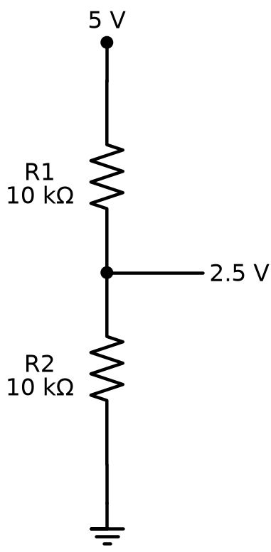

# Resistors and Capacitors

## Summary

The first passive-component chapter introduces resistors and capacitors: fixed vs. variable resistors, potentiometers, capacitor polarity, and the voltage-divider circuit the two components enable together. This chapter turns the abstract 'resistance' and 'circuit' ideas from Chapters 1-5 into real, holdable parts.

## Concepts Covered

This chapter covers the following 19 concepts from the learning graph:

1. Resistor
2. Resistor Color Code
3. Resistor Tolerance
4. Fixed Resistor
5. Variable Resistor
6. Potentiometer
7. Trimmer Resistor
8. Photoresistor
9. Light Dependent Resistor
10. Thermistor
11. Pull-Up Resistor
12. Pull-Down Resistor
13. Current Limiting Resistor
14. Voltage Divider Circuit
15. Capacitor
16. Electrolytic Capacitor
17. Ceramic Capacitor
18. Capacitor Polarity
19. Capacitance

## Prerequisites

This chapter builds on concepts from:

- [1. Electricity Basics: Voltage, Current, and Resistance](../01-electricity-basics/index.md)
- [2. Current, Charge, Units, and Electrical Safety](../02-current-charge-units-safety/index.md)
- [3. Circuit Analysis, Kirchhoff's Laws, and Energy](../03-circuit-analysis-kirchhoff/index.md)

---

Chapter 8 promised a deep dive into resistors and capacitors, and that promise starts paying off right now. Every circuit you've built so far — LED, switch, breadboard row — has leaned on components you were told to trust without really examining. That changes today.

Reach into your kit and pull out a resistor. Really do it — this chapter works best with the actual part sitting in your hand, not just a picture on a screen. You already know a resistor slows down current, from the water-pipe analogy back in Chapter 1. Now it's time to meet the whole family of parts that do that job, plus a very different-looking part that does something no component in this course has done yet: store up electricity and let it go later.

This chapter comes in two halves. The first explores resistors — the fixed kind that never changes, the adjustable kind you turn with your fingers or a tiny screwdriver, and the clever kinds that react to light and heat all on their own. The second half introduces capacitors, small components that behave nothing like a resistor, plus the one safety rule that keeps a very common capacitor type working correctly.

!!! mascot-welcome "Time to Meet the Parts"
    { class="mascot-admonition-img" }
    Welcome back, builder! Grab your kit — today you're finally shaking hands with the parts you've been wiring blind. Resistors, capacitors, and one clever trick that turns two resistors into a voltage-splitting machine. Let's light it up!

## Meet the Resistor: Same Job, One Fixed Value

A **resistor** is a component that limits, or resists, the flow of electric current through a circuit — exactly the job you've relied on since your very first LED circuit back in Chapter 1. Every resistor in your kit does this same basic job, but not every resistor does it the same way. Most of the resistors you'll find are **fixed resistors** — resistors whose resistance value is permanently set when they're manufactured and can never be adjusted afterward. A 220-ohm fixed resistor is 220 ohms forever, whether it's brand new or ten years old. Fixed resistors are the workhorses of this course; you've already used one every time you've protected an LED from too much current.

Pick up a fixed resistor and look closely at its tan or beige body. You'll notice a series of colored stripes wrapping around it — three, four, or five bands of color, depending on the resistor. That striped pattern is the **resistor color code**, a standardized system that prints a resistor's resistance value directly onto its tiny body using colors instead of numbers too small to read. Every resistor manufacturer in the world uses the exact same code, so a brown-black-red resistor from any kit means the same value as a brown-black-red resistor from any other kit, anywhere.

You'll learn to decode every color in Chapter 11 — this chapter's job is just to get you comfortable spotting the stripes and knowing what they're for. One stripe deserves a mention now, though: the band at the very end, usually gold or silver, isn't part of the value at all. It shows the **resistor tolerance** — how far a resistor's real, measured resistance is allowed to drift from its printed or coded value, expressed as a percentage. A 220-ohm resistor with 5% tolerance could actually measure anywhere from about 209 to 231 ohms, and that's completely normal.

!!! mascot-tip "Stripes Now, Decoding Later"
    { class="mascot-admonition-img" }
    Don't stress about memorizing colors yet — that's Chapter 11's job, and it's easier than it looks. For now, just get good at spotting that a resistor *has* a color code at all, and noticing when two resistors clearly have different stripes.

## Turning the Dial: Variable Resistors

Not every resistor is locked to one value forever. A **variable resistor** is a resistor whose resistance can be changed while it's in use, instead of being fixed at the factory. Variable resistors give you a dial, a slider, or a small screw to turn — and turning it changes how much the resistor slows down current, live, while the circuit is running.

The most common variable resistor you'll meet is the **potentiometer** — a three-terminal variable resistor with a rotating dial or sliding wiper that lets you smoothly dial in a resistance value anywhere between the part's minimum and maximum. Volume knobs on old stereos and brightness dials on desk lamps are potentiometers. Two of its three terminals connect across the full resistance range; the third terminal, the wiper, taps off a resistance value that depends entirely on where you've turned the dial.

Some potentiometers are meant to be adjusted constantly, like a volume knob you turn during a song. Others are built for a very different kind of use. A **trimmer resistor**, often called a trim pot, is a small potentiometer designed to be adjusted rarely — usually just once, during calibration — using a tiny screwdriver instead of a hand-friendly knob. The potentiometer in your $50 kit is very likely a trimmer: compact, screwdriver-slotted, and perfectly happy being set once and left alone for the rest of a project.

Two variable resistors, two different jobs — here's how to tell them apart at a glance:

- **Potentiometer** — has a knob or lever built for your fingers, meant to be turned often
- **Trimmer resistor** — has a small screwdriver slot instead of a knob, meant to be set once and left alone

## Resistors That React to the World

Some resistors don't need a hand or a screwdriver to change their value at all — they respond automatically to whatever's happening around them.

A **photoresistor** is a resistor whose resistance changes based on how much light hits its surface — high resistance in the dark, much lower resistance in bright light. This same component is also called a **light dependent resistor**, or LDR, and both names describe the exact same part; you'll see both terms used interchangeably in kits, datasheets, and other electronics resources. A photoresistor is the key part behind a light-activated night light, a project you'll build later in this course: bright light keeps its resistance low, dim light lets its resistance climb, and that changing resistance is what tells the rest of the circuit whether it's dark enough to act.

A **thermistor** is a resistor whose resistance changes based on temperature, rising or falling as the part heats up or cools down depending on its type. Thermistors show up inside thermostats, 3D printers, and battery chargers — anywhere a circuit needs to "feel" temperature without a screen or a thumb.

!!! mascot-thinking "Resistors That Act Like Sensors"
    { class="mascot-admonition-img" }
    Here's a mind-bender worth sitting with: a photoresistor and a thermistor aren't fancy chips with computer brains inside — they're just resistors whose materials happen to respond to light or heat. No code, no processor, just physics doing the sensing for you.

Before moving on, let's line up all five resistor types side by side. The table below reinforces what each one is and where you've already seen it show up in this course.

| Resistor Type | Resistance Changes By | Typical Use in This Course |
|---|---|---|
| Fixed Resistor | Never — set at the factory | Limiting current to protect an LED |
| Potentiometer | Turning a dial or wiper by hand, continuously | Dimming an LED, adjustable controls |
| Trimmer Resistor | Turning a small screw, rarely | One-time circuit calibration |
| Photoresistor (LDR) | Automatically, with light level | Light-activated night light |
| Thermistor | Automatically, with temperature | Sensing heat in a circuit |

#### Diagram: Meet the Resistor Family

<iframe src="../../sims/resistor-family-infographic/main.html" width="100%" height="702px" scrolling="no"></iframe>

[Run the Meet the Resistor Family MicroSim fullscreen](../../sims/resistor-family-infographic/main.html){ .md-button .md-button--primary }

Test how well the differences stuck in the sim below.

#### Diagram: Resistor Family Matching Sorter

<iframe src="../../sims/resistor-family-matching-sorter/main.html" width="100%" height="502px" scrolling="no"></iframe>

Resistor Family Matching Sorter

Type: microsim
**sim-id:** resistor-family-matching-sorter 
**Library:** p5.js 
**Status:** Specified

Purpose: Reinforce the five resistor types just introduced (Fixed Resistor, Potentiometer, Trimmer Resistor, Photoresistor/LDR, Thermistor) by having students actively match each type to the behavior that defines it, immediately after the comparison table.

Bloom Taxonomy: Understand (L2). Bloom Verb: classify, identify.

Learning objective: Given five resistor-type cards and five shuffled behavior-description cards, match each resistor type to the one description that correctly explains how and why its resistance changes.

Reuse check: An embeddings search (find-similar-templates, mode=reuse) for "Resistor Family Matching Sorter | Topic: Resistor Types (Fixed, Variable, Potentiometer, Trimmer, Photoresistor, Thermistor) | Subjects: Electronics, Beginning Electronics | Grade Level: Junior High | Learning Objectives: Identify and classify each resistor type by its defining characteristic and typical use case" returned a top match of "Photoresistor Component Visualization" (dmccreary/moving-rainbow, WHAT score 0.4948, recommendation "generate") — below the 0.60 template threshold. A keyword grep of the 3,764-entry MicroSim catalog for "potentiometer," "photoresistor," and "thermistor" found no existing matching game covering all five resistor types together. This is a new specification.

Canvas layout: Top row shows five resistor-type cards (icon + name) in a shuffled order; bottom row shows five behavior-description cards in a different shuffled order; a small infobox sits beneath both rows.

Components/elements involved: Five labeled resistor-type cards (Fixed Resistor, Potentiometer, Trimmer Resistor, Photoresistor/LDR, Thermistor), each with a simple icon; five behavior-description cards drawn from the comparison table above; connector lines drawn between matched pairs.

Required interactivity:
- Click a resistor-type card, then click a behavior-description card to propose a match; a connecting line is drawn between them
- Correct matches turn green and lock in place with a one-sentence confirmation in the infobox
- Incorrect matches flash red, unlock, and the infobox explains what's actually true about the resistor type that was clicked, without revealing the correct pairing
- Button: "Check All" reveals any remaining unmatched pairs once all five have been attempted
- Button: "Shuffle Again" re-randomizes both rows for repeated practice

Default state: All ten cards unmatched and shuffled; infobox reads "Click a resistor type, then click its matching behavior."

Instructional Rationale: An Understand-level "classify/identify" objective is well served by a matching-pairs pattern, which forces active recall of each resistor type's defining behavior rather than passive re-reading of the table above it.

Color scheme: Warm orange highlight for the currently selected card, green for a correct match, red flash for an incorrect attempt, light neutral gray for unmatched cards, consistent with this chapter's other diagrams.

Responsive behavior: The two card rows stack into a single scrollable column on narrow screens; tap-to-select works identically to click on touch devices.

Implementation: p5.js, with card data (name, icon, description, correct pairing) stored in a lookup array so the same sim can be reshuffled without reloading.

## Special Jobs Resistors Do

Beyond changing value, resistors do a handful of specific jobs so often that each job earned its own name — even though the resistor itself is often just an ordinary fixed resistor doing that job in a particular spot in a circuit.

You've already met one of these jobs without the formal name. A **current limiting resistor** is a fixed resistor placed in series with a component like an LED specifically to keep current from exceeding a safe level — the exact resistor Chapter 1 taught you to calculate with Ohm's Law before your very first LED ever lit up. Any fixed resistor can serve as a current limiting resistor; what makes it one is simply where you place it and why.

Two more named jobs matter whenever a circuit needs to read whether a button or switch is pressed. Without any resistor at all, a wire leading to a button can end up floating — sitting at an unpredictable, in-between voltage whenever the button isn't pressed, neither clearly "on" nor clearly "off." A **pull-up resistor** solves this by connecting that wire to the circuit's positive supply through a resistor, holding it at a known high voltage until the button actively pulls it low. A **pull-down resistor** solves the exact same problem the opposite way, connecting the wire to ground through a resistor so it rests at a known low voltage until the button actively pulls it high.

!!! mascot-encourage "Pull-Up and Pull-Down Feel Backwards at First"
    { class="mascot-admonition-img" }
    If "a resistor connected to power keeps a wire LOW until you press the button" sounds backwards, you're not alone — nearly every builder gets tangled here the first time. Play with the sim below a few times and it'll click. It always does.

Both pull-up and pull-down resistors do the same essential job: giving a wire a defined, predictable resting state instead of letting it float. You'll wire real pull-up and pull-down circuits with buttons in a later chapter — for now, the sim below lets you flip between both wiring styles and watch exactly what changes.

#### Diagram: Pull-Up and Pull-Down Resistor Explorer

<iframe src="../../sims/pull-up-pull-down-resistor-explorer/main.html" width="100%" height="492px" scrolling="no"></iframe>

Pull-Up and Pull-Down Resistor Explorer

Type: microsim
**sim-id:** pull-up-pull-down-resistor-explorer 
**Library:** p5.js 
**Status:** Specified

Purpose: Let students toggle between pull-up and pull-down wiring on a rendered breadboard circuit and directly observe how each configuration keeps a wire at a known, defined state whether or not a button is pressed.

Bloom Taxonomy: Understand (L2) / Apply (L3). Bloom Verb: explain, demonstrate.

Learning objective: Given a rendered breadboard circuit with a push button, a resistor, and a HIGH/LOW state indicator, and a toggle between pull-up and pull-down wiring, predict and then observe the indicator's state in each of the four combinations of wiring style (pull-up or pull-down) and button state (pressed or not pressed).

Reuse check: An embeddings search (find-similar-templates, mode=reuse) for "Pull-Up and Pull-Down Resistor Explorer | Topic: Pull-up resistor and pull-down resistor circuits with a push button on a breadboard, digital HIGH/LOW state | Subjects: Electronics, Beginning Electronics, Digital Logic | Grade Level: Junior High | Learning Objectives: Explain how a pull-up or pull-down resistor keeps a digital input at a known logic level when a button is not pressed" returned a top match of "Breadboard" (dmccreary/microsims, WHAT score 0.5264, recommendation "generate") — below the 0.60 template threshold, so no existing sim is a close enough fit to embed directly. A keyword grep of the microsim catalog for "pull-up" and "pull-down" returned zero matches. This is a new specification, and it is a strong candidate for the breadboard-sim-generator skill since it needs a rendered breadboard with a button and resistor placed in real tie-point positions and animated current flow that changes with the wiring toggle.

Canvas layout: Left/main area shows a rendered half-size breadboard with a battery pack, a resistor, and a push button wired in either a pull-up or pull-down configuration; right side panel holds a "Pull-Up / Pull-Down" toggle switch, a large HIGH/LOW state indicator light, and an infobox.

Components/elements involved: A rendered breadboard with power and ground rails; a battery pack; a resistor and push button with visible leads and wires; a HIGH/LOW indicator LED; a toggle control for wiring mode.

Required interactivity:
- Toggle between "Pull-Up" and "Pull-Down" wiring; the breadboard's rendered wires redraw to show the resistor connected to the supply rail (pull-up) or the ground rail (pull-down)
- Press and hold the button (click-and-hold or tap-and-hold) to see the indicator and animated current flow change in real time
- Release the button to see the wire return to its defined resting state
- Hover the resistor or the button's wire to open an infobox explaining why that specific point sits at HIGH or LOW right now
- Button: "Reset" returns to the default pull-up, button-not-pressed state

Default state: Pull-up mode selected, button not pressed, indicator shows HIGH, infobox reads "The resistor connects this wire to power, so it rests HIGH until the button pulls it to ground."

Instructional Rationale: An Understand/Apply objective that asks students to explain and demonstrate a resting electrical state benefits from a manipulable, cause-and-effect breadboard simulation far more than a static diagram — students must toggle the wiring and operate the button themselves to see why each configuration produces a predictable, non-floating result.

Color scheme: Warm orange for the currently highlighted wire or component, green glow on the indicator for HIGH, blue glow for LOW, consistent with the palette used in this chapter's other diagrams.

Responsive behavior: Breadboard view and the control/indicator panel stack vertically on narrow screens; the button supports tap-and-hold on touch devices as an alternative to click-and-hold.

Implementation: p5.js, built on the breadboard-sim-generator rendering approach (real tie-point hole grid, component placement, and animated current flow); well suited to breadboard-sim-generator since it needs an accurately rendered breadboard, a toggleable wiring configuration, and live current-flow animation tied to button state.

## Two Resistors, One Clever Trick: The Voltage Divider

Put two fixed resistors in series and something useful happens at the point where they meet. A **voltage divider circuit** is a simple arrangement of two resistors connected in series across a voltage source, where the point between the two resistors provides an output voltage that's a predictable fraction of the full source voltage — smaller than the full supply, but calculable exactly from the two resistor values.

This is the exact trick a potentiometer performs internally: its wiper is really just tapping the midpoint of a built-in voltage divider, and turning the dial changes how much resistance sits on each side of that tap. Understanding the voltage divider equation is understanding how every potentiometer, and a huge number of sensor circuits, actually work underneath.

<figure markdown="span">
  
  <figcaption>Two equal 10 kΩ resistors divide a 5 V supply in half, producing 2.5 V at the center tap.</figcaption>
</figure>

#### Voltage Divider Equation

\[ V_{out} = V_{in} \times \frac{R_2}{R_1 + R_2} \]

where:

- \( V_{out} \) is the output voltage measured at the point between the two resistors
- \( V_{in} \) is the full source voltage supplied to the circuit
- \( R_1 \) is the resistor connected between the voltage source and the output point
- \( R_2 \) is the resistor connected between the output point and ground

Try the numbers yourself: with a 5-volt supply, a 1,000-ohm \( R_1 \), and a 1,000-ohm \( R_2 \), the output works out to \( 5 \times \frac{1000}{1000 + 1000} = 2.5 \) volts — exactly half the supply, because the two resistors split the voltage evenly. Make \( R_2 \) bigger than \( R_1 \), and more of the voltage shows up at the output; make \( R_1 \) bigger, and less does.

!!! mascot-thinking "Same Circuit, New Superpower"
    { class="mascot-admonition-img" }
    Here's the big idea worth pausing on: a voltage divider doesn't need any special part at all — just two ordinary resistors and a little math. Swap one resistor for a photoresistor or a potentiometer, and suddenly that same simple circuit can sense light or respond to your hand. That's the superpower hiding inside two resistors.

#### Diagram: Voltage Divider Circuit Explorer

<iframe src="../../sims/voltage-divider-circuit-explorer/main.html" width="100%" height="537px" scrolling="no"></iframe>

Voltage Divider Circuit Explorer

Type: microsim
**sim-id:** voltage-divider-circuit-explorer 
**Library:** p5.js 
**Status:** Specified

Purpose: Let students adjust the two resistor values in a rendered breadboard voltage divider circuit and watch the calculated output voltage update live, connecting the abstract equation above to a concrete, wireable circuit.

Bloom Taxonomy: Apply (L3). Bloom Verb: calculate, demonstrate.

Learning objective: Given a rendered breadboard voltage divider circuit with two adjustable resistors, predict and then verify the output voltage at the midpoint tap as \( R_1 \) and \( R_2 \) change, connecting the observed value to the voltage divider equation.

Reuse check: An embeddings search (find-similar-templates, mode=reuse) for "Voltage Divider Circuit Explorer | Topic: Voltage Divider Circuit built from two resistors or a potentiometer on a breadboard | Subjects: Electronics, Beginning Electronics | Grade Level: Junior High | Learning Objectives: Calculate and predict the output voltage of a voltage divider circuit as resistor values change" returned a top match of "Ohm's Law Circuit Simulator" (dmccreary/automating-instructional-design, WHAT score 0.5607, recommendation "generate") — below the 0.60 template threshold, and that existing sim teaches single-resistor Ohm's Law rather than a two-resistor divider, so it is not a close enough fit to reuse. A keyword grep of the microsim catalog for "voltage divider" found no matches. This is a new specification, and it is a strong candidate for the breadboard-sim-generator skill since it needs a rendered breadboard with two resistors in real tie-point positions, animated current flow, and a live-updating voltage readout.

Canvas layout: Left/main area shows a rendered half-size breadboard with a battery pack, \( R_1 \), and \( R_2 \) wired in series, with a probe clipped at the midpoint tap; right side panel holds two resistor-value sliders, a numeric \( V_{out} \) readout, the equation with live numbers substituted in, and an infobox.

Components/elements involved: A rendered breadboard with power and ground rails; a battery pack; two resistors with visible leads; a probe or voltmeter icon at the tap point; two sliders labeled \( R_1 \) and \( R_2 \).

Required interactivity:
- Drag the \( R_1 \) slider (10 ohms to 100,000 ohms, logarithmic scale) and watch the breadboard's resistor, the animated current flow, and the \( V_{out} \) readout update immediately
- Drag the \( R_2 \) slider across the same range with the same live update
- Hover the probe point to open an infobox showing the equation with the current \( R_1 \), \( R_2 \), and \( V_{in} \) values filled in, alongside the calculated \( V_{out} \)
- Button: "50/50 Split" resets both sliders to equal values so students can confirm the output lands at exactly half of \( V_{in} \)
- Button: "Reset" returns to the default state

Default state: \( V_{in} \) fixed at 5 volts, \( R_1 \) = 1,000 ohms, \( R_2 \) = 1,000 ohms, \( V_{out} \) readout shows 2.5 V.

Data Visibility Requirements:
Stage 1: Show the fixed \( V_{in} \) value and the two current slider values
Stage 2: Show the equation with those exact numbers substituted in place of \( R_1 \), \( R_2 \), and \( V_{in} \)
Stage 3: Show the calculated \( V_{out} \) result, updating instantly as either slider moves

Instructional Rationale: An Apply-level "calculate/demonstrate" objective calls for a parameter-exploration calculator pattern with concrete, visible data at every stage, not a continuous animation — students need to see the actual numbers driving each new \( V_{out} \) value so they can connect slider movement directly to the equation above.

Color scheme: Warm orange for the currently dragged slider and its corresponding resistor on the breadboard, blue glow at the probe point, consistent with the palette used in this chapter's other diagrams.

Responsive behavior: Breadboard view and the slider/readout panel stack vertically on narrow screens; sliders remain full-width and touch-draggable.

Implementation: p5.js, built on the breadboard-sim-generator rendering approach (real tie-point hole grid, component placement, and animated current flow); well suited to breadboard-sim-generator since it needs an accurately rendered breadboard with two resistors in real tie-point positions and a live numeric readout tied to slider values.

## Meet the Capacitor: A Completely Different Kind of Part

Every resistor you've met so far does the same basic thing: it resists current. A capacitor does something resistors can't do at all.

A **capacitor** is a component that stores electric charge and releases it later, acting like a tiny, fast-charging and fast-discharging battery built right into a circuit. Unlike a real battery, a capacitor can charge and discharge in a fraction of a second, and it holds far less energy — but that speed is exactly what makes capacitors useful for jobs a battery could never do, like smoothing out a bumpy voltage or setting the timing for a blinking LED.

How much charge a capacitor can store is described by a property called **capacitance** — the amount of electric charge a capacitor can hold at a given voltage. Capacitance is measured in farads, though a full farad is an enormous amount for a small part; almost every capacitor in your kit is measured in microfarads (millionths of a farad) or smaller. You'll work with real capacitance values and RC timing math in Chapter 10 — for now, just know that a bigger capacitance number means a capacitor that can store more charge.

## Two Capacitor Families: Electrolytic and Ceramic

Capacitors come in more than one physical style, and two types matter most for this course. An **electrolytic capacitor** is a capacitor built to store a relatively large amount of charge in a small physical size, using a chemical electrolyte inside — recognizable by its cylindrical can shape and, almost always, a printed value in microfarads large enough to read easily. A **ceramic capacitor** is a much smaller capacitor, usually shaped like a tiny disc or a flat rectangular blob, built without any liquid electrolyte and typically storing a much smaller amount of charge than an electrolytic capacitor of similar size.

Here's where the two types matter most. A ceramic capacitor has no required direction — it can be wired into a circuit either way, exactly like a resistor. An electrolytic capacitor is different: its internal chemistry only works correctly in one direction, described by its **capacitor polarity** — the property of having a required orientation, marked with a positive lead and a negative lead that must connect to the correct sides of a circuit.

!!! mascot-warning "Electrolytic Capacitors Care About Direction"
    { class="mascot-admonition-img" }
    Look for the stripe. An electrolytic capacitor has a light-colored stripe running down one side marking its negative lead, and that lead is usually a little shorter than the other one too. Wiring one in backwards won't work correctly, and at higher voltages a reversed electrolytic capacitor can even bulge, leak, or vent. In this course's low-voltage kit that risk is small, but building the habit of checking polarity every single time — the same habit Chapter 8 taught you for LEDs — costs nothing and saves you a part.

The table below reinforces the differences between the two capacitor families you'll meet in this course.

| Feature | Electrolytic Capacitor | Ceramic Capacitor |
|---|---|---|
| Typical shape | Small cylindrical can | Tiny disc or flat blob |
| Typical capacitance | Larger (often 1 µF and up) | Smaller (often under 1 µF) |
| Polarity | Polarized — must be wired correctly | Not polarized — either direction works |
| How to spot the negative lead | Stripe down one side, shorter lead | No polarity to mark |
| Common use in this course | Smoothing power, longer RC timing | Fast timing, general-purpose use |

Before wiring any capacitor into a circuit, run through this quick check:

1. Is it a ceramic capacitor? If so, direction doesn't matter — place it either way.
2. Is it an electrolytic capacitor? Find the striped side — that's the negative lead.
3. Does the negative lead line up with the correct, more-negative side of the circuit?
4. When in doubt, double-check against your circuit diagram before applying power.

!!! mascot-tip "When You're Not Sure, Check the Shape"
    { class="mascot-admonition-img" }
    Losing track of which capacitor is which? Shape gives it away almost every time: a little cylindrical can is electrolytic and cares about direction, a tiny disc or rectangular blob is ceramic and doesn't. When your fingers know the shape, your circuit stays safe.

## Chapter Summary: Key Takeaways

You've now got real components in hand and real names for every part of the resistor and capacitor families:

- A **resistor** limits current, and a **fixed resistor** does it at one permanent value marked by a **resistor color code** and a **resistor tolerance** band
- A **variable resistor** changes value by hand — as a knob-friendly **potentiometer** or a screwdriver-only **trimmer resistor**
- A **photoresistor** (also called a **light dependent resistor**) reacts automatically to light, and a **thermistor** reacts automatically to temperature
- A **current limiting resistor**, a **pull-up resistor**, and a **pull-down resistor** are ordinary fixed resistors doing specific, named jobs
- Two resistors in series form a **voltage divider circuit**, splitting a supply voltage into a smaller, calculable output voltage
- A **capacitor** stores and releases electric charge, measured by its **capacitance**
- A **ceramic capacitor** has no polarity, while an **electrolytic capacitor** does — and getting that **capacitor polarity** right protects both the part and the rest of your circuit

Next up in Chapter 10: capacitors and resistors team up in RC timing circuits, where the exact values you choose control how fast an LED fades or how slowly a circuit reacts — the real-world payoff for everything you just learned about capacitance.

!!! mascot-celebration "Component ID: Unlocked"
    { class="mascot-admonition-img" }
    Nice work, builder — you can now recognize any resistor or capacitor in your kit and explain what it's actually doing in a circuit, not just where the wire goes. That's a real engineer's superpower, and it only gets sharper from here. Current's flowing your way — see you in Chapter 10!
