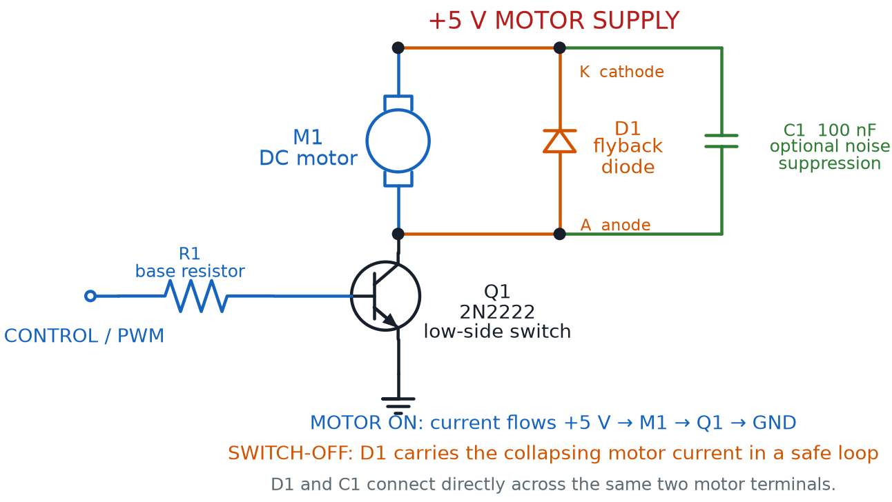
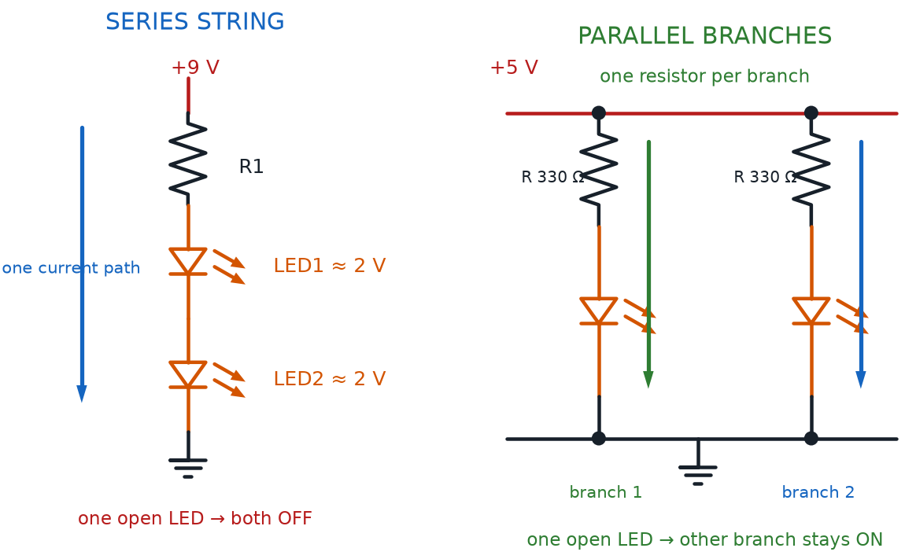
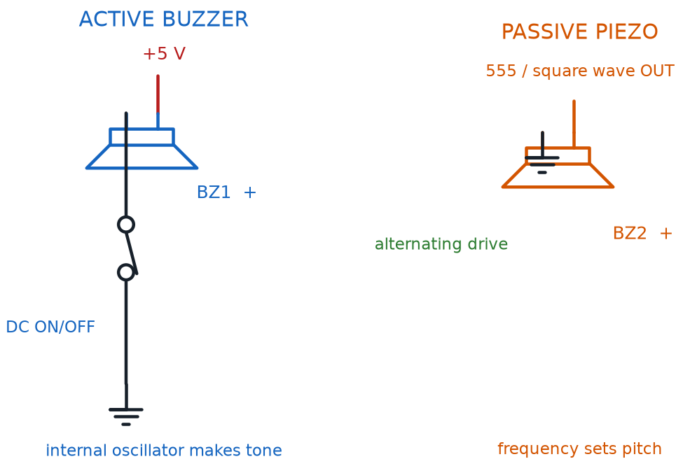

# Driving Outputs: Motors, Buzzers, and More

## Summary

Students go deeper into motor-driving details (stall current, back-EMF, noise suppression) and meet buzzers and general output-protection concepts needed before combining outputs into a real project.

## Concepts Covered

This chapter covers the following 20 concepts from the learning graph:

1. Motor Back-EMF
2. Series LED Wiring
3. Motor Noise Suppression
4. Motor Speed Control
5. PWM Control
6. Duty Cycle
7. Relay Basics
8. Visual Output
9. Indicator Light
10. Audio Output
11. Piezo Buzzer
12. Active Buzzer
13. Passive Buzzer
14. Buzzer Tone
15. Buzzer Polarity
16. Actuator
17. Load Resistance
18. Output Device Protection
19. Multi-Output Circuit
20. Output Response Time

## Prerequisites

This chapter builds on concepts from:

- [1. Electricity Basics: Voltage, Current, and Resistance](../01-electricity-basics/index.md)
- [2. Current, Charge, Units, and Electrical Safety](../02-current-charge-units-safety/index.md)
- [9. Resistors and Capacitors](../09-resistors-and-capacitors/index.md)
- [13. Meet the Transistor](../13-meet-the-transistor/index.md)
- [14. The 555 Timer Chip](../14-555-timer-chip/index.md)
- [18. LEDs, RGB Color, and Motors](../18-leds-rgb-color-motors/index.md)

---

Chapter 18 ended with a motor spinning under your control, safely switched by a transistor. This chapter asks the questions Chapter 18 didn't have room for: what happens the instant a spinning motor switches off, how do you make it spin *slower* instead of only fully on or off, and what changes when you swap that motor for a buzzer?

By the end of this chapter you'll protect a transistor from a motor's electrical kickback, dial motor speed with the same duty cycle idea a 555 timer already taught you, and wire buzzers, relays, and several outputs into one working circuit.

!!! mascot-welcome "Motors, Sound, and Safer Switching"
    { class="mascot-admonition-img" }
    Welcome back, builder! You already made a motor spin in Chapter 18 — now let's make it spin *smarter*, protect the parts around it, and add some noise (the fun kind) with buzzers. Grab your motor, your buzzer, and that flyback diode. Let's light it up!

## The Motor's Secret Push-Back: Motor Back-EMF

Chapter 18 told you to wire a flyback diode backward across a motor's leads, but didn't fully explain why. Here's the missing piece: a spinning DC motor isn't only a motor. The same coil-and-magnet setup that makes it spin also makes it act like a tiny electric generator.

**Motor back-EMF** is the voltage a spinning motor generates on its own, pushing opposite the voltage driving it, created by the same magnetic interaction that spins the shaft. ("EMF" stands for electromotive force, an older name for voltage.) While a motor runs normally, this back-EMF helps you — it naturally limits the running current from climbing too high.

The real danger shows up the instant power switches off. The coil is still surrounded by a magnetic field, and a field that collapses suddenly creates a sharp voltage spike — one that can reach many times the supply voltage. That spike has to go somewhere, and without a safe path, it slams straight into the transistor that was switching the motor.

!!! mascot-thinking "A Motor Living a Double Life"
    { class="mascot-admonition-img" }
    Picture the motor living a double life. While spinning, it's a motor. The instant it switches off, its collapsing field turns it into a tiny generator for a fraction of a second — and generators make voltage of their own, whether you wanted them to or not.

That's exactly why Chapter 12's flyback diode belongs in every motor circuit, not just this course's example projects. Wired backward across the motor's two leads, the flyback diode does nothing while the motor spins normally — it sits reverse-biased, blocking current, out of the way. The instant the circuit switches off, that voltage spike finally pushes the diode forward, giving the spike a safe, short loop to fade out in instead of slamming into the transistor.

#### Diagram: Protected Transistor Motor Driver

<figure markdown="span">
  
  <figcaption>Q1 switches the motor on the low side. D1 is reverse-biased while the motor runs, then safely carries the collapsing motor current at switch-off; its cathode connects to +5 V. Optional C1 suppresses brush noise directly across the motor terminals.</figcaption>
</figure>

!!! note "Why Is the Cathode Marked K?"
    Diode terminals are commonly labeled **A** for anode and **K** for cathode. The **K** comes from *Kathode*, the German-derived spelling, and avoids confusing the cathode with **C**, which already identifies capacitors and a transistor's collector. In the diagram, D1's **K** terminal connects to the positive supply.

!!! mascot-warning "No Flyback Diode, No Mercy"
    { class="mascot-admonition-img" }
    Skip the flyback diode, and motor back-EMF can spike high enough to punch straight through a transistor, destroying it the instant you switch the motor off — even though that same transistor handled the motor just fine while running. Wire the flyback diode before you power the circuit, not after something breaks.

## Keeping the Noise Down: Motor Noise Suppression

Motor back-EMF isn't the only electrical mess a spinning DC motor makes. Most small hobby motors use tiny metal brushes that scrape against a spinning ring of contacts, called a commutator, to keep current flowing to the right coil as the shaft turns. Every time a brush loses and regains contact, it sparks — and that spark radiates electrical noise into the rest of the circuit.

**Motor noise suppression** covers the techniques used to reduce that brush-spark noise. The most common technique is simple: a small capacitor wired directly across the motor's two leads, working alongside the flyback diode rather than replacing it. The capacitor smooths out the tiny voltage spikes each spark creates, the same way Chapter 9's capacitors smooth out other quick voltage changes.

This matters more than it might seem. A noisy motor sharing a breadboard with a 555 timer from Chapter 14 can make that timer's blinking or beeping pattern glitch, simply from noise riding along the shared power rails. A little noise suppression keeps every other circuit on the board behaving the way you designed it.

## Motor Speed Control: More Than On and Off

Chapter 18's transistor switch could only do two things: spin the motor at full speed, or stop it completely. Real projects often want something in between — a fan that runs quiet and slow, or a toy car that creeps instead of races. **Motor speed control** is any technique for adjusting how fast a motor spins, instead of only switching it fully on or off.

One tempting way to slow a motor is a series resistor that lowers the voltage it receives. That wastes energy as heat and stalls out at low speeds, since the motor doesn't get enough voltage to turn smoothly. A better trick switches the motor's full power on and off very fast — so fast that its own spinning momentum smooths the pulses into what feels like one steady, slower speed.

**PWM control**, short for Pulse Width Modulation, is exactly that trick: rapidly switching a circuit's power fully on and off, many times per second, so the load experiences an average power somewhere between "fully on" and "fully off." Nothing about it is unique to motors — the same rapid switching could dim an LED instead of dialing its current with a resistor — but a motor's own inertia makes it an especially natural fit.

The fraction of each on-off cycle that PWM spends "on" has its own name, and you've met it already. **Duty cycle** is the percentage of each full switching cycle spent on instead of off — you met duty cycle with the 555 timer's blinking LED in Chapter 14, and the exact same idea controls motor speed here, just switching far faster than any LED blink your eye could follow.

#### PWM Duty Cycle Percentage

\[ \text{Duty Cycle} (\%) = \frac{t_{on}}{t_{on} + t_{off}} \times 100 \]

where:

- \( t_{on} \) is how long the power stays on during each switching cycle
- \( t_{off} \) is how long the power stays off during each switching cycle

A few duty cycle values show what the formula means for a motor's felt speed.

- 10% — barely creeps, or may not turn at all against friction
- 50% — spins at roughly half its full speed
- 90% — spins close to full speed
- 100% — full speed, exactly like Chapter 18's plain on/off switch

!!! mascot-tip "Same Idea, Different Speed"
    { class="mascot-admonition-img" }
    If duty cycle clicked for you back in Chapter 14, you're most of the way there. A 555 timer's astable duty cycle might repeat a few times a second, slow enough to watch an LED blink. A motor's PWM duty cycle repeats hundreds or thousands of times a second — too fast to see, but plenty fast for a motor's spinning mass to average into one smooth speed.

Try the simulator below to see PWM duty cycle and motor speed side by side, on a wired breadboard circuit.

#### Diagram: PWM Motor Speed Control Breadboard

<iframe src="../../sims/pwm-motor-speed-control-breadboard/main.html" width="100%" height="522px" scrolling="no"></iframe>

PWM Motor Speed Control Breadboard

Type: microsim
**sim-id:** pwm-motor-speed-control-breadboard 
**Library:** p5.js 
**Status:** Specified

Purpose: Let students drag a duty-cycle slider driving a transistor-switched DC motor on a rendered breadboard, and directly observe how the on/off pulse ratio changes average motor speed.

Bloom Taxonomy: Apply (L3). Bloom Verb: demonstrate, predict, adjust.

Learning objective: Given a duty-cycle slider driving a transistor-switched DC motor on a breadboard, predict and observe how PWM duty cycle changes average motor speed, connecting the result to Chapter 14's 555 duty cycle.

Reuse check: An embeddings search (find-similar-templates, mode=reuse) for "Title: PWM Motor Speed Control Breadboard | Topic: PWM control, duty cycle, motor speed control, motor back-EMF, motor noise suppression | Subjects: Electronics, Electric Circuits | Grade Level: Junior High | Learning Objectives: Given a duty cycle slider driving a transistor-switched DC motor on a breadboard, predict and observe how PWM duty cycle percentage controls average motor speed" topped out at "Pwm" (dmccreary/microsims, WHAT score 0.582, "generate") — below the 0.60 template threshold and an unwired abstract waveform demo. New specification, extending `breadboard-lib.js` with a PWM signal-source component and a duty-cycle-driven speed model, reusing Chapter 18's spinning-motor component.

Canvas layout: Breadboard with a battery, 2N2222, base resistor fed by a "PWM Source" block, flyback diode across the motor, and a motor with an animated spinning shaft; right panel holds a duty-cycle slider (0-100%), a pulse-train mini-graph, a speed readout, and an infobox.

Components/elements involved: Breadboard with rails; battery; labeled 2N2222; base resistor; PWM source block; flyback diode; motor with rotating shaft; wires; current-flow dots that pulse on/off with duty cycle instead of flowing steadily.

Required interactivity:
- Dragging the duty-cycle slider (0-100%) changes the pulse-train graph's on/off ratio and the shaft's spin speed proportionally
- At 0% the motor stays stopped; at 100% it spins at full speed, identical to Chapter 18's plain switch
- Hovering the pulse-train graph or the flyback diode opens an infobox defining duty cycle or reinforcing back-EMF protection
- Button "Reset" returns the duty cycle to 0%

Default state: Duty cycle 0%, motor stopped, infobox reads "0% duty cycle — power is never on, so the motor stays still."

Data Visibility Requirements:
Stage 1: Show the duty-cycle slider's percentage
Stage 2: Show the pulse-train graph's on/off ratio
Stage 3: Show the resulting shaft spin speed
Stage 4: Show current readout scaling with duty cycle

Instructional Rationale: An Apply-level "demonstrate/predict" objective calls for a continuous slider with immediate visible feedback, connecting the abstract duty-cycle percentage to a concrete, observable motor speed.

Color scheme: Green current dots pulsing with duty cycle, blue shaft spinning faster as duty cycle rises, orange pulse-train highlight.

Responsive behavior: Breadboard and controls stack vertically on narrow screens; the slider stays full-width and touch-draggable.

Implementation: p5.js, breadboard-sim-generator approach, extending `breadboard-lib.js` with a PWM signal-source component and a duty-cycle-driven motor speed model.

## Load Resistance: How Hard the Output Has to Push

Chapter 18 introduced motor load as a feel — a bare shaft spins freely under a light load, and a jammed shaft strains under a heavy one. There's a more precise way to describe that idea, one that applies to every output device this course covers, not just motors.

**Load resistance** is the electrical resistance an output device's load presents to the circuit driving it, a major factor in how much current flows for a given voltage. For a plain resistor, load resistance is exactly what it sounds like — the resistor's own ohms value, straight out of Ohm's Law. A spinning motor's effective load resistance shifts with speed and mechanical load, but the rule is identical: whatever the current has to push through decides how much current flows.

Higher load resistance means less current for the same voltage; lower load resistance means more current — and if it drops unexpectedly low, like during a motor stall, that extra current can overwhelm a transistor or supply that wasn't sized for it.

## Relay Basics: Letting a Small Signal Switch a Big One

Chapter 13 already showed one way a small signal can control a much bigger current: a transistor, with a tiny base current switching a larger collector current. **Relay basics** start with a completely different mechanism aimed at that same goal, using magnets and metal contacts instead of semiconductor material.

A relay is an electromechanical switch. A small control current flows through a coil of wire, turning it into an electromagnet. That electromagnet pulls a metal arm, called an armature, which pushes a separate pair of switch contacts open or closed — switching a completely different circuit that shares no electrical connection with the control side. A relay's control side and load side stay electrically isolated, connected only through a magnetic field.

Relays aren't in this course's $50 kit, but understanding relay basics completes a picture you've been building since Chapter 13: a small signal controlling a large one. Engineers reach for a relay when the load is too big for a transistor, runs on a different voltage than the control circuit, or must never share a common ground — exactly how a wall thermostat switches a furnace, using only a tiny control current to command a much bigger one.

#### Diagram: Relay Basics Explorer

<iframe src="../../sims/relay-basics-explorer/main.html" width="100%" height="502px" scrolling="no"></iframe>

Relay Basics Explorer

Type: diagram
**sim-id:** relay-basics-explorer 
**Library:** p5.js 
**Status:** Specified

Purpose: Let students toggle a relay's control-side switch and observe how energizing the coil pulls the armature to open or close a completely separate, electrically isolated load-side circuit.

Bloom Taxonomy: Apply (L3). Bloom Verb: demonstrate, predict.

Learning objective: Given a control-side switch driving a relay's coil, predict and observe how energizing the coil pulls the armature to close a separate load-side circuit, and explain why the two sides stay electrically isolated.

Reuse check: An embeddings search (find-similar-templates, mode=reuse) for "Title: Relay Basics Explorer | Topic: relay, electromagnetic switch, actuator, load resistance, output device protection | Subjects: Electronics, Electric Circuits | Grade Level: Junior High | Learning Objectives: Explain how a relay uses a small control current to switch a much larger load current through electromagnetic coupling" topped out at "Wire MicroSim" (dmccreary/circuits, WHAT score 0.4824, "generate") — well below the 0.60 template threshold and not relay-specific. New specification. Since a relay isn't in this course's $50 kit, this diagram uses a schematic, non-breadboard layout, styled with the same palette as `breadboard-lib.js` sims.

Canvas layout: Two circuit halves joined only by a dashed "no electrical connection" line: control side (small battery, toggle switch, coil symbol), load side (separate battery, lamp icon, contacts next to a spring-loaded armature); right panel holds a "Control Switch" toggle and an infobox.

Components/elements involved: Control-side battery, switch, coil symbol; load-side battery, lamp icon, armature, movable contact; animated field lines when energized; current-flow dots on the active side.

Required interactivity:
- Clicking the "Control Switch" toggle energizes the coil, shown with animated field lines, pulling the armature down to close the load-side contacts and light the lamp
- Releasing the switch de-energizes the coil; a spring animation pulls the armature back open, turning the lamp off
- Hovering the coil, armature, or contacts opens an infobox explaining that part's role; hovering the dashed line explains the isolation
- Button "Reset" returns the control switch to off

Default state: Control switch off, coil de-energized, contacts open, lamp off, infobox reads "Coil off — no magnetic pull, so the spring holds the contacts open."

Data Visibility Requirements:
Stage 1: Show the control switch's on/off state
Stage 2: Show the coil energized or de-energized, with field-line animation
Stage 3: Show the armature's position
Stage 4: Show the load-side circuit's resulting open/closed and lamp state

Instructional Rationale: An Apply-level "demonstrate/predict" objective calls for a single manipulable switch with an immediate, visible cause-and-effect chain — coil, armature, contacts, lamp.

Color scheme: Blue for the control side, orange for the load side, red field lines when energized.

Responsive behavior: The two halves stack vertically on narrow screens; the toggle stays full-width and touch-friendly.

Implementation: p5.js, schematic-style diagram styled consistently with `breadboard-lib.js`'s palette, even though it does not render an actual breadboard.

## Actuator: The General Name for "Something That Moves"

Zoom out, and a pattern connects the DC motor from Chapter 18 to the relay you just met. Both convert an electrical signal into physical motion — a motor spins a shaft, a relay's armature clicks open or closed.

An **actuator** is any device that converts an electrical signal into physical motion or action, the general category both belong to. It's a useful word to know — it shows up constantly once you start reading about other people's projects and kits.

- **DC motor** — an actuator that converts current into continuous spinning motion
- **Relay** — an actuator that converts current into a single mechanical click, opening or closing a switch
- **Solenoid** (not in this course's kit) — an actuator that converts current into a short, straight-line push or pull
- **Servo motor** (not in this course's kit) — an actuator that converts a control signal into rotation to a specific, precise angle

#### Diagram: Meet the Actuator Family

<iframe src="../../sims/actuator-family-explorer/main.html" width="100%" height="732px" scrolling="no"></iframe>

[Run the Meet the Actuator Family MicroSim fullscreen](../../sims/actuator-family-explorer/main.html){ .md-button .md-button--primary }

!!! mascot-thinking "One Word, Many Parts"
    { class="mascot-admonition-img" }
    Notice that "actuator" isn't a specific part you can buy — it's a category, like "output device" or "sensor." Whenever a project description says "an actuator moves the arm," you now know exactly what family of part it means, even before you know which specific one.

## Visual Output, Completed: Series LED Wiring

Every LED circuit built so far in this course belongs to a bigger category worth naming. **Visual output** is the general term for output devices that communicate information through light — every LED, single-color or RGB, that you've wired since Chapter 1.

A specific job for visual output deserves its own name too. An **indicator light** is an LED, or a small lamp, used specifically to show a circuit's status at a glance — power on, battery charging, an error condition — rather than for illumination or the color-mixing fun of Chapter 18. The single red LED glowing on a power strip is doing exactly this job.

Chapter 18 showed you how to wire multiple LEDs in parallel, each its own independent branch across shared rails. There's a second, equally common way, worth knowing before your next multi-LED project. **Series LED wiring** connects multiple LEDs one after another along a single current path, so the same current flows through every LED in the chain, instead of each LED getting its own branch.

Series LED wiring uses fewer wires than parallel wiring — every LED just connects to the next — but it has two trade-offs. Supply voltage must cover every LED's forward voltage added together, and if even one LED in the chain fails open, the entire chain goes dark, since there's only one path current can take.

#### Diagram: Series and Parallel LED Wiring

<figure markdown="span">
  
  <figcaption>A series string shares one current and one resistor but fails as a whole if any LED opens; parallel branches need separate resistors but fail independently.</figcaption>
</figure>

#### Series LED Chain Voltage Requirement

\[ V_{supply} \geq n \times V_f \]

where:

- \( V_{supply} \) is the voltage available to power the whole chain
- \( n \) is the number of LEDs wired in series
- \( V_f \) is each LED's own forward voltage (assuming matching LEDs)

A chain of three red LEDs at 2.0 V each needs at least 6.0 V — more than this course's 5 V USB supply can provide, which is why series wiring works best with a higher-voltage battery pack or fewer LEDs per chain.

See series and parallel LED wiring side by side, now that you know both.

| Feature | Series LED Wiring | Parallel LED Wiring |
|---|---|---|
| Current path | One path through every LED | Each LED is its own separate path |
| Wires needed | Fewer — LEDs daisy-chain together | More — each LED needs its own branch |
| Supply voltage needed | Sum of every LED's forward voltage | Just one LED's forward voltage |
| If one LED fails open | Entire chain goes dark | Only that one LED goes dark |
| Best fit | A few matched LEDs, higher-voltage supply | Independent LEDs, this course's 5 V supply |

## Audio Output: Buzzers Enter the Circuit

Every output device this chapter has covered so far communicates through light or motion. It's time to add a third channel. **Audio output** is the general term for output devices that communicate information through sound instead of light — the same kind of category visual output belongs to, just for your ears.

The buzzer in this course's kit is a **piezo buzzer** — a small disc that vibrates and produces sound when voltage is applied across it, using a piezoelectric material that flexes whenever current flows through it. That flexing pushes air fast enough to make an audible tone, the same physics behind a speaker cone, just built from a crystal disc instead of a magnet and coil.

Piezo buzzers come in two very different flavors, and mixing them up is a common beginner surprise.

An **active buzzer** has a tiny built-in oscillator that generates its own fixed tone the instant power is applied. Wire one straight to a battery and it beeps immediately at one preset pitch — no signal shaping required, similar to a single-color LED that only ever glows one color.

A **passive buzzer** has no built-in oscillator. It needs an external, changing signal — like a 555 timer's astable output from Chapter 14 — to make any sound at all. That signal's frequency directly sets the pitch, making a passive buzzer the audio counterpart of Chapter 14's blinking LED, just turned into sound instead of light.

That pitch has its own name. **Buzzer tone** is the pitch, high or low, a buzzer produces — fixed inside an active buzzer, or set by the driving signal's frequency on a passive buzzer.

Both types share one more thing with LEDs. **Buzzer polarity** is the requirement that most piezo buzzers be wired with correct positive and negative orientation, exactly like an LED's anode and cathode, or they won't produce sound.

#### Diagram: Active and Passive Buzzer Driver Circuits

<figure markdown="span">
  
  <figcaption>An active buzzer needs only switched DC because its oscillator is internal; a passive piezo needs an alternating waveform whose frequency sets the pitch.</figcaption>
</figure>

!!! mascot-warning "Silent Buzzer? Check the Leads"
    { class="mascot-admonition-img" }
    A buzzer wired backward at this course's safe voltages won't get damaged — it will simply stay silent, which can look exactly like a dead component. Before you assume something's broken, check buzzer polarity first. It's the single most common reason a "working" buzzer circuit makes no sound.

A side-by-side comparison makes the active/passive difference easy to remember.

| Feature | Active Buzzer | Passive Buzzer |
|---|---|---|
| Built-in oscillator | Yes | No |
| Signal needed | None — just DC power | A changing signal, like a square wave |
| Tone produced | One fixed pitch | Pitch set by the driving signal's frequency |
| Easiest way to use | Wire straight to a switch or transistor | Drive it with a 555 timer or similar signal source |
| Feels most like | An LED that only glows one color | An LED you can dim and blink on your own schedule |

#### Diagram: Active vs. Passive Buzzer Tone Comparison

<iframe src="../../sims/active-passive-buzzer-breadboard/main.html" width="100%" height="522px" scrolling="no"></iframe>

Active vs. Passive Buzzer Tone Comparison

Type: microsim
**sim-id:** active-passive-buzzer-breadboard 
**Library:** p5.js 
**Status:** Specified

Purpose: Let students switch an active buzzer and a passive buzzer on a shared breadboard and directly compare a fixed built-in tone against a frequency-controlled tone, including what happens when polarity is reversed.

Bloom Taxonomy: Understand (L2) / Apply (L3). Bloom Verb: compare, demonstrate.

Learning objective: Compare an active buzzer's fixed tone against a passive buzzer's frequency-controlled tone by switching each on a breadboard and adjusting a frequency slider that only affects the passive buzzer, and predict the effect of reversing buzzer polarity.

Reuse check: An embeddings search (find-similar-templates, mode=reuse) for "Title: Active vs Passive Buzzer Tone Comparison Breadboard | Topic: piezo buzzer, active buzzer, passive buzzer, buzzer tone, buzzer polarity, audio output | Subjects: Electronics, Electric Circuits | Grade Level: Junior High | Learning Objectives: Compare an active buzzer's fixed tone against a passive buzzer's frequency-controlled tone on a wired breadboard circuit, and predict the audio output produced by each" topped out at "Tone Generator" (dmccreary/signal-processing, WHAT score 0.4897, "generate") — below the 0.60 template threshold and not wired or polarity-aware. New specification, extending `breadboard-lib.js`'s existing `bbBuzzer({a, b})` component with an active/passive mode and an oscillator block.

Canvas layout: Breadboard with two buzzers side by side, each with its own switch and polarity-marked leads: left wired straight to the battery (active), right through an "oscillator" block (passive); right panel holds "Active Switch" and "Passive Switch" toggles, a frequency slider (200-2000 Hz, passive only), a "Reverse Passive Polarity" button, and an infobox.

Components/elements involved: Breadboard with rails; battery; two labeled piezo buzzers with +/- markings; oscillator block feeding the passive buzzer; switches; wires; animated sound-wave rings expanding from whichever buzzer sounds, spacing matching pitch.

Required interactivity:
- Clicking "Active Switch" immediately sounds the active buzzer at one fixed pitch, regardless of the frequency slider
- Clicking "Passive Switch" sounds the passive buzzer only at the slider's frequency; dragging it changes the pitch and ring spacing live
- Clicking "Reverse Passive Polarity" flips the passive buzzer's leads and silences it even with switch and slider active
- Hovering either buzzer's polarity markings opens an infobox explaining buzzer polarity
- Button "Reset" turns both switches off and resets polarity and slider

Default state: Both switches off, silent, standard polarity, infobox reads "Active buzzers beep the instant they get power. Passive buzzers need a changing signal to make any sound at all."

Data Visibility Requirements:
Stage 1: Show each buzzer's switch state
Stage 2: Show the frequency slider's value and whether it affects sound
Stage 3: Show the animated ring spacing matching pitch
Stage 4: Show silence when the passive buzzer's polarity is reversed

Instructional Rationale: An Understand/Apply "compare/demonstrate" objective calls for a side-by-side toggle so the active/passive distinction, and buzzer polarity's effect, are directly observable.

Color scheme: Orange expanding sound-wave rings, green current dots, red flash when polarity is reversed and no sound plays.

Responsive behavior: Breadboard and controls stack vertically on narrow screens; sliders and buttons stay full-width and touch-friendly.

Implementation: p5.js, breadboard-sim-generator approach, extending `breadboard-lib.js`'s `bbBuzzer` component with active/passive modes and animated sound-wave rendering.

## Output Device Protection: The General Rule

Look back over this chapter, and a pattern connects the flyback diode, the noise-suppression capacitor, and even Chapter 10's current-limiting resistor for an LED. **Output device protection** is the general principle that every output device pushes back on its circuit in its own way, and needs a matching protection technique to keep the rest of the circuit safe.

- A flyback diode protects a transistor from a motor's back-EMF spike at switch-off
- A noise-suppression capacitor calms a motor's brush-spark noise
- A current-limiting resistor keeps an LED or buzzer from drawing more current than its rating allows
- Correct polarity wiring keeps an LED, buzzer, or relay coil from staying silent or dark

!!! mascot-encourage "A Lot of New Terms, One Simple Habit"
    { class="mascot-admonition-img" }
    Back-EMF, noise suppression, load resistance, buzzer polarity — that's a wall of new vocabulary. You don't need to memorize every definition today. Just build one habit: before powering any new output device, ask "does this one need a protection part?" That question saves more transistors than memorizing ever will.

## Multi-Output Circuit: Combining Everything

Every output device in this course has, so far, mostly lived in its own example circuit. Real projects rarely stop at one output. A **multi-output circuit** is a single circuit that drives more than one kind of output device at once — an LED and a buzzer and a motor, sharing one supply and responding to the same control signal.

Building one successfully means applying everything from this chapter at once. Every branch's current draw adds up, so total current must stay within what the supply and any switching transistor can safely provide. Every output device keeps its own protection component — the flyback diode stays with the motor, the resistor with the LED — even sharing one power source, and every branch still needs correct polarity.

## Output Response Time: How Fast Is "Instant"?

One last idea ties every output device in this chapter together. **Output response time** is how quickly an output device visibly, audibly, or physically reacts after its control signal changes — and it's not the same for every output, even when the signal changes instantly.

An LED reacts about as close to instantly as this course's circuits ever get. A buzzer reacts almost as fast, though your ear needs a few cycles of vibration to recognize a pitch. A motor is the slowest of the three, since its shaft has real physical mass that must speed up or slow down.

| Output Type | Typical Response Time | Why |
|---|---|---|
| Visual Output (LED) | Near-instant (microseconds) | Light has no inertia to overcome |
| Audio Output (Buzzer) | Very fast (a few cycles) | Disc vibrates almost immediately; pitch takes a few cycles to recognize |
| Motor (Actuator) | Slower (milliseconds to seconds) | Shaft's physical mass must speed up or slow down |

This is why Chapter 18's chaser effect could switch LEDs crisply from one to the next, while a PWM-controlled motor visibly ramps up to its new speed instead of jumping there instantly. Different output response times aren't a flaw to fix — they're a property to design around.

## Chapter Summary: Key Takeaways

You started this chapter with a motor already spinning, and you're ending it with a much deeper toolkit for controlling — and protecting — every output device in your kit. Here's what's now part of your toolkit:

- **Motor back-EMF** spikes dangerously at switch-off without a flyback diode, and **motor noise suppression** calms the extra noise a motor's brushes create
- **Motor speed control** goes beyond on/off using **PWM control**, relying on the same **duty cycle** idea Chapter 14 first taught with a 555 timer's blinking LED
- **Load resistance** generalizes motor load into a rule that applies to every output device
- **Relay basics** show a second way to let a small signal switch a big one, and **actuator** names the category of devices, like motors and relays, that convert electricity into motion
- **Visual output** now includes **series LED wiring** as the counterpart to Chapter 18's parallel wiring, alongside the **indicator light**'s job of showing status at a glance
- **Audio output** introduced the **piezo buzzer**, split into **active buzzer** and **passive buzzer**, each with its own **buzzer tone** and needing correct **buzzer polarity**
- **Output device protection** ties every safety technique together, and a **multi-output circuit** combines several outputs while respecting each one's own **output response time**

Chapter 20 hands you the tool every builder eventually reaches for: a multimeter, to measure the voltages, currents, and resistances this chapter only described in theory, on circuits you've already built.

!!! mascot-celebration "Motors, Buzzers, and Protection: Unlocked"
    { class="mascot-admonition-img" }
    Huge chapter, builder! You can now protect a transistor from a motor's electrical kickback, control motor speed with PWM and duty cycle, wire up a relay, and make buzzers sing safely in either flavor. Current's flowing your way — see you in Chapter 20!
