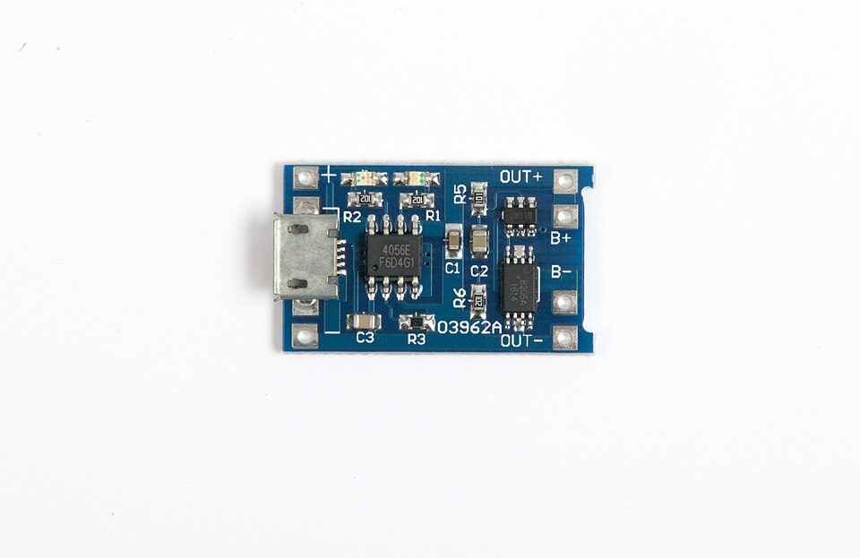

# Batteries, Regulators, and Buck Converters

## Summary

This chapter covers battery types and safe handling, the 7805 linear voltage regulator, and how a buck converter steps a higher voltage down efficiently — the first of the course's real-world power kits.

## Concepts Covered

This chapter covers the following 20 concepts from the learning graph:

1. USB Power Supply
2. 5 Volt Power
3. Battery Power
4. 9 Volt Battery
5. AA Battery
6. Battery Holder
7. Battery Pack Wiring
8. Rechargeable Battery
9. LiPo Battery
10. TP4056 Charger Module
11. Power Supply Selection
12. Voltage Regulator
13. 7805 Voltage Regulator
14. Regulator Dropout Voltage
15. Regulator Bypass Capacitors
16. Heat Sink
17. Buck Converter
18. Step-Down Conversion
19. Buck Converter Inductor
20. Adjustable Output Trimmer

## Prerequisites

This chapter builds on concepts from:

- [1. Electricity Basics: Voltage, Current, and Resistance](../01-electricity-basics/index.md)
- [2. Current, Charge, Units, and Electrical Safety](../02-current-charge-units-safety/index.md)
- [5. Conductors, Batteries, and Circuit Vocabulary Review](../05-conductors-batteries-review/index.md)
- [9. Resistors and Capacitors](../09-resistors-and-capacitors/index.md)
- [13. Meet the Transistor](../13-meet-the-transistor/index.md)

---

Chapter 21 turned you into a circuit detective — someone who tracks down a hidden fault with a meter and a method instead of a guess. Chapter 22 hands that same evidence-gathering mindset a brand-new target: the power itself.

Every circuit you've built so far has assumed power just shows up — a breadboard's rails carry current, an LED lights, a motor spins. But something has to deliver that power first, and something usually has to clean it up before a sensitive chip will accept it. This chapter is the first of the course's real-world kits — the same building blocks hiding inside every USB charger and power bank you own, the same 7805 regulator soldered onto a thousand hobby projects, and the same buck converter module sold four-for-thirteen-dollars online. Build both kits with the meter skills you just earned, and you'll never look at a power adapter the same way again.

!!! mascot-welcome "Powering Up for Real-World Kits"
    { class="mascot-admonition-img" }
    Welcome back, builder! Every circuit you've ever powered up depended on something feeding it clean, steady electricity — and today you get to build the parts that actually do that job. Batteries, regulators, buck converters: these are the exact building blocks hiding inside every USB charger and power bank you own. Let's light it up!

## Powering Your Circuits: Two Families of Power Sources

Every project in this course needs electricity from somewhere — wall power delivered through a cable, or battery power carried around in a pack.

A **USB power supply** is a wall adapter, or a computer's USB port, that delivers a fixed 5-volt DC output through a standard USB cable — the same kind of adapter that charges a phone. Nearly every USB source agrees on that same voltage, which makes it a convenient, predictable choice for breadboard work.

That agreed-upon number has its own name. **5 volt power** is the standard, regulated output voltage that USB and most small electronics supplies deliver — already "cleaned up" before it ever reaches your breadboard, with none of the drift or sag a battery shows as it runs down. Every 5V USB supply you'll ever plug in, from a $5 phone charger to a $50 wall adapter, aims at that exact same number.

**Battery power**, by contrast, is electricity stored chemically inside a battery and released as the battery discharges — untethered from any wall outlet, but also far less steady. A fresh 9V battery might measure 9.6 volts; the same battery an hour into a motor project might measure 7.8 volts. Nothing about a raw battery promises a fixed, exact voltage the way a USB supply does — which turns out to be the whole reason regulators and buck converters exist at all, as you'll see later in this chapter.

## Battery Types in Your Kit

Most beginner electronics kits, including this course's, keep things simple with two familiar battery types plus a couple of ways to hold them.

A **9 volt battery** is a rectangular battery, easy to recognize by its two snap terminals on top, that supplies roughly 9 volts and is a common, simple choice for powering small breadboard projects and IC-based circuits. An **AA battery** is a cylindrical 1.5-volt battery, one of the most common battery sizes in the world, almost always used in a group of two or more to reach a higher combined voltage.

Loose batteries don't connect themselves to a breadboard — they need a holder and some deliberate wiring first. A **battery holder** is a plastic case that holds one or more batteries in place and brings their combined positive and negative terminals out to two leads, ready for a breadboard. **Battery pack wiring** is how batteries inside a holder connect together — end-to-end in series, which adds each battery's voltage together, or side-by-side in parallel, which keeps the voltage the same but adds up how long the pack can supply current.

Before that pattern becomes just another fact to memorize, it helps to see it in real numbers.

- Two AA batteries wired in **series** (a standard 2-AA holder) → 1.5 V + 1.5 V = 3 V, same capacity as one battery
- Four AA batteries wired in **series** (a standard 4-AA holder) → 1.5 V × 4 = 6 V, same capacity as one battery
- Two AA batteries wired in **parallel** → still 1.5 V, but roughly double the capacity — the pack runs about twice as long
- A single 9V battery → 9 V straight out of the snap connector, no wiring choice to make

## Rechargeable Power: LiPo Batteries and Safe Charging

AA and 9V batteries are disposable — once they're drained, they go in the recycling bin. A different category of battery is built to be used again and again.

A **rechargeable battery** is a battery designed to be recharged and reused many times over, instead of thrown away once its charge runs out — trading a slightly higher upfront cost for hundreds of reuses. The rechargeable battery you'll meet most often in robotics and drones isn't a AA or 9V shape at all.

A **LiPo battery** (short for lithium polymer) is a rechargeable battery built from a flexible pouch of lithium-based chemistry that packs a lot of energy into a small, lightweight package — exactly why it shows up in drones, RC cars, and small robots. A single-cell LiPo settles around 3.7 volts, noticeably different from a AA's 1.5 volts.

LiPo batteries store an enormous amount of energy in a very small space, and that same property makes them genuinely riskier to handle carelessly than a AA or 9V battery.

!!! mascot-warning "LiPo Batteries Deserve Real Respect"
    { class="mascot-admonition-img" }
    LiPo batteries are safe when you follow a few simple rules — worth taking seriously, not fearing. Never puncture, crush, or bend a LiPo pouch; a damaged one can overheat quickly. Never overcharge one past its rated voltage. Always charge with a proper LiPo charger, like the TP4056 module you're about to meet, never a generic charger built for a different battery chemistry. And never leave a LiPo charging unattended — check in on it the way you'd check on anything else that's actively working.

That's exactly the job a dedicated charging module exists to do safely and automatically.

A **TP4056 charger module** is a small circuit board, built around the TP4056 charging chip, that takes in standard 5V USB power and charges a single-cell LiPo battery safely, automatically stopping once the battery reaches full charge. Most TP4056 modules include a tiny status LED — often red while charging and blue or green once complete — so you can tell at a glance whether the battery underneath is still topping up or ready to use.

<figure markdown="span">
  { width="500" }
  <figcaption>A TP4056 charger module, about the size of a postage stamp. Micro-USB jack on the left, the TP4056 chip in the middle, two status LEDs along the top edge, and six solder pads around the outside.</figcaption>
</figure>

### The Six Pads: What Connects Where

Wiring a TP4056 is genuinely simple, because the whole job is deciding which of six pads each wire belongs on. Look at the photo above and you'll find them all: a **+** and a **−** beside the USB jack, and **OUT+**, **B+**, **B−**, **OUT−** stacked down the opposite edge.

| Pad pair | What connects here | Notes |
|---|---|---|
| **+ / −** (next to the USB jack) | 5V power in | These are the *same* electrical connection as the USB jack — a solder-pad alternative to it, not an addition. Feed one or the other, never both at once. |
| **B+ / B−** | The LiPo battery, and nothing else | Red battery wire to B+, black to B−. Most LiPo cells arrive with a small white JST plug on those two wires. |
| **OUT+ / OUT−** | Your project's circuit board | OUT+ to your project's V+ (or VIN), OUT− to your project's ground. |

That leaves one question worth answering carefully, because it's the mistake almost every beginner makes at least once: if B+ already carries battery voltage, why not just wire your project there too and skip the OUT pads entirely?

!!! mascot-thinking "Why the Project Goes on OUT, Not on B+"
    { class="mascot-admonition-img" }
    Look closely at the photo and you'll spot two extra 8-pin chips crowded near the right-hand pads. That's a **protection circuit** — a DW01A watching the cell's voltage and a pair of FS8205 transistors ready to act as its switch. It sits between the battery and the OUT pads, so it can disconnect your project the moment the cell runs too low. Wire your project straight to B+ and you've walked right around that guard, leaving nothing to stop a hungry circuit from draining a LiPo past the point of no return. One pad over is the difference between a battery that lasts for years and one that's ruined in an afternoon.

### Wiring It Up

Here's the whole circuit, start to finish — five connections, and you're charging safely:

1. **Battery red wire → B+**, and **battery black wire → B−**. If your cell has a JST plug, this is where a matching JST socket gets soldered.
2. **Project V+ → OUT+**, and **project ground → OUT−**. Everything your project needs now runs through the module's protection circuit.
3. **Plug a USB cable into the module's jack** whenever the battery needs topping up. The red CHRG LED lights while charging; the blue STDBY LED takes over when the cell is full and the module has stopped on its own.

Notice what's *not* in that list: no switch you have to remember to flip, no timer, no watching the clock. Charging stops by itself at 4.2 volts, and your project keeps running from OUT the whole time the battery is charging.

Trace all five connections yourself in the diagram below — then unplug the USB and watch what the module does when the battery runs down.

#### Diagram: TP4056 Charging Circuit Wiring

<iframe src="../../sims/tp4056-lipo-charging-wiring/main.html" width="100%" height="592px" scrolling="no"></iframe>

[Run the TP4056 Charging Circuit Wiring MicroSim fullscreen](../../sims/tp4056-lipo-charging-wiring/main.html){ .md-button .md-button--primary }

TP4056 Charging Circuit Wiring

Type: microsim
**sim-id:** tp4056-lipo-charging-wiring 
**Library:** p5.js 
**Status:** Built

Purpose: Give students a labeled, animated wiring diagram of a real TP4056 module so they can see exactly which pads the USB supply, the LiPo cell, and their own project board connect to — and discover, by mis-wiring it deliberately, why the load belongs on OUT+/OUT− rather than B+/B−.

Bloom Taxonomy: Understand (L2) / Apply (L3). Bloom Verb: identify, demonstrate.

Learning objective: Given a wiring diagram of a TP4056 charger module connected to a single-cell LiPo battery and a project board, identify which pads each wire connects to, plug and unplug the USB supply, and observe the charge current, status LEDs, and cell voltage respond — including the protection circuit disconnecting an empty cell.

Canvas layout: A left-to-right wiring diagram across the top of the canvas — USB supply, TP4056 module with all six pads labeled in the order they appear on the real board, LiPo cell wired to B+/B−, and a project board fed from OUT+/OUT− — above a four-column readout strip (USB input, current into the cell, cell voltage, project board draw) with a one-line explanation of the current state.

Components/elements involved: 5V USB supply; TP4056 module rendered to match the chapter photograph (micro-USB jack, TP4056 chip, DW01A + FS8205 protection pair, R_PROG resistor, CHRG and STDBY status LEDs, six gold pads); single-cell LiPo with a charge-level bar; project board with a power LED; animated current dots along the wires.

Required interactivity:

- A plug/unplug button starts and stops charging; the CHRG and STDBY LEDs follow the real module's behavior and the charge current tapers to zero on its own near 4.2 V
- A menu swaps R_PROG (1.2 kΩ, 2 kΩ, 5 kΩ, 10 kΩ), changing the charge current per I = 1200 ÷ R_PROG, so a load drawing more than the charge current visibly stops the cell from gaining charge
- A checkbox switches the project board on and off, showing that the module's current is shared between charging and running the project
- A checkbox re-routes the project board's wires to B+/B−, and with the USB unplugged the cell then drains past empty into a clearly flagged over-discharge state — the same scenario ends safely with the wires on OUT+/OUT−
- Hovering any part (chip, protection pair, R_PROG, status LEDs, each pad pair, cell, project board) opens an explanatory note

Default state: USB plugged in, cell at 35%, project board switched on, charging at the module's as-shipped 1000 mA; the readout reads "Charging. Current runs USB → the module → B+ → the cell."

Instructional Rationale: The chapter's claim that the load belongs on OUT+/OUT− is easy to state and easy to ignore. Letting students wire it the wrong way and watch the cell drain past its floor — with no protection chip in the path — turns a rule to memorize into a consequence they've seen.

Color scheme: Blue PCB matching the module in the chapter photograph, gold pads, red wires for positive and black for negative, red CHRG and blue STDBY status LEDs, orange highlight for hovered parts.

Responsive behavior: Parts and wire routing scale with canvas width; at phone widths the helper wire labels and the finer silkscreen detail drop away so the pad labels stay legible, and the readout strip reflows to two columns.

Implementation: Plain p5.js via the microsim-generator's standard scaffolding — a sealed module with solder pads has no breadboard tie points, the same choice the buck converter sim made. Charging follows a constant-current phase then a constant-voltage taper, and time only advances while the pointer is over the diagram so nothing important happens before the student is watching.

### Setting the Charge Current

One more detail separates a module that charges a battery well from one that merely charges it. A LiPo cell has a preferred charging speed, and the module has to be told what it is.

The TP4056 reads that setting from a single resistor on the board, labeled **R_PROG** — the one marked `121` in the photo, meaning 1.2 kΩ.

#### Charge Current Set by R_PROG

\[ I_{charge} = \frac{1200}{R_{PROG}} \]

where:

- \( I_{charge} \) is the current the module pushes into the battery, in amps
- \( R_{PROG} \) is the programming resistor's value, in ohms
- The 1200 is a fixed property of the TP4056 chip itself

The 1.2 kΩ resistor modules ship with gives 1200 ÷ 1200 = 1 amp, which suits a large cell but is aggressive for a small one. A good rule of thumb is to charge at no more than the battery's capacity per hour — a 500 mAh cell wants about 500 mA, not a full amp — which means swapping R_PROG for a larger resistor on small batteries.

One last habit is worth building before your first plug-in: **red goes to B+ and black goes to B−, every single time.** Reverse those two and the TP4056 is usually destroyed the instant power arrives, sometimes taking the battery with it. Checking the wire colors twice costs five seconds and saves a part you can't un-burn.

## Choosing the Right Power Supply

You now know four real options for powering a project: USB's steady 5 volts, a 9V battery, a pack of AA batteries, or a rechargeable LiPo. **Power supply selection** is the practice of matching a project's power source to what it actually needs — voltage, portability, run time, and cost — instead of grabbing whatever's closest on the workbench.

The table below gathers everything you've just learned about each option side by side, so you can compare them at a glance the next time a project needs power.

| Power Source | Typical Voltage | Rechargeable? | Best For | Watch Out For |
|---|---|---|---|---|
| USB power supply | 5 V (fixed) | N/A — wall or computer power | Breadboard testing, anything near a desk | Needs a nearby outlet or computer |
| 9 V battery | ~9 V (drops as it drains) | No (unless a rechargeable 9V) | Small, simple, portable projects | Voltage sags noticeably under load |
| AA battery pack | 1.5 V × number of cells | No (unless rechargeable NiMH) | Portable projects needing more current | Bulkier; needs a holder and wiring |
| LiPo battery | ~3.7 V per cell | Yes | Lightweight, high-power portable builds | Requires careful, supervised charging |

#### Diagram: Power Source Chooser

<iframe src="../../sims/power-source-chooser/main.html" width="100%" height="732px" scrolling="no"></iframe>

[Run the Power Source Chooser MicroSim fullscreen](../../sims/power-source-chooser/main.html){ .md-button .md-button--primary }

!!! mascot-tip "When in Doubt, Start With USB"
    { class="mascot-admonition-img" }
    Not sure which power source to reach for? USB is usually the easiest starting point on a breadboard — it's already a steady 5 volts, it never needs recharging mid-project, and it won't quietly drain overnight the way a battery can. Save batteries for the moment your project actually needs to leave the desk.

## Voltage Regulators: Turning Messy Voltage into a Steady 5 V

A fresh 9V battery doesn't measure exactly 9.00 volts, and it definitely won't still measure 9 volts an hour later. Plenty of chips and sensors, though, expect a supply that never wavers.

!!! mascot-thinking "Why Bother Regulating at All?"
    { class="mascot-admonition-img" }
    A raw battery's voltage drifts as it drains, and a USB supply can sag under a big load. Sensitive chips don't forgive that kind of drift — some stop working correctly, and some can be damaged outright by too much voltage. A voltage regulator's whole job is to stand between a messy, drifting input and a circuit that needs a clean, exact number.

A **voltage regulator** is a component that takes in a higher, less predictable input voltage and outputs a fixed, steady voltage regardless of small changes in the input or in how much current the circuit draws. This course's kit uses the most common beginner regulator in the world.

The **7805 voltage regulator** is a three-terminal chip, in a black TO-220 package with a metal tab, that accepts a range of input voltages and always outputs a steady, regulated 5 volts. Its three pins do exactly what its job description promises: one accepts input voltage, one connects to ground, one delivers the regulated 5V output — check the datasheet before wiring, since pin order differs across regulator families.

A bare 7805 chip rarely works well on its own — it needs a little help from two small parts you've already met.

**Regulator bypass capacitors** are small capacitors placed directly at a regulator's input and output pins to smooth out voltage spikes and prevent oscillation — without them, a regulator can behave unpredictably even though it looks perfectly wired. This course's 5V regulator kit uses exactly the codes Chapter 11 taught you to decode: a "334" capacitor (330 nF, or 0.33 µF) on the input, and a "104" capacitor (100 nF, or 0.1 µF) on the output. Reading those two codes cold, straight off the capacitor's own body, is Chapter 11's skill paying off in a real kit.

Even with bypass capacitors doing their job, a regulator has a hard limit on how close its input voltage can get to its output voltage before regulation simply fails.

**Regulator dropout voltage** is the minimum extra voltage a linear regulator needs above its target output before it can no longer hold that output steady. A 7805 typically needs about 2 extra volts of headroom, so a 5V output really requires an input of at least 7 volts.

#### Minimum Input Voltage for Regulation

\[ V_{in(min)} = V_{out} + V_{dropout} \]

where:

- \( V_{in(min)} \) is the lowest input voltage that still holds a steady output, in volts
- \( V_{out} \) is the regulator's target output voltage, in volts (5 V for a 7805)
- \( V_{dropout} \) is the regulator's dropout voltage, in volts (about 2 V for a 7805)

Feed a 7805 only 6 volts, and it can't hold 5 volts steady anymore — the output sags along with the input instead, exactly the drift a regulator was supposed to prevent. That's why the 5V regulator kit's supply must run at least 7 volts, comfortably above the 7805's floor.

Where does that extra input voltage actually go once the regulator throws it away? It doesn't vanish — it turns into heat.

#### Power Dissipated as Heat in a Linear Regulator

\[ P_{heat} = (V_{in} - V_{out}) \times I_{out} \]

where:

- \( P_{heat} \) is the power the regulator must dissipate as heat, in watts
- \( V_{in} \) is the regulator's input voltage, in volts
- \( V_{out} \) is the regulator's output voltage, in volts
- \( I_{out} \) is the current the circuit draws, in amps

Feed a 7805 12 volts while it delivers 5 volts at 200 mA, and it dissipates \( (12 - 5) \times 0.2 = 1.4 \) watts as pure heat — enough to make the chip's metal tab genuinely hot to the touch. A **heat sink** is a piece of metal, usually finned to expose more surface area, attached to a hot component specifically to draw heat away from it and release that heat into the surrounding air faster than the bare component could on its own. Small projects at low current sometimes get away without one; a 7805 working hard, dropping several volts at real current, usually can't.

!!! mascot-warning "Big Voltage Drops Mean a Hot Chip"
    { class="mascot-admonition-img" }
    The bigger the gap between input and output voltage, the hotter a 7805 runs — hot enough to genuinely burn a finger on a real project, not just feel warm. If your regulator feels too hot to touch comfortably, that's your circuit telling you it needs a heat sink, a lower input voltage, or a switching alternative — which is exactly what the rest of this chapter introduces.

You've now met every part of this course's 5V regulator kit: the 7805 itself, its two bypass capacitors, and the heat management its dropout voltage forces you to think about. Try the whole circuit — including its dropout behavior — in the sim below.

#### Diagram: 7805 Voltage Regulator Breadboard Circuit

<iframe src="../../sims/7805-regulator-breadboard/main.html" width="100%" height="542px" scrolling="no"></iframe>

7805 Voltage Regulator Breadboard Circuit

Type: microsim
**sim-id:** 7805-regulator-breadboard 
**Library:** p5.js 
**Status:** Specified

Purpose: Let students build intuition for how a 7805 linear regulator responds to changing input voltage — holding a steady 5V output across a range of inputs, then visibly failing to regulate once input drops below the dropout floor — using a rendered breadboard circuit with bypass capacitors and a virtual meter.

Bloom Taxonomy: Apply (L3). Bloom Verb: demonstrate, calculate.

Learning objective: Given a rendered breadboard circuit with a 7805 regulator, a 334 input bypass capacitor, a 104 output bypass capacitor, and an LED output indicator, adjust the input voltage with a slider and observe the point at which the regulated 5V output stops holding steady, calculating the dropout voltage from the observed transition.

Reuse check: An embeddings search (find-similar-templates, mode=reuse) for "Title: 7805 Voltage Regulator Breadboard Circuit | Topic: 7805 linear voltage regulator, bypass capacitors, dropout voltage, heat sink | Subjects: Electronics, Electric Circuits | Grade Level: Junior High | Learning Objectives: Given a breadboard-mounted 7805 voltage regulator circuit with input and output bypass capacitors, adjust the input voltage and observe the regulated output and dropout behavior" returned a top match of "Breadboard" (dmccreary/microsims, WHAT score 0.4449, recommendation "generate") — well below the 0.60 template threshold. A keyword search of the 3,764-entry MicroSim catalog for "voltage regulator," "7805," "buck converter," and "TP4056" found nothing relevant. New specification. **Library/Implementation fit:** a strong fit for the breadboard-sim-generator skill — the 7805, its two bypass capacitors, and an LED indicator sit in real tie-point holes on a rendered breadboard exactly as a student would wire them, and the input-voltage slider drives the same `bbVoltage()` solver used elsewhere in this course, clamped to model dropout.

Canvas layout: A rendered breadboard occupying the left/main area with a 7805 (TO-220 body) straddling the center channel, a 334 capacitor at the input pin and a 104 capacitor at the output pin, and a 470 Ω-resistor-plus-LED output indicator; a right-side panel holds an input-voltage slider, an on/off power switch, and a two-line voltmeter readout (Vin, Vout).

Components/elements involved: Rendered breadboard with rails; 7805 regulator (3 pins: Vin, GND, Vout); 334 input bypass capacitor (0.33 µF); 104 output bypass capacitor (0.1 µF); 470 Ω resistor; red LED indicator; a virtual voltmeter reading both Vin and Vout simultaneously; an input-voltage slider (0–15 V); a power switch.

Required interactivity:
- Moving the input-voltage slider changes Vin live; Vout tracks a regulated model: exactly 5.00 V whenever Vin is 7 V or higher, and equal to (Vin − 2 V), falling below 5 V, whenever Vin is below 7 V — visibly demonstrating dropout
- The LED indicator brightens with Vout up to full brightness at 5 V, and visibly dims once Vout sags below its own forward-voltage threshold during dropout
- Hovering the 334 or 104 capacitor opens an infobox recalling its capacitor value code (Chapter 11) and its bypass role at that specific pin
- Clicking the 7805 body opens an infobox showing its three-pin layout (Vin, GND, Vout) and a one-line reminder of the dropout-voltage relationship
- A "Show Dropout Zone" checkbox shades the slider's 0–7 V range in red, letting students predict the dropout boundary before sliding into it

Default state: Power off, slider at 9 V, LED dark; once switched on, Vout reads 5.00 V and the LED lights at full brightness; infobox reads "Slide Vin down below about 7 V and watch what happens to Vout."

Instructional Rationale: An Apply-level "demonstrate/calculate" objective needs a manipulable parameter with an immediately visible, quantifiable consequence — sliding Vin and watching Vout and the LED respond in real time lets a student discover the dropout boundary experimentally instead of only reading about it, then confirm it against the chapter's equation.

Color scheme: Black 7805 body with a silver metal tab; blue capacitor bodies labeled with their printed codes; red LED; green "regulated" state vs. amber "dropout" state on the Vout readout.

Responsive behavior: Breadboard and control panel stack vertically on narrow screens; slider and readouts remain full-width and legible at any viewport size.

Implementation: p5.js, built on the breadboard-sim-generator rendering approach (real tie-point hole grid, `bbVoltage()` for readouts); the regulator's clamped dropout response is a small function layered on top of the standard solver rather than a full SPICE-accurate model.

## Buck Converters: Stepping Down Efficiently

A 7805 solves the voltage problem, but it wastes every extra volt as heat — fine for a small LED indicator, wasteful for a project that draws real current from a high-voltage battery. A different kind of regulator solves the same problem a completely different way.

A **buck converter** is a switching power supply that steps a higher input voltage down to a lower, steady output voltage by rapidly switching the input on and off, instead of continuously burning off the extra voltage as heat the way a linear regulator does. That single difference — switching instead of burning — is why a buck converter runs cool and efficient at the same job that leaves a 7805 hot.

**Step-down conversion** is the general task any buck converter performs: taking a higher DC voltage and converting it to a lower one, however its internal circuitry manages the trick. A buck converter earns its efficiency by storing energy briefly in one part, over and over, thousands of times each second.

A **buck converter inductor** is the coil at the heart of a buck converter that stores energy from the input during each "on" switching moment and releases that stored energy to the output during each "off" moment, smoothing a rapid on-off switching signal into a steady DC output. Pair that switching inductor with an output capacitor, and the rapid on-off pulses blend into what looks, to the rest of your circuit, like ordinary steady DC.

How much the voltage actually drops depends entirely on how long the switch stays "on" during each cycle.

#### Buck Converter Output From Duty Cycle

\[ V_{out} \approx D \times V_{in} \]

where:

- \( V_{out} \) is the converter's output voltage, in volts
- \( V_{in} \) is the converter's input voltage, in volts
- \( D \) is the duty cycle — the fraction of each switching cycle the internal switch spends "on," a number between 0 and 1

A duty cycle of 0.5 turns a 12V input into roughly 6V; a duty cycle of 0.25 turns that same 12V input into roughly 3V. Turning the output voltage up or down is really just turning that duty cycle up or down — thousands of times a second, far faster than any human hand could switch.

!!! mascot-encourage "Duty Cycle Sounds Harder Than It Is"
    { class="mascot-admonition-img" }
    "Duty cycle" can sound like an intimidating term the first time you read it. Really it's just a percentage — what fraction of the time the switch spends on versus off. You already understand percentages; this chapter is just giving that idea a new job to do.

A real buck converter module doesn't ask you to set that duty cycle by hand — a small feedback circuit inside the module does it automatically, thousands of times a second, to hold the output at whatever target you've dialed in.

An **adjustable output trimmer** is a small trim potentiometer on a buck converter module that lets you set the target output voltage by turning a tiny screw — adjusting it changes the feedback network's resistance, which the module's control chip reads and uses to automatically adjust its duty cycle until the output matches your new target.

A real buck converter module packages every one of these pieces on one small board, ready to wire into a project:

- An IC (such as the LM2596) that contains the switching transistor and control logic
- An input capacitor to smooth the raw battery or USB voltage feeding the board
- The buck converter inductor, usually a squat, square metal-cased component
- A fast diode that gives the inductor's current somewhere to go during each "off" moment
- An output capacitor to smooth the converter's stepped-down output
- The adjustable output trimmer, ready to set your target voltage with a small screwdriver
- IN+/IN− and OUT+/OUT− screw terminals or pin headers for wiring it into a project

That switching approach is also why a buck converter runs so much cooler than a 7805 doing the same job. The table below compares the two side by side.

| Property | 7805 Linear Regulator | Buck Converter |
|---|---|---|
| How it drops voltage | Burns off the extra voltage as heat | Switches rapidly, storing and releasing energy in an inductor |
| Typical efficiency | Often 40–60% when dropping a large voltage | Often 85–95% |
| Heat produced | Significant — usually needs a heat sink | Minimal — rarely needs a heat sink |
| Output adjustable? | No — fixed at 5 V | Yes — set by the trimmer |
| Circuit complexity | Very simple — 3 pins, 2 capacitors | More complex, but packaged on a ready-made module |

Efficiency itself is a simple ratio: the power a converter delivers to its load compared to the power it draws from its input, expressed as a percentage. A converter that's 90% efficient turns 90% of its input power into useful output, losing only 10% to heat — quite different from a 7805, which might waste half its input power as heat doing the same job.

Turn the trimmer yourself, and watch duty cycle and output voltage respond together, in the sim below.

#### Diagram: Buck Converter Trimmer Explorer

<iframe src="../../sims/buck-converter-trimmer-explorer/main.html" width="100%" height="542px" scrolling="no"></iframe>

Buck Converter Trimmer Explorer

Type: microsim
**sim-id:** buck-converter-trimmer-explorer 
**Library:** p5.js 
**Status:** Specified

Purpose: Let students turn a rendered buck converter module's adjustable output trimmer and directly observe the relationship between duty cycle and output voltage, reinforced by a live LED load and a voltage/current readout.

Bloom Taxonomy: Apply (L3) / Analyze (L4). Bloom Verb: demonstrate, examine, distinguish.

Learning objective: Given a rendered buck converter module fed by an adjustable input voltage and driving an LED load, turn the output trimmer and observe how the duty cycle and regulated output voltage change together, then compare the module's efficiency to a linear regulator performing the same step-down task.

Reuse check: An embeddings search (find-similar-templates, mode=reuse) for "Title: Buck Converter Step-Down Adjustable Output Explorer | Topic: buck converter, step-down DC-DC conversion, inductor, adjustable output trimmer potentiometer, LM2596, duty cycle, efficiency | Subjects: Electronics, Electric Circuits | Grade Level: Junior High | Learning Objectives: Given an adjustable buck converter module, turn the trimmer and observe how the regulated output voltage changes while input voltage stays visible" returned a top match of "Transistor Driver and Dimmer Circuit" (dmccreary/moving-rainbow, WHAT score 0.4515, recommendation "generate") — below the 0.60 template threshold and about PWM LED dimming, not a regulated step-down converter. The same keyword search used for the regulator sim above found no existing buck-converter sim. New specification. **Library/Implementation fit:** unlike the 7805 sim above, a commercial buck converter module is a sealed board with only four external connections (IN+/IN−, OUT+/OUT−) rather than a hand-wired breadboard circuit, so this sim better suits the general microsim-generator's plain p5.js approach — a labeled PCB with a turnable trimmer — than the breadboard-sim-generator's tie-point grid, the same choice Chapter 21 made for its out-of-circuit diode tester.

Canvas layout: A rendered buck converter module (PCB with LM2596 IC, input/output capacitors, inductor, diode, and trimmer) in the center, wired on its left to a battery/USB input-voltage slider and on its right to an LED-plus-resistor load; a side panel shows duty cycle (%), Vin, Vout, and Iout readouts.

Components/elements involved: Rendered buck converter PCB with labeled IC, inductor, input/output capacitors, diode, and trimmer; input-voltage slider (5–20 V); a turnable trimmer control (drag or click-and-hold to rotate); an LED-plus-resistor load; a four-line readout (duty cycle, Vin, Vout, Iout).

Required interactivity:
- Turning the trimmer (drag rotation or a +/− stepper) changes the target output voltage across a realistic range (roughly 1.5–12 V), recalculating duty cycle as D = Vout ÷ Vin and updating all readouts live
- Moving the input-voltage slider changes Vin; because the module regulates, Vout stays locked at the trimmer's target as long as Vin stays above Vout, only drifting once Vin drops too close to Vout
- The LED load brightens or dims to match the current trimmer-set Vout, giving a visual, not just numeric, confirmation of the change
- Hovering the inductor opens an infobox explaining its store-and-release role each switching cycle; hovering the trimmer opens an infobox connecting the screw position to the feedback network and duty cycle
- A "Compare to 7805" toggle overlays a second heat-output readout showing how much power a linear regulator would waste doing the same Vin-to-Vout job, reinforcing the efficiency table already presented in the chapter

Default state: Vin at 9 V, trimmer set for 5 V output, LED lit at moderate brightness; readout shows "Duty Cycle: 56% | Vin: 9.0 V | Vout: 5.0 V"; infobox reads "Turn the trimmer to change the target output voltage."

Instructional Rationale: An Apply/Analyze-level objective needs a parameter the learner directly manipulates (the trimmer) paired with a comparison against the chapter's other regulator (the 7805 toggle), so the sim serves both the "observe cause and effect" objective and the "distinguish switching from linear regulation" objective in one interaction.

Color scheme: Green PCB matching the reference buck-converter module's typical color; blue trimmer highlight when active; amber duty-cycle readout; red/green comparison bars in the "Compare to 7805" overlay.

Responsive behavior: Module rendering and control/readout panel stack vertically on narrow screens; trimmer remains a comfortably large touch target at any width.

Implementation: Plain p5.js via the microsim-generator's standard scaffolding (not the breadboard tie-point renderer, since this module has no exposed tie points) — a lookup function maps trimmer angle to target Vout, and the duty-cycle/readout math runs directly from the chapter's Vout ≈ D × Vin relationship.

Before you trust a buck converter module's output on a real project, one habit from Chapter 20 is worth repeating here.

!!! mascot-tip "Measure Before You Trust the Label"
    { class="mascot-admonition-img" }
    A brand-new buck converter's trimmer isn't guaranteed to be set where you expect — some ship set to their maximum output. Before connecting a sensitive chip or LED, probe the output with your multimeter and adjust the trimmer until it reads your target voltage. Ten seconds with a meter beats a puff of magic smoke from a part you can't get back.

## Chapter Summary: Key Takeaways

You started this chapter powering circuits without thinking much about where that power actually came from. You're ending it able to choose, build, and measure three completely different ways of delivering clean electricity.

- **USB power supplies** deliver a fixed **5 volt power** output, while **battery power** — from a **9 volt battery**, an **AA battery** pack in a **battery holder**, or a full understanding of **battery pack wiring** — drifts as it drains
- **Rechargeable batteries**, especially **LiPo batteries** charged safely through a **TP4056 charger module**, trade a little extra care for hundreds of reuses
- **Power supply selection** means matching voltage, portability, and safety needs to the right source for each project
- A **voltage regulator** like the **7805 voltage regulator** turns a messy input into a steady 5V output, but only above its **regulator dropout voltage** — and needs **regulator bypass capacitors** and often a **heat sink** to do it safely
- A **buck converter** performs the same **step-down conversion** far more efficiently, storing and releasing energy in a **buck converter inductor** and letting you dial in any target voltage with an **adjustable output trimmer**

You've now assembled and understood the first of this course's real-world kits — the exact building blocks running inside every USB charger and power bank you own. Chapter 23 keeps the real-world-kits momentum going, introducing signal generators that create waveforms on demand and a solar panel that turns sunlight itself into one more power source for your growing toolkit.

!!! mascot-celebration "Power: Unlocked"
    { class="mascot-admonition-img" }
    Fantastic work, builder! You can now choose the right battery, wire a real voltage regulator, and explain why a buck converter runs cool doing the same job that makes a 7805 sweat. That's a genuine engineer's superpower — powering anything, safely and efficiently. Current's flowing your way — see you in Chapter 23!
