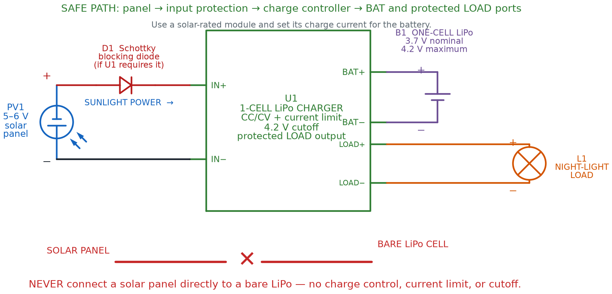

# Signal Generators and Solar Power

## Summary

Students explore the XR2206 signal-generator kit's sine, square, and triangle wave outputs, plus solar cells and safe battery-charging circuits for a solar-powered night-light project.

## Concepts Covered

This chapter covers the following 20 concepts from the learning graph:

1. Buck Converter Efficiency
2. Boost Converter
3. Linear Regulator
4. Switching Regulator
5. Power Efficiency
6. Input Voltage
7. Output Voltage
8. Current Capacity
9. XR2206 Function Generator
10. Sine Wave Output
11. Square Wave Output
12. Triangle Wave Output
13. Frequency Adjustment
14. Amplitude Adjustment
15. Solar Cell
16. Photovoltaic Effect
17. Solar Panel Wiring
18. Charging Circuit
19. Battery Overcharge Protection
20. Power Budget

## Prerequisites

This chapter builds on concepts from:

- [1. Electricity Basics: Voltage, Current, and Resistance](../01-electricity-basics/index.md)
- [2. Current, Charge, Units, and Electrical Safety](../02-current-charge-units-safety/index.md)
- [4. Series, Parallel, and Circuit Topology](../04-series-parallel-topology/index.md)
- [5. Conductors, Batteries, and Circuit Vocabulary Review](../05-conductors-batteries-review/index.md)
- [13. Meet the Transistor](../13-meet-the-transistor/index.md)
- [22. Batteries, Regulators, and Buck Converters](../22-batteries-regulators-buck-converters/index.md)

---

Chapter 22 handed you two specific parts — a 7805 chip and a buck converter module — and showed you exactly how each one turns messy voltage into something a circuit can trust. This chapter zooms out first, then hands you two brand-new superpowers: shaping any waveform you can imagine, and pulling power straight out of sunlight.

!!! mascot-welcome "New Powers: Waveforms and Sunshine"
    { class="mascot-admonition-img" }
    Welcome back, builder! You already know how to clean up messy voltage — now you're about to generate any waveform you need on command, and power a project with nothing but sunlight. Two brand-new real-world kits are waiting. Let's light it up!

## Regulators, Generalized: Linear, Switching, Buck, and Boost

The 7805 and the buck converter you built in Chapter 22 are each one example of a bigger family. Every regulator or converter you'll ever meet belongs to one of exactly two families, no matter what chip is inside.

A **linear regulator** is any voltage regulator — the 7805 is one example — that holds a steady output by continuously burning off extra input voltage as heat. A **switching regulator** is any voltage regulator — a buck converter is one example — that holds a steady output by rapidly switching current on and off and storing energy in an inductor, instead of burning it away. Every fact you learned about the 7805's heat and the buck converter's cool efficiency in Chapter 22 was really a fact about these two whole families.

That efficiency difference has a name and a number attached to it.

#### Power Efficiency

\[ \eta = \frac{P_{out}}{P_{in}} \times 100\% \]

where:

- \( \eta \) (the Greek letter "eta") is the **power efficiency**, expressed as a percentage
- \( P_{out} \) is the power actually delivered to the load, in watts
- \( P_{in} \) is the power drawn from the source, in watts

**Buck converter efficiency** is simply this same power-efficiency ratio measured for a buck converter doing its step-down job — and it's usually an excellent number. Picture a buck converter fed 9 V at 0.32 A (2.88 W in) and delivering 5 V at 0.5 A (2.5 W out):

\[ \eta = \frac{2.5}{2.88} \times 100\% \approx 86.8\% \]

Nearly 87% of the input power reaches the load — only about 13% is lost, mostly as a small amount of heat in the inductor and switching transistor. A 7805 doing that same 9-to-5-volt job might waste closer to half its input power as heat instead.

!!! mascot-thinking "Why Two Families of Regulator?"
    { class="mascot-admonition-img" }
    If switching regulators are so much more efficient, why does anyone still use a linear regulator like the 7805? Simplicity and cost. A 7805 is three pins and two capacitors — nothing to go wrong. A switching regulator needs an inductor, a diode, and careful layout to avoid electrical noise. For a small, low-current project, "simple and a little wasteful" often beats "efficient but fussier."

A buck converter always steps voltage down. Its mirror-image cousin does the opposite job.

A **boost converter** is a switching power supply that steps a lower input voltage up to a higher, steady output voltage — the same store-and-release inductor trick as a buck converter, just timed to push voltage up instead of down. A boost converter is exactly what turns a single 3.7 V LiPo cell (Chapter 22) into the steady 5 V a USB power bank delivers.

#### Boost Converter Output From Duty Cycle

\[ V_{out} \approx \frac{V_{in}}{1 - D} \]

where:

- \( V_{out} \) is the converter's output voltage, in volts
- \( V_{in} \) is the converter's input voltage, in volts
- \( D \) is the duty cycle — the fraction of each switching cycle the internal switch spends "on," a number between 0 and 1

Notice the buck converter's formula from Chapter 22, \( V_{out} \approx D \times V_{in} \), and this boost formula are almost mirror images — one multiplies by the duty cycle, the other divides by what's left over. Same trick, opposite direction.

Every regulator, converter, and kit in this book — including the two you're about to meet — advertises the same three numbers on its spec sheet, and it pays to know them by name.

- **Input voltage** is the range of voltages a device is designed to safely accept at its power input
- **Output voltage** is the voltage a device is designed to deliver at its output, whether fixed (like a 7805's 5 V) or adjustable (like a buck converter's trimmer range)
- **Current capacity** is the maximum current a device can safely deliver (or accept) without overheating or its output voltage sagging

Before trusting any power module on your bench, check all four numbers you now know: input voltage, output voltage, current capacity, and power efficiency.

The table below gathers everything you now know about the two regulator families side by side.

| Property | Linear Regulator | Switching Regulator |
|---|---|---|
| How it holds voltage steady | Burns off extra voltage as heat | Switches rapidly, storing/releasing energy in an inductor |
| Typical power efficiency | Often 40–60% on a large voltage drop | Often 85–95% |
| Direction | Steps down only | Buck steps down; boost steps up |
| Circuit complexity | Very simple — few parts | More parts, but often sold as a ready-made module |
| Good fit for | Small, low-current, cost-sensitive projects | Battery-powered or high-current projects |

!!! mascot-tip "Current Capacity Matters Just as Much as Voltage"
    { class="mascot-admonition-img" }
    A module can output the perfect voltage and still fail your project if its current capacity is too low. A regulator rated for 100 mA will sag, overheat, or shut down if your motor tries to pull 500 mA through it. Always check current capacity against your circuit's actual draw, not just the voltage number.

## Meet the XR2206 Signal Generator Kit

Every waveform you've built so far — a 555 timer's blink (Chapter 14), an RC circuit's charge curve (Chapter 10) — came from a fixed set of resistor and capacitor values soldered or wired in place. Change the wave, and you had to change a part. This chapter's first new kit throws that limitation out entirely.

The **XR2206 function generator** is a small DIY kit, built around the XR2206 chip, that generates sine, square, or triangle waveforms at any frequency from 1 Hz to 1 MHz — a range you dial in with knobs instead of swapping components. Where a 555 timer commits to one shape, the XR2206 lets you change the wave's shape, speed, and height on the fly, which is exactly why real engineers keep a signal generator like this one on their bench for testing any circuit.

This kit's input voltage runs 9–12 V DC through a small barrel-jack power connector — always check a barrel jack's polarity markings before plugging one in, since kits differ on which pin carries positive voltage. The kit's own documentation even admits its waveform "may not be stable" much above 12 V, a nice real-world reminder that every input voltage rating has a ceiling for a reason.

## Three Waveforms, One Chip: Sine, Square, and Triangle

The XR2206 doesn't just make "a wave" — it makes three distinctly different shapes, and each one teaches something different about how voltage can move over time.

**Sine wave output** is a smooth, continuously curving waveform that rises and falls gradually between its minimum and maximum voltage, with no sharp corners anywhere. **Square wave output** is a waveform that jumps instantly between its high and low voltage, spending equal time at each level with no gradual transition at all — the closest thing to a pure digital on/off signal a signal generator can produce. **Triangle wave output** is a waveform that rises and falls at a constant, steady rate, forming sharp points at its peaks instead of the sine wave's smooth curves.

On this kit, a small jumper cap decides which shape comes out of the SIN/TRI terminal: moving it to position J1 selects sine, moving it to J2 selects triangle, and only one of the two can be plugged in at a time. A separate SQU terminal always outputs the square wave, so you can compare it side by side with whichever of the other two you've selected.

Each shape earns its keep in a different kind of project, as the table below shows.

| Waveform | Shape | Typical Amplitude (9 V input) | Common Real-World Use |
|---|---|---|---|
| Sine | Smooth curve, no corners | 0–3 V | Testing audio circuits; simulating AC-style signals |
| Square | Instant jump, high/low only | Up to 8 V (no load) | Mimicking digital on/off signals; testing logic circuits |
| Triangle | Straight-line rise and fall | 0–3 V | Smoothly fading an LED; simulating ramp signals |

## Dialing In Frequency and Amplitude

Two knobs on this kit turn a signal generator from "one fixed wave" into "any wave you need." Both concepts connect back to ideas you've already met.

**Frequency adjustment** is the process of setting how many complete wave cycles a signal generator produces each second, controlled on this kit by a COARSE range dial and a FINE fine-tuning dial working together. Recall the period concept from Chapter 10's RC timing circuits — frequency and period are simply two ways of describing the same repeating motion.

#### Frequency and Period

\[ f = \frac{1}{T} \]

where:

- \( f \) is the frequency, in hertz (cycles per second)
- \( T \) is the period, the time for one complete wave cycle, in seconds

A 1 kHz sine wave completes 1,000 full cycles every second, each cycle lasting exactly 1 millisecond. Turn the COARSE dial to jump between wide frequency ranges, then use FINE to zero in on an exact number within that range.

**Amplitude adjustment** is the process of setting a waveform's peak height above and below its center, controlled on this kit by a single AMP knob that affects the sine and triangle outputs. A small amplitude produces a gentle, low-voltage wave; a large amplitude produces a wave that swings closer to the kit's full rated range.

!!! mascot-encourage "1 Hz to 1 MHz Sounds Like a Lot"
    { class="mascot-admonition-img" }
    A million-to-one frequency range can sound intimidating the first time you read it. In practice, it's just two knobs: COARSE gets you into the right neighborhood, FINE zeroes in from there. You already turned a trimmer to set a buck converter's output voltage in Chapter 22 — this is the exact same "turn a knob, watch the number change" skill applied to time instead of voltage.

Try all three waveforms, and both knobs, in the sim below.

#### Diagram: XR2206 Waveform Generator Explorer

<iframe src="../../sims/xr2206-waveform-generator-explorer/main.html" width="100%" height="542px" scrolling="no"></iframe>

XR2206 Waveform Generator Explorer

Type: microsim
**sim-id:** xr2206-waveform-generator-explorer 
**Library:** p5.js 
**Status:** Specified

Purpose: Let students select among sine, square, and triangle waveforms on a rendered XR2206 kit and adjust frequency and amplitude, watching a live scope trace respond in real time so the abstract wave math connects to knobs they will actually turn on their own kit.

Bloom Taxonomy: Apply (L3). Bloom Verb: demonstrate, examine.

Learning objective: Given a rendered XR2206 signal generator kit with a jumper-selectable waveform, a frequency slider (1 Hz–1 MHz, log scale), and an amplitude slider, select each waveform type and adjust both sliders, observing how the live scope trace's shape, speed, and height change together.

Reuse check: An embeddings search (find-similar-templates, mode=reuse) for "Title: XR2206 Waveform Generator Explorer | Topic: XR2206 function generator, sine wave, square wave, triangle wave, frequency adjustment, amplitude adjustment | Subjects: Electronics, Electric Circuits | Grade Level: Junior High | Learning Objectives: Given a rendered XR2206 signal generator kit, select a waveform type and adjust frequency and amplitude sliders to observe the resulting sine, square, or triangle wave" returned a top match of "Sine Wave" (dmccreary/signal-processing, WHAT score 0.596, recommendation "generate") — below the 0.60 template threshold and a generic math sine-wave demo (amplitude/period/phase on a Cartesian axis), not a selectable-waveform kit tied to real component knobs. A keyword search of the 3,764-entry MicroSim catalog for "waveform generator," "function generator," and "XR2206" found only that same generic sine-wave family, no function-generator-kit sim. New specification. **Library/Implementation fit:** an excellent, central candidate for the breadboard-sim-generator skill — the kit's IC socket, jumper caps (J1/J2), blue screw terminals, and AMP/FINE/COARSE potentiometers are rendered as real, labeled components exactly as a student would see them on their own board, adapting the same "rendered PCB with turnable knobs" approach Chapter 22 used for its buck converter module.

Canvas layout: A rendered XR2206 kit board occupying the left/main area — IC socket, jumper block (J1/J2), SIN/TRI and SQU blue terminals, and AMP/FINE/COARSE potentiometers; a right-side panel holds a waveform selector (Sine/Square/Triangle radio buttons tied to the jumper position), a frequency slider (log scale, 1 Hz–1 MHz), an amplitude slider, and a live oscilloscope-style plot with a numeric readout (frequency in Hz, peak amplitude in V).

Components/elements involved: Rendered XR2206 kit board; jumper cap toggling J1 (sine) vs. J2 (triangle) at the SIN/TRI terminal; SQU terminal always active; AMP potentiometer; COARSE range control; FINE frequency control; oscilloscope-style waveform plot.

Required interactivity:
- Selecting Sine, Square, or Triangle (radio buttons tied to a virtual jumper) redraws the scope with the correct shape and opens an infobox naming which physical jumper (J1, J2, or neither) a student would move on the real kit
- Moving the frequency slider (log scale, 1 Hz–1 MHz) changes the plotted wave's speed live, with the numeric readout updating in real time and the scope's time axis auto-scaling so both very slow and very fast waves stay visible
- Moving the amplitude slider changes the plotted wave's peak height, clamped to each waveform's realistic range (0–3 V for sine/triangle, up to 8 V for square) matching the kit's real spec sheet
- Hovering the AMP, FINE, or COARSE potentiometer opens an infobox naming its real-world function and which control on the physical kit it represents
- Clicking the XR2206 IC opens an infobox with a one-line description of its internal oscillator core — something the student controls, not something they need to build

Default state: Sine selected, frequency at 1 kHz, amplitude at 2 V; scope shows a smooth sine trace; infobox reads "Try switching to Square or Triangle and see how the shape changes."

Instructional Rationale: An Apply-level "demonstrate/examine" objective needs a manipulable parameter (waveform shape, frequency, amplitude) with an immediate, visible consequence on a live scope, letting students discover how each knob changes the wave before ever touching the real kit.

Color scheme: Green PCB matching real kit photos; black IC body; blue terminal blocks matching the kit's labeled blue screw terminals; amber scope trace on a dark scope background for contrast.

Responsive behavior: Kit rendering and control/scope panel stack vertically on narrow screens; sliders and radio buttons remain full-width and legible at any viewport size.

Implementation: p5.js, built using the breadboard-sim-generator skill's component-rendering conventions (labeled PCB parts, real-feel potentiometer knobs) adapted for a sealed kit board rather than a literal tie-point grid, plus a small waveform-plotting function driven by the current shape/frequency/amplitude state.

## Harvesting Sunlight: Solar Cells and the Photovoltaic Effect

A signal generator makes waves out of a power source you already supply. This chapter's second kit does something more remarkable — it makes its own electricity, straight out of sunlight, no battery or wall outlet required to get started.

A **solar cell** is a small, flat device, made from the same family of semiconductor material as the diodes and transistors you met in Chapters 12 and 13, that converts light energy directly into electrical energy. The effect that makes this possible has a name of its own.

The **photovoltaic effect** is the physical process by which photons of light striking a semiconductor material knock electrons loose, pushing them into motion and creating a flow of current — with no moving parts, no fuel, and no chemical reaction to wear out. "Photovoltaic" literally combines "photo" (light) and "voltaic" (electricity), which is exactly what's happening: light in, voltage out.

!!! mascot-thinking "What's Actually Happening Inside a Solar Cell?"
    { class="mascot-admonition-img" }
    A solar cell's semiconductor layers are built so that light-freed electrons can only flow in one direction — very similar to the one-way behavior you learned about diodes in Chapter 12. Sunlight supplies the push; the cell's structure supplies the one-way street. No sunlight, no push, no current — which is exactly why a solar-powered project needs a battery for nighttime, as you'll see shortly.

## Wiring Solar Panels and Building a Charging Circuit

A single solar cell produces only a small voltage — often under a volt. Real projects wire many cells together into a panel, using the exact same series-and-parallel rules you already learned for batteries back in Chapter 22.

**Solar panel wiring** is how individual solar cells inside a panel connect together — in series to add their voltages, or in parallel to add their current capacity — the same pattern battery pack wiring follows.

#### Diagram: Solar Panel LiPo Charging Circuit

<figure markdown="span">
  
  <figcaption>Route panel power through a solar-rated one-cell CC/CV charge controller whose current setting matches the battery. Use D1 when the selected module lacks equivalent reverse-current protection, connect the LiPo only to the BAT terminals, and power the project from the protected LOAD output. Never connect a panel directly to a bare LiPo cell.</figcaption>
</figure>

- Two identical solar cells wired in **series** → their voltages add together, current capacity stays the same as one cell
- Two identical solar cells wired in **parallel** → voltage stays the same as one cell, current capacity adds together
- A typical small hobby solar panel, like the kind used in this course's solar night-light project, outputs roughly 5–6 V in full sun with a modest current capacity well under 1 amp — plenty for slowly charging a single battery, not enough to spin a motor directly

That variable, sunlight-dependent output can't just be wired straight to a battery — a dedicated circuit has to manage it safely.

A **charging circuit** is the combination of parts between a power source and a rechargeable battery that manages how current flows into the battery, protecting it from damage while it charges. This chapter's solar charging circuit adds one new part to the TP4056 module you already met in Chapter 22: a blocking diode, placed between the solar panel and the charge module, that lets current flow only from the panel toward the battery — never backward. Without it, a battery would slowly drain itself through the panel every night, exactly the kind of one-way-street behavior Chapter 12's diodes were built for.

## Protecting the Battery: Overcharge Protection and Power Budgets

A charging circuit's most important job isn't charging the battery quickly — it's knowing exactly when to stop.

**Battery overcharge protection** is a safety feature, built into charge modules like the TP4056, that automatically stops current from flowing into a battery once it reaches full charge, preventing the damage, overheating, or fire risk that continued charging past full can cause.

!!! mascot-warning "Overcharge Protection Isn't Optional"
    { class="mascot-admonition-img" }
    Chapter 22 warned you to never overcharge a LiPo battery past its rated voltage — this is exactly why. A rechargeable battery pushed past full charge can overheat, swell, or in rare cases catch fire. Always charge through a module with built-in overcharge protection, like the TP4056, and never rig a solar panel directly to a bare battery with no charge controller in between.

A solar-powered project also has to answer a question a wall-powered project never has to ask: will there be enough energy to go around?

A **power budget** is a tally comparing how much power (or energy over time) a project needs against how much its power source can actually supply — essential for any solar project, since sunlight isn't available around the clock.

#### Power Budget Arithmetic

\[ P_{budget} = \sum (V_n \times I_n) \]

where:

- \( P_{budget} \) is the total power a project's components draw, in watts
- \( V_n \) is the voltage across each component
- \( I_n \) is the current each component draws, in amps

A single LED night light drawing about 20 mA at roughly 2 V across the LED itself uses only about 0.04 W — a tiny load. Comparing that draw against the panel's supply means thinking in energy over time, not just an instant power number.

#### Energy From Power and Time

\[ E = P \times t \]

where:

- \( E \) is energy, in watt-hours
- \( P \) is power, in watts
- \( t \) is time, in hours

A small panel producing about 0.3 W in full sun for 6 daylight hours stores roughly 1.8 watt-hours of energy in the battery. A 0.04 W LED running for 10 nighttime hours only needs about 0.4 watt-hours — a comfortable power budget with room to spare, exactly the kind of margin a well-designed solar project should have.

!!! mascot-tip "Measure Your Panel's Real Output"
    { class="mascot-admonition-img" }
    A solar panel's spec sheet describes ideal, full-sun conditions — a cloudy day or an indoor window can cut its real output dramatically. Before trusting a power budget on a real build, put your multimeter (Chapter 20) on the panel's leads outdoors and see what it actually reads. Ten seconds with a meter turns a guess into a real number.

Watch sunlight, charging current, and overcharge protection all work together in the sim below.

#### Diagram: Solar Panel Charging Circuit Explorer

<iframe src="../../sims/solar-charging-circuit-explorer/main.html" width="100%" height="542px" scrolling="no"></iframe>

Solar Panel Charging Circuit Explorer

Type: microsim
**sim-id:** solar-charging-circuit-explorer 
**Library:** p5.js 
**Status:** Specified

Purpose: Let students adjust a simulated sunlight-intensity level on a rendered solar charging circuit and observe panel voltage/current, battery charge level rising over time, automatic overcharge cutoff at full charge, and the battery taking over to power an LED once sunlight drops to zero.

Bloom Taxonomy: Apply (L3) / Analyze (L4). Bloom Verb: demonstrate, examine, distinguish.

Learning objective: Given a rendered solar panel wired through a blocking diode and a TP4056-style charge module to a LiPo battery and LED load, adjust a sunlight-intensity slider and observe panel voltage/current, charging current into the battery, the automatic overcharge cutoff once full, and the LED switching to battery power at night.

Reuse check: An embeddings search (find-similar-templates, mode=reuse) for "Title: Solar Panel Charging Circuit Explorer | Topic: solar cell, photovoltaic effect, solar panel wiring, charging circuit, battery overcharge protection, power budget | Subjects: Electronics, Electric Circuits | Grade Level: Junior High | Learning Objectives: Given a rendered solar panel wired to a charging circuit and rechargeable battery, adjust simulated sunlight intensity and observe voltage, current, and charging behavior including overcharge protection" returned "Solar Cell" (dmccreary/microsims, WHAT score 0.6437, recommendation "template") and "Solar Battery" (dmccreary/microsims, WHAT score 0.6118, recommendation "template") — both above the 0.60 threshold on general topic, but neither models this chapter's specific wiring (blocking diode, TP4056-style overcharge cutoff) or its junior-high reading level; reviewed as reference inspiration for the sunlight-to-output-current relationship, not directly reused. A keyword search of the catalog for "solar panel," "photovoltaic," and "charging circuit" found the same two entries and no closer match. New specification informed by that precedent. **Library/Implementation fit:** a strong second candidate for breadboard-sim-generator — the panel, blocking diode, charge module, and battery all sit in real tie-point holes exactly as a student would wire them, continuing the tie-point rendering approach Chapter 22 used for its 7805 sim.

Canvas layout: A rendered breadboard with a solar panel symbol wired through a blocking diode into a TP4056-style charge module, then to a LiPo battery symbol and an LED night-light load; a right-side panel holds a sunlight-intensity slider (0–100%, labeled "Night" to "Full Sun"), a "Fast-forward to Night" button, and readouts for panel voltage, charging current, and battery charge percentage.

Components/elements involved: Rendered breadboard with rails; solar panel (small blue-paneled rectangle with a sun icon); blocking diode; TP4056-style charge module; LiPo battery with a charge-level bar; LED load with resistor; sunlight-intensity slider; a virtual meter reading panel voltage and charging current.

Required interactivity:
- Moving the sunlight-intensity slider changes simulated panel voltage/current live (0% → 0 V/0 A, 100% → the panel's full rated output), driving a charging-current readout into the battery
- The battery's charge-percentage bar fills over simulated time while charging current flows, and holds steady rather than overfilling once it reaches 100% — visibly demonstrating overcharge protection cutting the charge current automatically
- Hovering the blocking diode opens an infobox explaining it prevents the battery from draining backward through the panel at night, connecting to Chapter 12's diode polarity concept
- Clicking the charge module opens an infobox describing its overcharge-protection role, explicitly naming the TP4056 module from Chapter 22
- Clicking "Fast-forward to Night" drops sunlight to 0% and shows the LED switching on, now powered from the battery instead of the panel

Default state: Sunlight slider at 70% ("Partly Sunny"), battery at 45% charge and rising, LED off (daytime); infobox reads "Slide toward Night and watch the LED turn on, powered by the battery instead of the panel."

Instructional Rationale: An Apply/Analyze-level objective needs a manipulable environmental parameter (sunlight) whose consequences — voltage, charging current, battery percentage, overcharge cutoff, and the nighttime handoff to battery power — are all visible together, letting students trace energy from sunlight to stored charge to nighttime light in one interactive view.

Color scheme: Blue solar panel with a yellow sun icon; red/black diode body; green charge-module PCB echoing the TP4056's real color from Chapter 22; LiPo battery rendered as a silver pouch with a green-to-red charge bar; warm yellow LED glow at night.

Responsive behavior: Breadboard rendering and control/readout panel stack vertically on narrow screens; slider and readouts remain full-width and legible at any viewport size.

Implementation: p5.js, built on the breadboard-sim-generator rendering approach (real tie-point hole grid, `bbVoltage()`-style solver) extended with a simple time-based charge accumulator for the battery percentage and a clamped overcharge cutoff.

## Chapter Summary: Key Takeaways

You started this chapter with two specific parts from Chapter 22. You're ending it with two entire families of power electronics, plus two brand-new real-world kits of your own.

- A **linear regulator** and a **switching regulator** are the two families every voltage regulator belongs to; a **boost converter** is a switching regulator's step-up counterpart to the buck converter you already built, and **buck converter efficiency** shows just how little power a switching design wastes compared to a linear one, measured by **power efficiency**
- Every power module's spec sheet boils down to three numbers worth checking every time: **input voltage**, **output voltage**, and **current capacity**
- The **XR2206 function generator** dials up **sine wave output**, **square wave output**, or **triangle wave output** on command, shaped by **frequency adjustment** and **amplitude adjustment** instead of swapped-out parts
- A **solar cell** turns sunlight into electricity through the **photovoltaic effect**, and real panels scale that up with **solar panel wiring** in series and parallel — the same pattern you learned for batteries
- A **charging circuit**, including a blocking diode and **battery overcharge protection**, keeps a rechargeable battery safe while it charges — and a **power budget** makes sure a project's energy needs actually fit what sunlight can supply

Every circuit in this chapter has been analog — voltages that slide smoothly up and down, whether it's a sine wave's curve or a solar panel's sunlight-driven output. Chapter 24 flips that idea on its head, formalizing the world of digital signals that are only ever fully on or fully off, and building true Boolean logic gates from the very transistors you first met back in Chapter 13.

!!! mascot-celebration "Waveforms and Sunshine: Unlocked"
    { class="mascot-admonition-img" }
    Incredible work, builder! You can now generate any waveform you need, explain why a switching regulator runs cooler than a linear one, and power a project with nothing but sunlight and a well-built charging circuit. That's a genuine engineer's superpower. Current's flowing your way — see you in Chapter 24!
