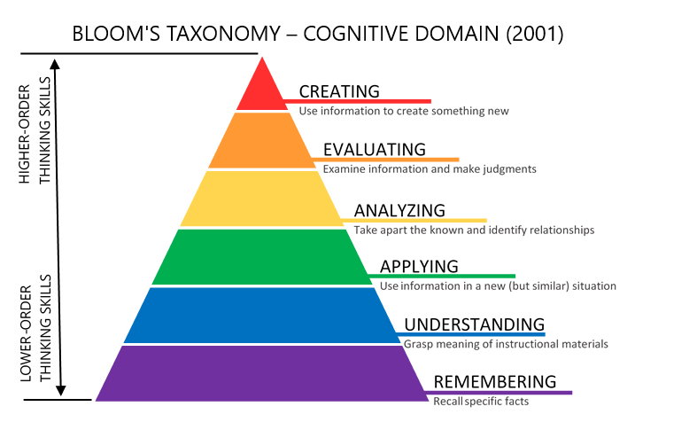

# Beginning Electronics Corse Description

This course is designed to teach beginning electronics
concepts to students that may not have a strong math
background.  It focuses on using low-cost parts
combined with interactive simulations (MicroSims)
to help build an intuitive sense of how electronics
works for students.

To get started our baseline lessons assume that students have access to some basic
low-cost electronics components such as a solderless
breadboard, 5v USB power supply and simple components
such as wires, LEDs, resistors, buttons, potentiometers, photosensors, 
motors, transistors, 74565 shift registers and 555 timers.  
It is amazing how many fun projects we can create from these simple components.

This course touches on some of the basic ideas around digital
electronics, but it does not cover digital logic more complicated than an simple
memory cell, flip flop and shift register (74595).  
See our [Digital Electronics](https://dmccreary.github.io/digital-electronics/) course for these topics.

After we cover how to use the breadboard to build some simple
circuits, we then discuss some simple low-cost kits
that can be purchased on eBay to demonstrate ideas such
as photocells, night lights, voltage meters, voltage regulators, buck converters,
signal generators.  These kits generally cost about $10 and
are great ways to apply the concepts we have learned in the basic
section.

We also include an optional final projects section that discusses
how to package your project including how to solder components
onto a perf board.

We also do not cover microcontrollers in this course.  For that topic
we strongly suggest you guide your students to our course 
on [Microcontrollers](https://dmccreary.github.io/learning-micropython/).  These courses are designed to work together.

## Bloom Taxonomy

We use the 2001 Bloom Taxonomy to distribute our course content from foundational materials through application and creation stages.

!!! prompt
    For the course-description.md file in this project, rewrite it in terms of a formal course description using the 2001 Bloom Taxonomy.  Start with foundational terms and definitions and move toward concepts that require students to create their own projects.

### Beginning Electronics Course Description

### Course Overview
This introductory electronics course is designed for students with limited mathematical background, emphasizing hands-on learning through low-cost components and interactive simulations (MicroSims). The course structure follows a progressive learning path that builds from fundamental concepts to practical applications.

### Learning Outcomes

By the end of this course, students will be able to:

#### Remember and Understand

- Define basic electronic components including resistors, LEDs, buttons, potentiometers, photosensors, motors, transistors, shift registers, and timers
- Explain the function of a solderless breadboard and its role in prototyping
- Describe the basic principles of voltage, current, and power in DC circuits
- Identify the proper use of common testing and measurement tools

#### Apply

- Demonstrate proper breadboard wiring techniques
- Implement basic circuit designs using provided components
- Use USB power supplies safely with various electronic components
- Configure basic timing circuits using 555 timers
- Set up shift registers (74565) for basic sequential operations

#### Analyze

- Troubleshoot common circuit problems
- Compare different types of sensors and their applications
- Examine the behavior of various electronic components under different conditions
- Investigate the relationship between input and output in basic circuits

#### Evaluate

- Test circuit performance using appropriate measurement techniques
- Assess the suitability of different components for specific applications
- Determine the most cost-effective solutions for given project requirements
- Judge the efficiency of different circuit designs

#### Create

- Design original circuits using combinations of basic components
- Develop working prototypes using breadboard construction techniques and perf boards
- Construct functional projects such as night lights, voltage meters, and signal generators
- Build custom sensing and control circuits using various input/output components

### Required Materials

- Solderless breadboard
- 5V USB power supply
- Basic electronic components:
  - Jumper wires
  - LEDs
  - Resistors
  - Push buttons
  - Potentiometers
  - Photosensors
  - DC motors
  - Transistors
  - 74565 shift registers
  - 555 timer ICs
- Optional Project Supplies
  - Perf board
  - Solar cells
  - Batteries
  - Voltage monitor
  - TP4056 LiPo battery charger

## Course Scope and Limitations

This course focuses on fundamental analog and basic digital electronics. It does not cover:

- Advanced digital logic beyond simple memory cells or flip-flops
- Microcontroller programming and applications
- Complex mathematical analysis of circuits

## Related Courses

Students interested in advancing their knowledge should consider:

- [Digital Electronics Course]() - For advanced digital logic concepts
- [Microcontroller Course] - For programming and embedded systems applications

## Teaching Methodology

The course employs a hands-on, practical approach utilizing:

- Interactive simulations (MicroSims)
- Low-cost experimental kits
- Guided project construction
- Progressive skill-building exercises

This approach ensures students develop both theoretical understanding and practical skills in electronics, preparing them for more advanced study or practical applications in their projects.