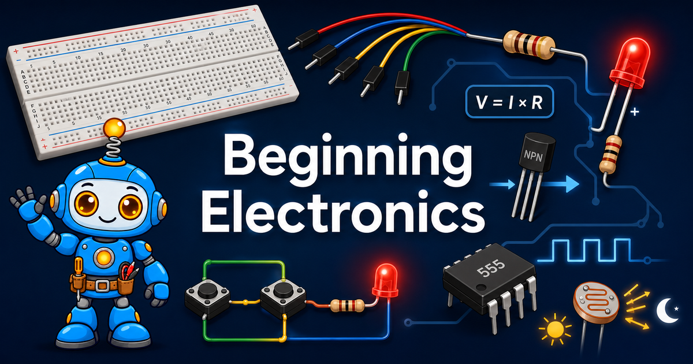

# Beginning Electronics

Welcome to **Beginning Electronics** — a free, hands-on textbook where you
learn electronics the best way there is: by building real circuits with your
own two hands. No soldering iron. No computer programming. No expensive lab
equipment. Just a solderless breadboard, about **$50 worth of parts**, and
the growing suspicion that you can make just about anything light up, spin,
beep, or sense the dark.

!!! mascot-welcome "Hi, I'm Volt!"
    { class="mascot-admonition-img" }
    I'll be tagging along on every chapter to point out the tricky bits and
    cheer you on when a circuit finally clicks. Understanding electronics is a
    genuine superpower — and you're about to unlock it. Let's light it up!

## What You'll Build

By the end of this book, you'll have built circuits that:

- **Light an LED** without letting out the magic smoke
- **Turn two push buttons into logic gates** — AND and OR, built from nothing
  but wires
- **Dim a light by hand** with a potentiometer
- **Sense darkness** and switch on a night light all by itself
- **Spin a motor** with a transistor doing the heavy lifting
- **Blink and beep on a schedule** you design with a 555 timer chip
- **Command eight LEDs at once** from just a few wires with a shift register
- **Power real gadgets** with voltage regulators, buck converters, and a
  signal generator
- **Finish with a capstone project** of your own invention

## What's Inside

| | |
|---|---|
| **26 chapters** | Sequenced so every new idea rests on one you already know |
| **500 concepts** | Mapped in an interactive [learning graph](learning-graph/index.md) |
| **70+ MicroSims** | Browser-based [simulations](sims/index.md) you can experiment with right now |
| **16 hands-on labs** | Step-by-step [builds](labs/index.md) for your breadboard |
| **8 project kits** | [Real-world kits](kits/index.md) — regulators, converters, busy boards, and more |

!!! mascot-tip "No parts yet? No problem."
    { class="mascot-admonition-img" }
    Every MicroSim runs right in your browser, so you can wire up a circuit,
    break it, and fix it without owning a single resistor. When your kit
    shows up, you'll already know what you're doing.

## Who This Book Is For

This book is written for **students in 5th through 12th grade** (ages 10-18)
in classrooms, afterschool programs, and maker clubs — and it's written
plainly enough that hobbyists, parents, mentors, and adult learners can pick
it up and work straight through.

**No prior experience required.** No electronics background, no programming,
and no strong math. If you can add and multiply small numbers, you have
everything you need for the Ohm's Law activities.

## What You Need to Get Started

1. **A solderless breadboard** — no soldering anywhere in this course
2. **A safe low-voltage power source** — a 5V USB supply or a battery pack
3. **A ~$50 kit of parts** — resistors, LEDs, buttons, a potentiometer, a
   photoresistor, transistors, capacitors, a small motor, a 555 timer, and a
   74HC595 shift register

Our [Getting Started](setup/index.md) section walks you through exactly what
to buy, where to buy it, and how to power it safely. Every circuit in this
book runs on low-voltage DC — never wall power.

## Custom Lesson Plans with AI

This is an *intelligent* textbook, which means it can adapt to you. Use
generative AI tools to build a lesson plan customized to your situation. A
good prompt includes:

1. Your age or grade in school
2. What you want to learn
3. Any lessons you've already finished
4. What parts you have on hand
5. How much time you have available

You'll get back a lesson plan and a circuit diagram built for exactly what
you asked for. See [Generating Lessons](setup/generating-lessons.md) for
prompts you can copy and adapt.

## How to Use This Book

Use the navigation menu on the left to explore:

- **[Getting Started](setup/index.md)** — what to buy and how to power it safely
- **[Chapters](chapters/index.md)** — the main path, in order, from voltage to capstone
- **[Hands-on Labs](labs/index.md)** — build-it-yourself circuits for your breadboard
- **[MicroSims](sims/index.md)** — interactive simulations to experiment with
- **[Kits and Projects](kits/index.md)** — real-world kits and project ideas
- **[Learning Graph](learning-graph/index.md)** — see how all 500 concepts connect

There's also a search box in the upper right corner when you're hunting for
something specific.

## Start Here

New to electronics? Begin with
[Chapter 1: Electricity Basics](chapters/01-electricity-basics/index.md) and
work forward — each chapter builds on the one before it.

Already have your kit on the table and can't wait? Jump to
[Chapter 6: Meet Your Breadboard](chapters/06-meet-your-breadboard/index.md),
where the reading stops and the building starts.

!!! mascot-celebration "One more thing before you go"
    { class="mascot-admonition-img" }
    That first LED you light up is a moment you'll remember. Everything after
    it is just adding more parts to the same idea. Nice wiring, builder!

## What Comes Next

This book is the companion volume to
[Learning MicroPython and Physical Computing](https://dmccreary.github.io/learning-micropython/).
This course builds deep, tactile intuition for how electricity and components
actually behave; that one picks up right where this leaves off, adding
microcontrollers and code to bring your circuits to life with software.
Finish both, and you'll have a rare combination: real hardware fluency *and*
real programming fluency.

## About This Book

Beginning Electronics is a free, open intelligent textbook licensed under
[CC BY-NC-SA 4.0](license.md) for non-commercial use — teachers and students
are welcome to copy, remix, and adapt it. The MicroSims were built with the
help of generative AI tools; see the [MicroSims](https://dmccreary.github.io/microsims/)
site for more examples.

Questions, corrections, or a project you want to show off?
[Get in touch](contact.md).

Have fun!

**Dan McCreary** — Lead Content Author
