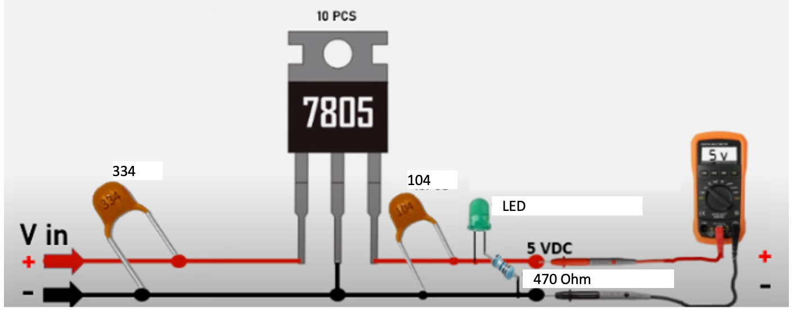

# 5v Regulator

1.  **7805 Voltage Regulator**: This is the three-terminal device labeled "7805" in the image. It is used to maintain a constant 5V output from a higher input voltage.

2.  **Input Capacitor (334)**: This is likely a capacitor with a capacitance value given by the code "334". The first two digits are the significant figure digits, and the third is a multiplier. So "334" translates to 33 with 4 additional zeros, which is 330,000 picofarads or 330 nanofarads (nF) or 0.33 microfarads (µF). This capacitor is placed at the input of the voltage regulator to filter out noise from the input power.

3.  **Output Capacitor (104)**: Another capacitor with a code "104", which translates to 10 with 4 additional zeros, meaning 100,000 picofarads or 100 nanofarads (nF) or 0.1 microfarads (µF). It is used at the output of the voltage regulator to help stabilize the output voltage and reduce noise.

4.  **LED (Light Emitting Diode)**: This is the component labeled "LED". It emits light when current passes through it. It is being used here as an indicator, presumably to show that the circuit is powered.

5.  **Current Limiting Resistor (470 Ohm)**: This is a resistor with a resistance of 470 ohms, connected in series with the LED to limit the current passing through the LED, protecting it from excess current that could damage it.

6.  **Digital Multimeter**: The device labeled "5V" is a digital multimeter set to measure DC voltage. It's showing that the output of the circuit is 5 volts, which is the output voltage of the 7805 regulator.

7.  **The Power Supply (Vin)**: This is where the input voltage is applied to the circuit. The positive is indicated by the "+" sign and the negative/ground by the "-" sign. The exact value of the input voltage is not specified, but

it must be higher than the output voltage (5V) and within the input range that the 7805 voltage regulator can handle, typically around 7 to 25 volts.

The combination of these components forms a basic voltage regulation circuit that provides a stable 5V DC output for low-power devices or electronic components, with the LED serving as an indicator that the circuit is functioning correctly.