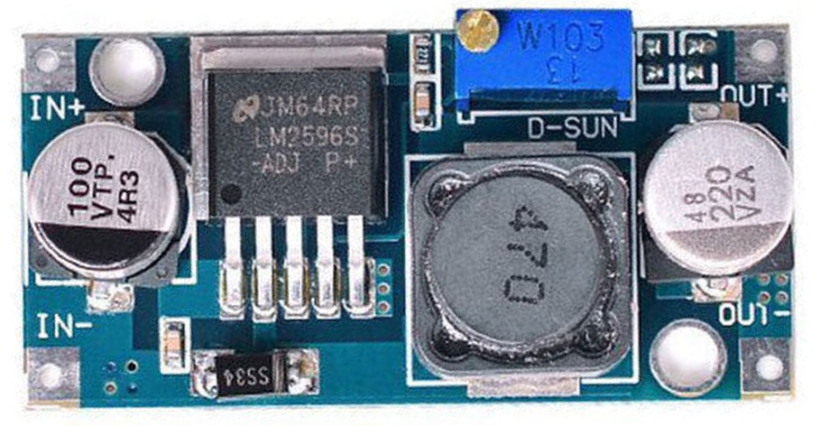
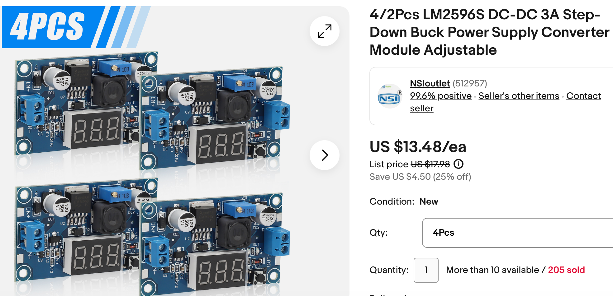

# Low Cost Buck Converter Kit

Creating a low-cost buck converter can be achieved with a basic set of components and a straightforward design. Here's a simple approach:

### Components Needed

1.  **Inductor:** Choose an inductor with a suitable current rating and inductance value for your desired output current and voltage.
2.  **Switch (Transistor):** A MOSFET or a similar transistor can be used as the switch.
3.  **Diode:** A Schottky diode is often preferred due to its low forward voltage drop.
4.  **Capacitor:** For smoothing the output voltage. The value depends on your load and desired ripple.
5.  **Resistors:** For setting up the feedback network if you're using a regulator IC.

### Steps to Build a Basic Buck Converter

1.  **Circuit Design:** Start with a basic buck converter schematic. You can find many simple designs online.
2.  **Choose the Right Components:** Ensure the inductor, capacitor, and transistor can handle the input voltage and desired output current.
3.  **Assembly:** Solder the components onto a breadboard or a PCB. Pay attention to the polarity of the components like the diode and capacitor.
4.  **Testing:** Before connecting to the actual load, test the output voltage with a multimeter. Adjust the duty cycle of the switch (transistor) to get the desired output voltage.

### Additional Tips

-   **Use a Regulator IC:** For better stability and ease of use, consider using a buck regulator IC. These ICs often require fewer external components and include built-in protection features.
-   **Heat Management:** Ensure your transistor and inductor can dissipate heat efficiently, especially in higher current applications.
-   **PCB Layout:** If designing a PCB, pay attention to the layout for minimizing noise and interference.

### Safety Precautions

-   Always start with a lower input voltage during initial testing.
-   Be cautious about the polarity and ratings of the components to prevent damage.

This is a very basic guideline. If you're new to electronics, it might be helpful to follow a detailed tutorial or a kit first. Remember, the complexity can vary based on the specifications of your desired output voltage and current.

## Finding an Regulator IC

Please suggest an IC that can be used as a regulator for a buck converter.

ChatGPT

ChatGPT

A commonly used and widely available integrated circuit (IC) for a buck converter is the LM2596. This IC is popular for its ease of use, efficiency, and versatility. Here are some key features of the LM2596:

### LM2596 Features

1.  **Adjustable Output Voltage:** It typically offers an output voltage range that can be adjusted from 1.23 V to 37 V.
2.  **High Efficiency:** It provides up to 92% efficiency, which is quite good for many applications.
3.  **Current Capability:** It can handle up to 3A of output current, making it suitable for a variety of medium-power applications.
4.  **Thermal Overload Protection:** The IC includes thermal shutdown and current limit protection, enhancing its safety and reliability.
5.  **Input Voltage Range:** It can handle an input voltage range typically from 4.5 V to 40 V.
6.  **Frequency:** The switching frequency is around 150 kHz, which strikes a balance between efficiency and the size of external components.

### Applications

-   The LM2596 is ideal for DIY projects, battery chargers, powering LEDs, and in any application where you need to step down a higher voltage to a lower voltage efficiently.

### Design Considerations

-   When designing a circuit with the LM2596, you need to consider the choice of inductor and capacitors for optimal performance and stability. The datasheet usually provides guidance on how to select these components.
-   Also, consider the thermal aspects of your design, especially if you are drawing close to the maximum current rating.

### Alternatives

-   If the LM2596 does not meet your specific requirements, there are other options like the LM2576, MP1584EN, or the more advanced and feature-rich chips from manufacturers like Texas Instruments, Analog Devices, and ON Semiconductor.

Always refer to the datasheet of the IC for detailed information and application notes. This will help you understand the limitations and capabilities of the IC for your specific application.

[LM2596 Data Sheet](https://www.ti.com/lit/ds/symlink/lm2596.pdf)

The image above is a buck board with an LM2596 IC on it. Please identify all the components in the image and what they are used for.

The image you've provided appears to be of a commercially produced buck converter module that uses the LM2596 regulator IC. Here's a list of the visible components and their typical uses:

1.  **LM2596 IC:** The large black component with five legs on one side is the LM2596 voltage regulator IC. It's the main component that controls the conversion process.

2.  **Input Capacitor:** The large cylindrical component labeled "100 VTP 470" on the left is an electrolytic capacitor, likely used to filter the input voltage to the buck converter. The "100" may indicate the voltage rating, and "470" likely indicates the capacitance in microfarads (μF).

3.  **Output Capacitor:** Similar to the input capacitor, the other large cylindrical component on the right near the out is also an electrolytic capacitor used to filter the output voltage of the buck converter.

4.  **Inductor:** The large, square, metallic component with the "470" on it is the inductor. This is a crucial component in a buck converter that stores and releases energy to smooth out the current flow and stabilize the output voltage.

5.  **Diode:** The small black component below the regulator labeled SS34 is likely a Schottky diode, which provides a path for current when the switching transistor inside the LM2596 is off, preventing reverse current that could damage the IC or reduce efficiency.

6.  **Potentiometer:** The blue component labeled "W103" with a screw on top is a potentiometer, which is used to set the output voltage. By turning the screw, the resistance changes, which adjusts the output voltage.

7.  **Feedback Resistors:** While not clearly labeled, there are typically a couple of small resistors that form a voltage divider network for the feedback loop. This helps the LM2596 regulate the output voltage.

8.  **Rectification Diode (Not visible):** Usually, there's a diode involved in the buck conversion process, but it might not be visible in this image. It would typically be used for rectification, ensuring current flows in the proper direction.

9.  **Heat Sink:** The large metal area around the LM2596 IC is a heat sink to dissipate heat generated by the IC during operation.

10.  **SMD Components:** There are several small, surface-mounted devices (SMDs) that could be additional capacitors, resistors, or diodes to support the circuit's stability and performance.

11.  **Input/Output Terminals:** The "IN+" and "OUT+" labels indicate the input and output terminals for the voltage supply and the voltage out to the load, respectively.

12.  **LED Indicator (Not visible):** Some modules also include an LED indicator to signal when the device is powered, though it's not visible in this image.

13.  **Printed Circuit Board (PCB):** All these components are mounted on a PCB, which provides the electrical connections between them according to the buck converter circuit design.

This module is designed to make it easy for users to incorporate a buck converter into their projects without having to design and build the circuit from scratch. Users can easily adjust the output voltage to their desired level by turning the potentiometer, and connect their input and output through the provided terminals.

## Price

4 for $13 free shipping

