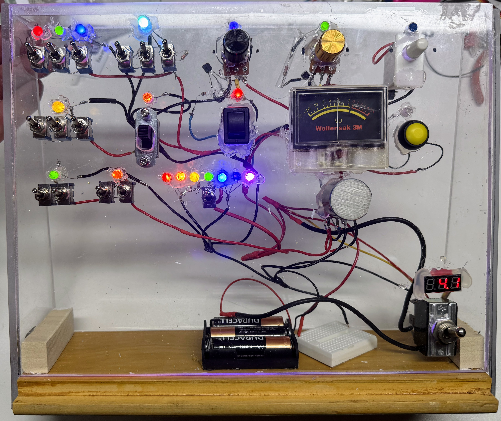

# Interactive Electronic Busy Board



## Educational Purpose and Benefits

A busy board is an interactive learning tool that combines various electronic components and mechanical elements to create an engaging, hands-on experience for young children. These boards develop fine motor skills, cause-and-effect understanding, and basic electronics concepts through play-based learning.

## Core Components and Learning Objectives

### Basic Interactive Elements

#### Buttons and Switches

- Toggle switches, momentary buttons, and arcade-style pushbuttons
- Teaches: Cause-and-effect relationships, motor control, basic circuit concepts
- Implementation: Connect to LEDs or buzzers for immediate feedback

#### Knobs and Potentiometers

- Rotary encoders and variable resistors
- Teaches: Fine motor control, gradual change concepts, basic analog principles
- Implementation: Control LED brightness or motor speed

###  Light-Based Components

#### LEDs and LED Noodles

- Various colored LEDs and flexible LED strips
- Teaches: Light properties, color recognition, sequential patterns
- Implementation: Create interactive light patterns triggered by other components

#### Photosensors

- Light-dependent resistors (LDRs) and photodiodes
- Teaches: Light detection, environmental awareness, sensor basics
- Implementation: Trigger responses based on ambient light or shadows

### Advanced Interactive Elements

#### Transistors

- Used to generate smooth dimming circuits for LEDs
- Basic NPN/PNP transistors for switching
- Teaches: Signal amplification, electronic switching, current control
- Implementation: Control higher-power components safely

## Safety Considerations
1. Low voltage operation (3-5V maximum)
2. Component enclosure to prevent direct contact
3. Rounded corners and edges
4. Secure mounting of all components
5. Regular maintenance checks

## Implementation Guidelines

### Circuit Design
```
Power Source (3V) --> Switch --> Current Limiting Resistor --> LED --> Ground
                  --> Potentiometer --> Transistor --> Motor
                  --> Photosensor --> Comparator --> Buzzer
```

### Physical Layout
- Group similar components together
- Maintain adequate spacing between interactive elements
- Include clear visual indicators for cause-effect relationships
- Use color coding for different functional groups

## Educational Activities

### Basic Explorations
1. Light and Shadow Play
   - Use photosensors to detect hand movements
   - Create interactive light patterns with LED sequences

2. Control and Response
   - Adjust LED brightness with potentiometers
   - Trigger sound or light effects with buttons

### Advanced Learning
1. Simple Programming Concepts
   - Pattern recognition through LED sequences
   - Basic logic through multiple button combinations

2. Scientific Principles
   - Light detection and measurement
   - Electronic amplification and switching

## Assessment Metrics
- Fine motor skill development
- Pattern recognition ability
- Cause-effect understanding
- Basic circuit comprehension
- Problem-solving skills

## Maintenance and Updates
- Regular component testing
- Battery replacement schedule
- Circuit verification
- Safety check procedures
- Component replacement guidelines

This guide serves as a foundation for creating educational busy boards. Adapt the complexity and components based on age group and learning objectives.