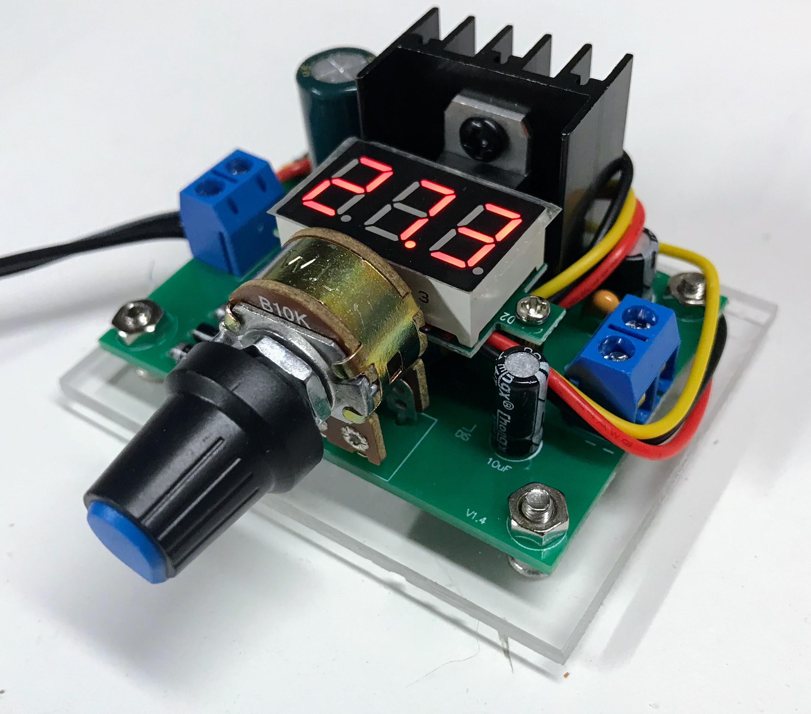

# Kits

## Power

### Variable Power Supply

This is a very popular kit to get started.  It does
require you to have basic soldering skills.

[Variable](./variable-power-supply/index.md)

### 5-Volt

[5-Volt](./5v-regulator/index.md)

### Buck Converters

[Buck](./buck-converter/index.md)