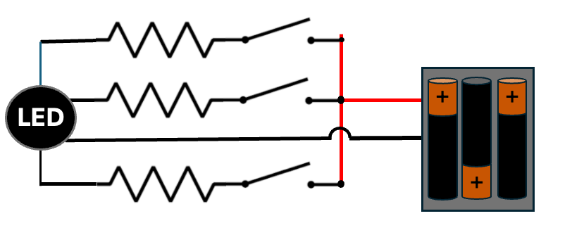

# RGB LED Project

<!--
<iframe width="315" height="560"
src="https://youtube.com/shorts/0hl1X1YPWHI?si=qZjIVpCRAFAhLL66"
title="YouTube video player"
frameborder="0"
allow="accelerometer; autoplay; clipboard-write; encrypted-media; gyroscope; picture-in-picture; web-share"
allowfullscreen></iframe>
-->
[YouTube Video](https://youtube.com/shorts/0hl1X1YPWHI?si=qZjIVpCRAFAhLL66)

## Supplies

* 2 AA batteries
* battery holder
* 3 330 ohm resistors (or similar)
* An RGB LED (I use a common cathode)
* hookup wire

## Tools

* A solderless breadboard or a soldering iron

## Circuit

