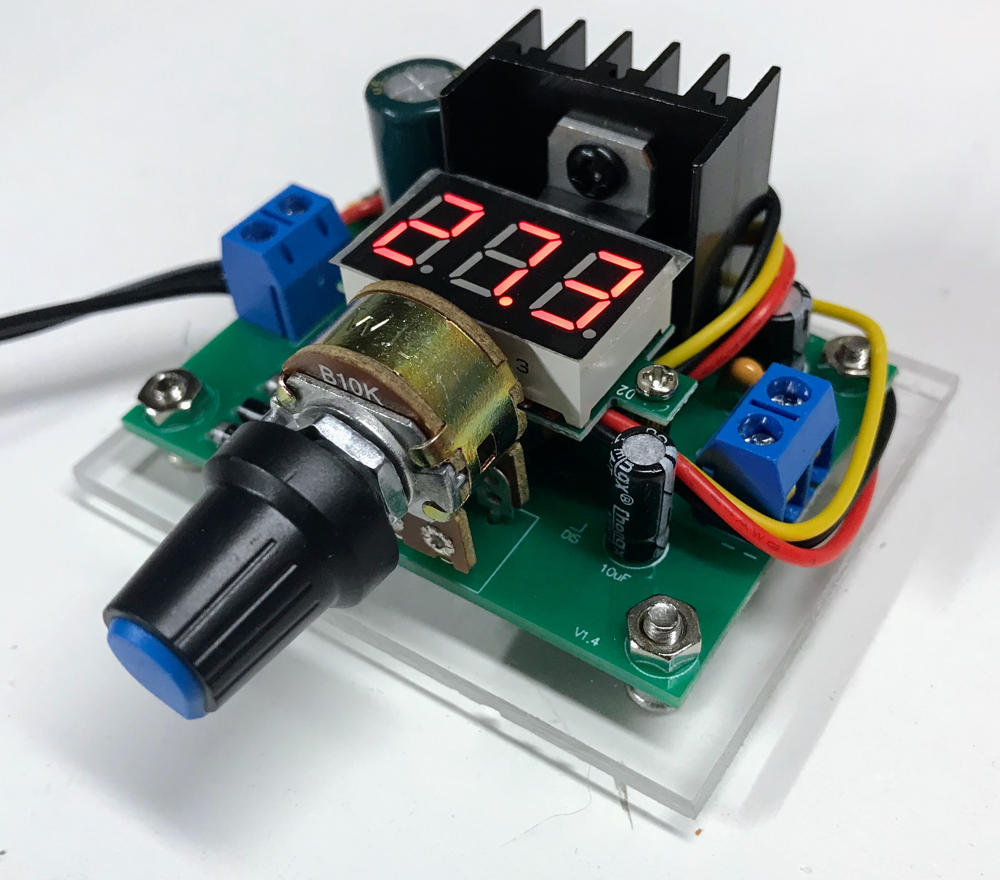

# Variable Power Supply

{ width="400" }
<br/>[$7 LM317 Adjustable DC Voltage Regulator DIY Kit](https://www.ebay.com/itm/355199915646)

{ width="400" }
<br/>[$17 LM317 Adjustable DC Voltage Regulator DIY Kit With Transformer and Enclosure](https://www.ebay.com/itm/275242338730)

We can build a variable DC Power Supply for under $10 from a kit using the popular [LM317](https://en.wikipedia.org/wiki/LM317) adjustable positive linear voltage regulator.  The LM317 is a simple 3-terminal adjustable regulator circuit
that is low-cost and flexible.  It only needs a few capacitors and a resistor
to work.  The kit we used can use any old transformer (both AC and DC) you have lying around the house.
In this example, I used a very old 20-volt AC transformer from an old appliance that
was no longer working.

We can see from the [LM317 data sheet](https://www.ti.com/lit/ds/symlink/lm317.pdf) that with a single potentiometer, we can change any DC voltage
into any other lower DC voltage.

There are many LM317 kits on eBay:

[eBay Search for LM317 Adjustable Voltage Regulator Kit](https://www.ebay.com/sch/i.html?_nkw=LM317+Adjustable+Voltage+Regulator+Kit)

Here is a [Sample Regulated Power Supply from XYZ Electronics](https://www.ebay.com/itm/355199915646) that sells for under $4 with $3 shipping.  For a classroom, you can order many of these for teaching basic soldering skills.

Many kits have a power cord and a potentiometer you can adjust to get
any output voltage from 1.25V to 30V DC.

The LM317 has overheating and current short-circuit protection.


Many of these kits also have a 3-digit LED display of output voltage.  The connections on the
LED displays are as follows:

1. Black is ground (GND)
2. Red is power (VCC) which powers the display
2. Yellow is the point you would like to monitor

## Assembly Suggestions

The kit listing on eBay is very minimal.  So here is some additional information.

Here are some [photos of this assembly process](https://photos.app.goo.gl/6AGQD1yKx1BAAuVP9).

Here are a few notes on assembly.

1. Be careful to note the polarity on both the diodes and capacitors.
2. The smallest parts are the screws on the LED offset.  If you put them in first, they are a little bit easier to manage.  You may need needle-nose pliers to position them.
3. Note that the band on the capacitors is usually the negative side.  Some of them indicate this with a small negative side in the band.
4. Note the capacitance rating on the printed circuit boards.  Make sure to match them up correctly.  The larger capacitor is easy, but the two smaller ones have the same diameter, but different heights.
5. You can trim some of the extra wire off the LED display.  In the photos, I kept the original wire length but then I had to wrap the wires around the back of the kit.
6. The board has places for an LED power indicator and the resistor, but since the LED display is used, they are not included.
7. The kit does not include [Thermal Heatsink Paste](https://www.ebay.com/sch/i.html?_from=R40&_nkw=thermal+paste+heatsink&_sacat=0&rt=nc&_odkw=heat+sink+thermal+paste+for+electronics&_osacat=0&LH_BIN=1).  You can purchase this on eBay for a few dollars.  You can spread this on the back of the LM317 before you screw it into the heatsink.  This step is optional since the screw will provide a strong heat coupling.

## Creating an Enclosure or Stand


The kit does not come with an enclosure.  I had some old pieces of plexiglass in my shop so I just screwed it to a square with some 10mm long M3 screws.  However, you can build a full enclosure for your own projects.  I also added a few rubber feet to the bottom of my kit.  In retrospect, I should have made the base 1/4 larger so I could put the feet directly in the corners.  The screws got in my way on this kit.

## LM317 Circuit Diagram

From the datasheet for the LM317 we can see they provide the following
suggested circuit diagram:


Out kit adds a [Diode Bridge Rectifier](https://en.wikipedia.org/wiki/Diode_bridge) on the input and a [Digital LED voltage display](https://www.ebay.com/itm/224073010639) on the output.  Note that you can purchase these nice LED Voltage displays for under $1.00 in quantity 10.


## Sample ChatGPT Prompt

```linenums="0"
I have a very nice small variable voltage regulator kit that I created using a standard LM317 voltage regulator.  I added a bridge rectifier on the front end and a digital LED voltage display to display the output voltage.  By turning the potentiometer I can create any DC voltage between 1.2volts and 30volts.

Please suggest a lesson plan for a 5th-grade student that is very interested in learning more about electronics.  Include some fun hands-on activities.  Don't worry about estimating time, just create ideas of fun things you can learn from this kit.
```

## Sample GPT-4 Response

That sounds like a fantastic project for a 5th-grade student interested in electronics! Here's a lesson plan that incorporates your variable voltage regulator kit with some engaging, hands-on activities. Each activity is designed to introduce basic concepts in electronics and foster curiosity and experimentation.

### Lesson 1: Introduction to Basic Electronics

**Objective**: Understand basic electronic components and their functions.

1.  **Discussion**: Introduce basic components like resistors, capacitors, diodes, and the LM317 voltage regulator. Explain their functions in simple terms.
2.  **Show and Tell**: Demonstrate how the voltage regulator works. Show how adjusting the potentiometer changes the output voltage on the LED display.
3.  **Activity**: "Identify the Component" game - show various components and ask students to identify them and guess their function.

### Lesson 2: Exploring the Voltage Regulator Kit

**Objective**: Learn how voltage regulation works and the role of each component in the kit.

1.  **Discussion**: Explain voltage regulation and the purpose of the bridge rectifier and the LM317 in the kit.
2.  **Interactive Demonstration**: Show the effect of varying the potentiometer on the output voltage. Discuss the concept of variable resistance.
3.  **Activity**: "Predict the Voltage" - Before adjusting the potentiometer, ask students to predict how the voltage will change.

### Lesson 3: Simple Circuit Building

**Objective**: Understand how to build and modify simple circuits.

1.  **Hands-On Activity**: Using breadboards, let students create simple circuits with a battery, LED, and resistor.
2.  **Experiment**: Allow students to use the voltage regulator to power their circuit. They can experiment with different voltages to see how the brightness of the LED changes.
3.  **Discussion**: Talk about the importance of correct voltage and resistance in a circuit.

### Lesson 4: Safety in Electronics

**Objective**: Learn about electrical safety.

1.  **Discussion**: Talk about the importance of safety when working with electricity, even at low voltages.
2.  **Demonstration**: Show proper handling of components and what precautions to take (like not touching components while the circuit is powered).
3.  **Activity**: "Safety Scenarios" - Present different scenarios and ask students what they should do to stay safe.

### Lesson 5: Real-World Applications

**Objective**: Understand how voltage regulation is used in everyday devices.

1.  **Discussion**: Talk about how devices like chargers, computers, and televisions use voltage regulation.
2.  **Exploratory Questioning**: Ask students to think of devices at home that might use a voltage regulator.
3.  **Activity**: "Imaginary Invention" - Students draw or describe an invention that uses a voltage regulator.

### Lesson 6: Creative Project

**Objective**: Apply learned concepts in a creative project.

1.  **Project Brief**: Students design and plan a simple device or gadget that uses the voltage regulator. It could be a small fan, a night light, etc.
2.  **Hands-On Building**: Under supervision, students start building their project, using the voltage regulator kit.
3.  **Presentation**: Each student presents their project, explaining how it works and the role of the voltage regulator.

### Conclusion and Reflection

-   **Group Discussion**: Reflect on what was learned, what was challenging, and what students found most interesting.
-   **Feedback Session**: Students can talk about what they enjoyed and what they would like to learn next.

Remember, the key is to keep the lessons interactive and fun, allowing plenty of room for experimentation and creativity. Safety should always be emphasized, especially when working with electricity and electronic components.
