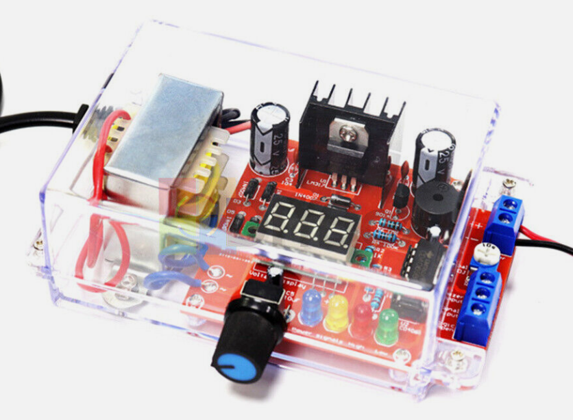

# Voltage Regulator

We can build our own voltage regulator for under $10 using the powerful LM317 variable voltage regulator.  The LM317 is a simple 3-terminal adjustable regulator circuit.

We can see from the [LM317 data sheet](https://www.ti.com/lit/ds/symlink/lm317.pdf) that with a single potentiometer, we can change any DC voltage
into any other lower DC voltage.

There are many LM317 kits on eBay:

[eBay Search for LM317 Adjustable Voltage Regulator Kit](https://www.ebay.com/sch/i.html?_nkw=LM317+Adjustable+Voltage+Regulator+Kit)

Many kits have a power cord and a potentiometer you can adjust to get
any output voltage from 1.25V to 30V DC.

The LM317 has overheating and current short-circuit protection.

Many of these kits also have a 3-digit LED display of output voltage.

