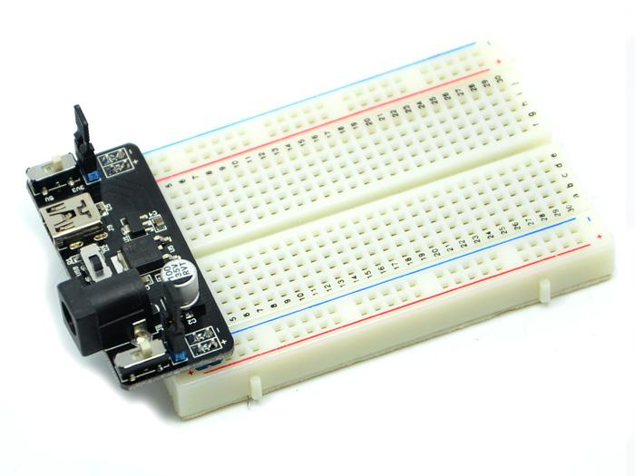
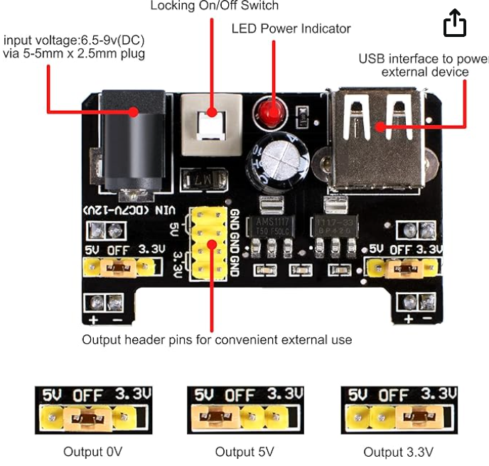
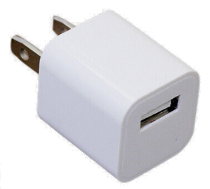

# Power

There are several methods to supply power to your
breadboard.

!!! tip "Set Up Safely First"
    Before running this lab, read
    [Safe Power for Learning](../setup/safe-power-for-learning/index.md). It covers
    choosing a supply for the age group you are teaching, why a 7.5 V adapter
    is safer than a 12 V one, and how to add a PTC resettable fuse to the
    +5 V rail so a shorted breadboard resets itself instead of destroying the
    power module.

## Option 1: Batteries

The first is to use a battery pack with 2 or 3 AA or AAA batteries.  These battery
packs can then be connected to 

## Option 2: Breadboard Power Connectors

## Option 3: USB Wall Adaptors

## Option 4: Professional Bench Power Supply

