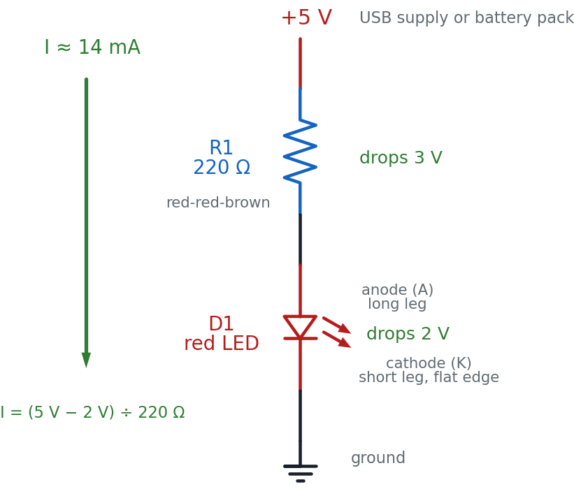

# Your First LED Circuit

Flip a switch and a light comes on. You have done that a thousand times. Today
you build the light — four parts, one breadboard, and a tiny glowing dot that
is entirely your doing.

!!! mascot-welcome "Hi again, builder!"
    { class="mascot-admonition-img" }
    This is the circuit everyone starts with, and there is a reason. Almost
    every project in this book ends with something lighting up. Get this one
    right and you have the foundation for all of them. Let's light it up!

## What You'll Learn

By the end of this lab you will be able to:

- **Build** a working LED circuit on a breadboard from a diagram
- **Identify** an LED's anode and cathode before you connect any power
- **Calculate** the right current-limiting resistor for a 5 V supply
- **Predict** what happens when the LED is reversed or the resistor is swapped, then test it
- **Find and fix** the four mistakes that most often leave an LED dark

## Before You Start

| | |
|---|---|
| **Time** | 40 minutes |
| **Difficulty** | Beginner — your first build |
| **You should already know** | How breadboard rows and rails connect ([Chapter 6](../../chapters/06-meet-your-breadboard/index.md)) and how to power a board safely ([Power](../09-power.md)) |
| **Helpful background** | [Chapter 12: Diodes and LEDs](../../chapters/12-diodes-and-leds/index.md) |

## What You'll Need

Everything here is in the $50 kit.

| Qty | Part | Value or marking | How to spot it |
|-----|------|------------------|----------------|
| 1 | Breadboard | half-size, 30 columns | the white plastic board with rows of holes |
| 1 | LED | red, 5 mm | clear red dome; **one leg is longer than the other** |
| 1 | Resistor | 220 Ω | tan body, bands **red-red-brown**, then gold |
| 1 | Jumper wire | red | for the positive connection |
| 1 | Jumper wire | black | for the ground connection |
| 1 | Power supply | 5 V USB, or a 3×AA battery pack | any phone charger with a USB-A male-to-male cable |

**Optional:** a multimeter, for the measuring challenge at the end. You do not
need one to finish this lab — the numbers you would measure are printed here.

A 3×AA battery pack gives about 4.5 V rather than 5 V. Everything works exactly
the same; your LED just runs a little dimmer, at about 11 mA instead of 14 mA.

!!! mascot-tip "Can't find a 220 Ω resistor?"
    { class="mascot-admonition-img" }
    Anything from 220 Ω to 470 Ω works fine here. Higher resistance just means
    a dimmer LED. What you must **never** do is leave the resistor out — you'll
    see why in about ten minutes.

## Safety First

At 5 volts, this circuit cannot hurt you. You can touch every part of it while
it is running. That is exactly why we start here.

The parts are a different story, and three habits protect them:

- **Wire everything first, plug in power last.** Every time.
- **Unplug before you rewire.** Moving a live wire is how you make a short circuit — a path where current races straight from + to − with nothing to slow it down.
- **Never connect an LED without a resistor.** An LED has almost no resistance of its own. With nothing to limit the current, it draws far more than it can handle and burns out in about a second.

## Try It in the Simulator

Before you touch a single wire, play with the circuit you are about to build.
**Move your mouse over the board to start the current moving.**

<iframe src="../../sims/led-current-limiting-resistor-circuit/main.html" width="100%" height="522px" scrolling="no"></iframe>

Three things to try right now:

1. **Watch the orange dots.** That is the current, flowing out of the + rail, through the resistor, through the LED, and back to ground. Every dot that leaves has to come back.
2. **Press "Flip LED".** The dots stop. An LED only lets current through one way — backwards, it blocks. Notice the LED is not damaged, just dark.
3. **Change the resistor to 1K, then to 10K, then to "no resistor".** Watch the current number and the brightness bar. At 10 kΩ the LED barely glows. With no resistor at all, the current shoots past the 20 mA the LED can survive.

That last one is the whole reason the resistor exists. Now you know what you
are protecting against, let's build the real thing.

## The Circuit Diagram

Here is the same circuit drawn the way engineers draw it.

<figure markdown>
{ width="480" }
<figcaption>The complete circuit. R1 takes the 3 V the LED does not use, which sets the current to about 14 mA.</figcaption>
</figure>

Read it top to bottom, the way current flows: out of **+5 V**, down through
**R1**, down through **D1** (in the anode side, out the cathode side), and into
**ground**. That loop is the circuit. Break it anywhere and the LED goes dark.

!!! mascot-thinking "Why the triangle points that way"
    { class="mascot-admonition-img" }
    The LED symbol is an arrow with a line across its tip. Current can flow in
    the direction the arrow points, and the line is a wall that stops it coming
    back. That arrow is pointing from the anode to the cathode — which is
    exactly which way round the real part has to go.

## The Breadboard Layout

Now the same circuit on the actual board. This is the picture to copy.

<figure markdown>
{ width="760" }
<figcaption>Every hole named in the build steps is marked here. Only the top half of the board is used.</figcaption>
</figure>

The two pictures show the same four connections. Here is how they line up:

| In the schematic | On the breadboard |
|------------------|-------------------|
| The **+5 V** rail at the top | The red **+ rail**, reached by the red jumper into **a3** |
| **R1**, the 220 Ω resistor | The tan part bridging **b3** and **b10** |
| **D1**, the LED, anode side up | The red dome, long leg in **c10**, short leg in **c11** |
| The **ground** symbol at the bottom | The blue **− rail**, reached by the black jumper from **a11** |

The trick that makes this work is the breadboard's hidden wiring. Holes
**a3, b3, c3, d3 and e3** are all one connected group, so the red jumper in a3
and the resistor leg in b3 are joined without touching. Column 10 does the same
job for the resistor and the LED's long leg, and column 11 for the LED's short
leg and the black jumper.

## Build It

Work down the list. Do not skip the checkpoints — they catch mistakes while
they are still easy to find.

1. **Leave the power unplugged.** Do not connect the USB supply or the battery pack yet.
2. Push the **red jumper** into a hole on the red **+ rail**, and the other end into **a3**.
3. Push the **black jumper** into **a11**, and the other end into a hole on the blue **− rail**.
4. Bend the legs of the **220 Ω resistor** down, and push them into **b3** and **b10**. A resistor has no direction — either way round is fine.

!!! mascot-warning "Stop here. This is the mistake everyone makes."
    { class="mascot-admonition-img" }
    Look at your LED before it goes in. **One leg is longer.** That long leg is
    the anode, and it goes toward the resistor. Get this backwards and your LED
    stays dark no matter what else you do. Roughly half of all first builds get
    it wrong — checking now costs five seconds.

5. Push the LED's **long leg into c10** and its **short leg into c11**. If you look closely at the plastic rim, there is a small flat edge on the short-leg side. That flat edge is the second way to tell which end is which.
6. **Checkpoint — before power.** Run your finger along the path and say it out loud: + rail → a3 → resistor → b10 → LED long leg → short leg → a11 → − rail. If any step in that sentence has nothing in it, find the gap now.
7. **Predict first.** Write down two guesses: will it light, and how bright do you think it will be — like a phone screen, a night light, or a car headlight?
8. Plug in the 5 V supply. **The LED should light immediately.**

**You are done when** your LED glows steadily, the board is not warm anywhere,
and you can name what each of the four parts is doing.

!!! mascot-celebration "That's a real circuit!"
    { class="mascot-admonition-img" }
    You just turned electricity into light on purpose. Not a kit that snaps
    together — a circuit you wired hole by hole, and can explain. That's your
    superpower in action!

## How It Works

Remember the water-pipe picture from [Chapter 1](../../chapters/01-electricity-basics/index.md):
voltage is the water pressure, current is how much water actually flows, and
resistance is how narrow the pipe is. An LED is a wide-open pipe. Connect it
straight across the supply and everything the supply has rushes through it.

That is the problem in one sentence. The LED is fussy about current: about
20 milliamps (20 mA, or 0.020 amps) makes it bright and happy, and much more
kills it. Something has to narrow the pipe.

The resistor solves that, and here is the arithmetic.

Your supply gives **5 volts**. A red LED uses up about **2 volts** just getting
lit — that is its *forward voltage*, a fixed cost it takes off the top. So the
voltage left over for the resistor is:

\[ 5\text{ V} - 2\text{ V} = 3\text{ V} \]

Now use Ohm's Law, rearranged to find resistance, with the 20 mA we want:

\[ R = \frac{V}{I} = \frac{3\text{ V}}{0.020\text{ A}} = 150\ \Omega \]

There is no 150 Ω resistor in your kit, and when in doubt you go **up**, never
down — a bigger resistor means less current, which is the safe direction. The
next standard value up is 220 Ω, which gives:

\[ I = \frac{3\text{ V}}{220\ \Omega} = 0.0136\text{ A} = 13.6\text{ mA} \]

About 14 mA. A little dimmer than maximum, comfortably inside what the LED can
take, and it will run like that for years.

!!! mascot-neutral "Where you have seen this"
    { class="mascot-admonition-img" }
    Every standby light on every device in your house is this circuit. The dot
    on your TV, the charging light on a laptop, the little glow on a power
    strip — an LED and a resistor, sized exactly the way you just sized yours.

## When It Doesn't Work

Almost every failure is one of these five. Work down the list in order — check
power before you check anything clever, and change only one thing at a time.

| What you see | Likely cause | Fix |
|--------------|--------------|-----|
| Nothing at all | No power reaching the rails | Check the supply is plugged in, and that both jumpers are pushed fully into the rail holes |
| Still nothing | **LED is backwards** | Long leg toward the resistor. Pull it out, turn it around, push it back in |
| Still nothing | A leg is in the wrong column | The LED's two legs must be in **different** columns. Both in column 10 means current skips the LED entirely |
| Still nothing | Rails not connected all the way across | Some boards split the power rails in the middle. Look for a gap in the red line, and bridge it with a jumper |
| Very dim | Resistor too large | 220 Ω is right for 5 V. A 10 kΩ resistor gives a barely visible glow |
| Bright flash, then dark forever | No resistor in the path | The LED is gone — fit a new one, and check the resistor really is in series |

!!! mascot-encourage "Dark LED? You have not broken anything."
    { class="mascot-admonition-img" }
    A backwards LED is not a damaged LED. At 5 volts it simply blocks the
    current and sits there. Turn it around and it lights up like nothing
    happened. Finding out *why* something is dark is the actual skill here —
    the lighting-up part is just the reward.

## Check Your Understanding

Answer each one before you open it. Guessing and then checking teaches you far
more than reading the answer first.

??? question "1. Which leg of an LED is the anode, and which way does it face?"
    The **longer** leg is the anode. It faces the positive side of the circuit
    — in this lab, toward the resistor and the + rail.

    If the legs have been trimmed to the same length, look at the plastic rim.
    There is a small **flat edge** on the cathode side.

??? question "2. You have a 5 V supply and a red LED that uses 2 V and wants 20 mA. What resistor do you need?"
    The resistor gets whatever the LED does not use:

    \[ 5\text{ V} - 2\text{ V} = 3\text{ V} \]

    \[ R = \frac{3\text{ V}}{0.020\text{ A}} = 150\ \Omega \]

    There is no 150 Ω in the kit, so go **up** to the next standard value —
    **220 Ω**. That gives about 14 mA: slightly dimmer, completely safe. Going
    *down* to 100 Ω would push 30 mA through a part rated for 20 mA.

??? question "3. Your LED lit up for a moment, then went dark and never came back. What most likely happened?"
    It was connected with **no current-limiting resistor** — or the resistor
    was not actually in the current's path. With nothing to hold the current
    back, the LED drew far more than 20 mA and burned out.

    This one is permanent. A backwards LED recovers; a cooked one does not.
    That is why the resistor goes in before the power does.

??? question "4. You swap the 220 Ω resistor for a 10 kΩ one. Predict what happens, with a number."
    \[ I = \frac{3\text{ V}}{10{,}000\ \Omega} = 0.0003\text{ A} = 0.3\text{ mA} \]

    That is about **one fortieth** of the current you had before, so the LED
    will be very dim — you may need to cup your hands around it to see it at
    all. Nothing is damaged. More resistance always means less current.

??? question "5. Your LED is dark. A classmate says you have burned it out. How can you tell whether they are right?"
    Turn it around. If it lights when reversed, it was simply **backwards** —
    a diode blocks current in one direction, and blocking is not damage.

    If it stays dark both ways, then check the rest of the loop before blaming
    the LED: power at the rails, both jumpers fully seated, and the two legs in
    **different** columns. A burned-out LED is the *last* thing to suspect, not
    the first.

??? question "6. A student pushes both LED legs into column 10 — the long leg in c10 and the short leg in d10. The LED stays dark. Why?"
    Holes **a10 through e10 are all one connected group**. Putting both legs in
    that group connects the LED's two ends to each other, so current takes the
    easy path through the metal strip instead of through the LED.

    This is a **short circuit** across the LED. The current still flows around
    the loop — through the resistor and back to ground — but it never passes
    through the part that makes light. The fix is to move the short leg to
    **c11**, a different column.

## Take It Further

**Challenge: make it dimmer on purpose.** Swap the 220 Ω resistor for a 1 kΩ
one. Before you plug the power back in, work out the new current with the same
formula you used above.

*You have succeeded when* you can state the new current, the LED is visibly
dimmer than before, and your calculated number matches what the simulator shows
for 1K.

**With a multimeter: prove the numbers.** Set the meter to DC volts. Touch the
probes to the two ends of the resistor, then to the two legs of the LED.

*You have succeeded when* you measure roughly **3 V across the resistor** and
**2 V across the LED**, and you notice that the two add up to your supply
voltage. That is not a coincidence — the voltage the supply provides has to be
completely used up going around the loop.

**If that was easy, try these:**

- Put a **second LED in series** with the first. Two red LEDs use about 4 V between them, leaving only 1 V for the resistor. Work out the new current — and then explain why both LEDs end up dimmer.
- Move the whole circuit to the **bottom half of the board** (rows f–j) without changing what it does. You will need to re-map every hole number, which is the best possible proof that you understand how the board is wired.

## Learn More

- [Chapter 12: Diodes and LEDs](../../chapters/12-diodes-and-leds/index.md) — why a diode only conducts one way, and how forward voltage differs between LED colours
- [Chapter 6: Meet Your Breadboard](../../chapters/06-meet-your-breadboard/index.md) — the hidden rows and rails that made this circuit possible
- [Chapter 11: Resistor Codes](../../chapters/11-resistor-codes-capacitor-details/index.md) — how to read red-red-brown, and every other band combination
- [LED Resistor Calculator](../../sims/led-resistor-calc/index.md) — enter any supply voltage and LED colour, get the resistor value
- [SparkFun: Light-Emitting Diodes](https://learn.sparkfun.com/tutorials/light-emitting-diodes-leds) — a thorough outside tutorial with photos of real parts and failure modes
- [Next lab: LED Button Circuit](../11-buttons.md) — add a push button so *you* decide when the LED is on
