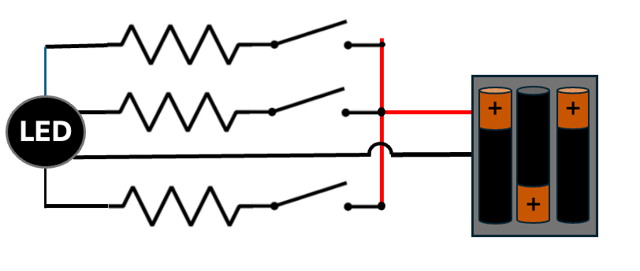

# RGB LED Circuit

The goal of this circuit is to connect up a RGB LED so that when you
press one of three momentary switch buttons, one of the three
LEDs will light up.

## Circuit Diagram

This LED is a common cathode circuit.  The GND pin goes
to the lower ground rail and each of the LED pins
are routed through a resistor and a momentary switch
on the breadboard.  The resistors are calibrated
so that the brightness of each of the LEDs is balanced.

The top rail is +5v.

