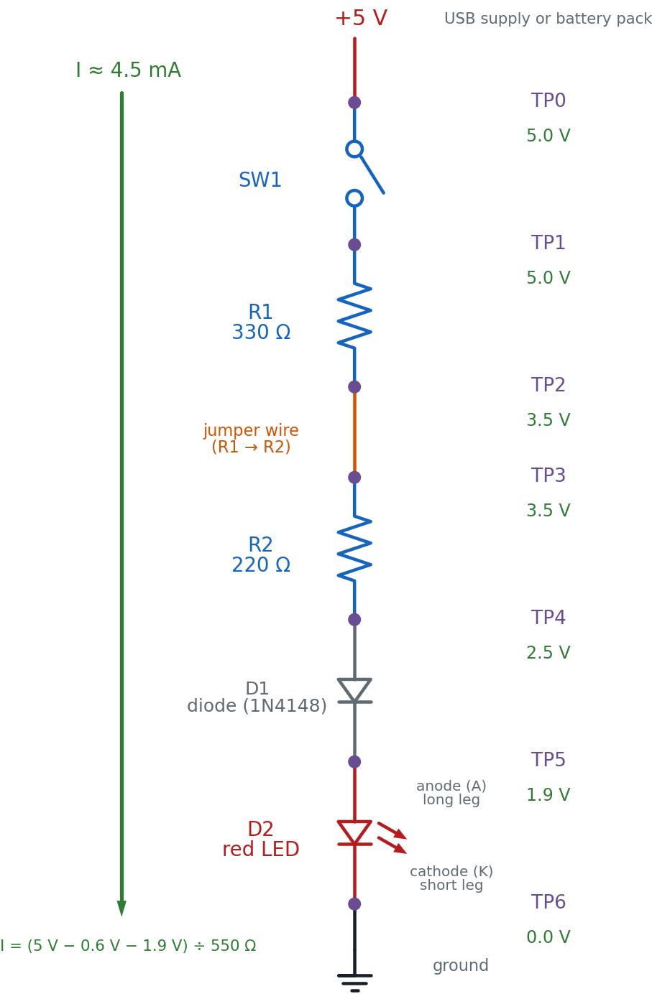

# Hunt Down a Hidden Fault

A wire works loose. A part dies quietly. A circuit that lit up perfectly
yesterday is dark today, and nothing about it tells you why. Today you build
a switch-and-resistor chain that lights a red LED — a circuit with six
places trouble could be hiding — then learn the exact method real engineers
use to corner any one of them in three measurements or less.

!!! mascot-welcome "Time to Play Detective, Builder!"
    { class="mascot-admonition-img" }
    Every circuit you've built so far, you built to work. Today you build one
    on purpose so you can practice finding what's wrong with it — using a real
    board you trust, and a safe simulator with a fault hidden inside. Let's
    light it up!

## What You'll Learn

By the end of this lab you will be able to:

- **Build** a six-stage series circuit — a switch, two resistors, a diode, and an LED — and measure its healthy voltage at every test point
- **Predict** each test point's voltage using Ohm's Law and the diode/LED forward-voltage drops, before you ever touch a probe to it
- **Apply** half-split testing to locate a hidden fault in three or fewer measurements
- **Read** a multimeter's open, short, and normal signatures and use them as evidence, not guesses
- **Document** a troubleshooting log clear enough that another builder — or your future self — could follow it

## Before You Start

| | |
|---|---|
| **Time** | 50 minutes |
| **Difficulty** | Intermediate — your first troubleshooting lab |
| **You should already know** | How to use a multimeter's voltage mode ([Chapter 20](../../chapters/20-using-a-multimeter/index.md)) |
| **Strongly recommended first** | [Lab 60: Meet Your Multimeter](../60-multimeter-basics/index.md) |
| **Helpful background** | [Chapter 21: Systematic Troubleshooting](../../chapters/21-systematic-troubleshooting/index.md) |

## What You'll Need

Everything here is in the $50 kit.

| Qty | Part | Value or marking | How to spot it |
|-----|------|------------------|-----------------|
| 1 | Breadboard | half-size, 30 columns | the white plastic board with rows of holes |
| 1 | Slide switch | SW1, SPDT | a small plastic body with a sliding lever |
| 1 | Resistor | R1, 330 Ω | tan body, bands **orange-orange-brown**, then gold |
| 1 | Resistor | R2, 220 Ω | tan body, bands **red-red-brown**, then gold |
| 1 | Diode | D1, 1N4148 or 1N4001 | small gray cylinder with a painted **band on the cathode end** |
| 1 | LED | D2, red, 5 mm | clear red dome; **one leg is longer than the other** |
| 3 | Jumper wires | 1 red, 1 black, 1 any color | to wire the + rail, the − rail, and the R1–R2 gap |
| 1 | Power supply | 5 V USB, or a battery pack | any phone charger with a USB-A male-to-male cable |

**Optional but recommended:** a multimeter, for Part A's real measurements.
You do not need one to finish this lab — every predicted voltage is printed
below, so you can compare the simulator's readings against those printed
numbers instead of your own.

No exact 330 Ω or 220 Ω on hand? Anything close works — the predicted
voltages will shift a little, but the *method* you're practicing today
doesn't care about the exact numbers. What you must not do is skip a
resistor entirely; that changes which test point the current-limiting job
happens at, and the math in this lab won't match your board anymore.

## Safety First

At 5 volts, nothing in this circuit can hurt you. You can touch every part of
it while it runs. The habits below protect the *parts*, not you — and one of
them protects your multimeter specifically.

- **Wire everything first, plug in power last.** Every time, no exceptions.
- **Unplug before you rewire.** A live wire moved by accident is how a short
  circuit happens — a path where current races straight from + to − with
  nothing to slow it down.

!!! mascot-warning "Resistance and Diode-Test Mode Need the Power OFF"
    { class="mascot-admonition-img" }
    This is the one multimeter mistake that matters most in this whole lab.
    **Never** switch your meter to resistance (Ω) or diode-test mode while
    your circuit is still powered. Those modes push the meter's *own* small
    test current through whatever you're probing — and a live 5 V supply
    fighting that test current gives you a meaningless reading at best, and
    risks the meter at worst. Voltage mode is the only mode you'll use while
    the board is powered on in this lab.

## The Circuit Diagram

Here is the circuit you're about to build and then hunt for faults in — one
supply, six stages, seven test points.

<figure markdown>
{ width="520" }
<figcaption>Six stages, seven test points. TP0 is the battery's positive terminal; TP6 is the LED's cathode, tied to ground.</figcaption>
</figure>

Read it top to bottom, the way current flows: out of **+5 V**, through
**SW1**, through **R1**, across the **jumper wire** that connects R1 to R2,
through **R2**, through **D1** (anode to cathode), through **D2** (anode to
cathode), and into **ground**. That single loop is the whole circuit — break
it anywhere and TP6 stops being the only dark point; everything downstream of
the break goes with it.

TP2 and TP3 sit on either side of a plain jumper wire, not a component. That's
on purpose — a loose or broken jumper is one of the most common real faults
on any breadboard, so this circuit treats "the wire between R1 and R2" as a
suspect stage exactly like R1 or R2 themselves.

## The Breadboard Layout

Here is the same six stages on the actual board — the picture to copy, hole
for hole.

<figure markdown>
{ width="900" }
<figcaption>Purple rings mark all seven test points at row d — touch your meter's probe there. The orange jumper is a signal wire, not a power wire; it's colored differently so it stands out as its own test stage.</figcaption>
</figure>

The two pictures show the same six stages. Here's exactly how they line up:

| In the schematic | On the breadboard |
|-------------------|--------------------|
| **TP0**, the +5 V supply | The red jumper from the **+ rail** into **a2** |
| **SW1** | The slide switch bridging **b2 → b6** |
| **TP1** | Column **6** — the shared node between SW1 and R1 |
| **R1**, 330 Ω | The tan resistor bridging **c6 → c10** |
| **TP2** | Column **10** — the shared node between R1 and the jumper wire |
| The **jumper wire** (R1 → R2) | The orange wire bridging **b10 → b14** |
| **TP3** | Column **14** — the shared node between the wire and R2 |
| **R2**, 220 Ω | The tan resistor bridging **c14 → c18** |
| **TP4** | Column **18** — the shared node between R2 and D1 |
| **D1**, diode | The banded gray cylinder, anode at **b18**, cathode at **b22** |
| **TP5** | Column **22** — the shared node between D1 and D2 |
| **D2**, red LED | The red dome, anode at **c22**, cathode at **c26** |
| **TP6**, ground | D2's cathode leg at **c26**, returned to the **− rail** by a black jumper from **b26** |

The trick that makes this work is the same hidden wiring from your very first
LED circuit: every hole in a column's top group (a-e) is one connected node.
Column 10's group joins R1's right leg to the jumper wire's left leg without
them ever touching directly — that connection *is* TP2.

## Part A: Build It and Find Your Baseline

You're building a real, working circuit first — one you trust, with numbers
you calculated yourself and can check with a meter. That trusted baseline is
what Part B compares against.

1. **Leave the power unplugged.** Every wire goes in before any power does.
2. Push the **red jumper** into a hole on the **+ rail**, and its other end into **a2**.
3. Push the **slide switch's** two legs into **b2** and **b6**.
4. Bend **R1's** legs and push them into **c6** and **c10**. A resistor has no direction — either way round is fine.
5. Push a **jumper wire** from **b10** to **b14**. This is the R1–R2 stage — TP2 to TP3.
6. Bend **R2's** legs and push them into **c14** and **c18**.
7. Look at **D1** before it goes in: the painted band marks the **cathode**. Push the plain (anode) end into **b18** and the banded (cathode) end into **b22**.
8. Push **D2's long leg (anode) into c22** and its **short leg (cathode) into c26**.
9. Push a **black jumper** from **b26** to a hole on the **− rail**.

!!! mascot-tip "Checkpoint — before power"
    { class="mascot-admonition-img" }
    Run your finger along the whole path and say it out loud: **+ rail → a2 →
    SW1 → R1 → wire → R2 → D1 → D2 → − rail.** If any step in that sentence
    has nothing plugged into it, find the gap now — it's much easier to spot
    with the power still off. Then check the two parts where direction
    matters: D1's band should face **b22**, and D2's long leg should be in
    **c22**, not c26. Every other part in this build is direction-proof.

### Predict First

Before you measure anything, work out what a *healthy* version of this
circuit should read. A silicon diode like D1 drops about **0.6 V** in the
forward direction (the same number Chapter 21 used for diode-test mode), and
a red LED like D2 drops about **1.9 V** — the number this book has used since
Chapter 12.

With R1 and R2 in series, the total resistance is:

\[ R_1 + R_2 = 330\ \Omega + 220\ \Omega = 550\ \Omega \]

The current has to push through both resistors, the diode, and the LED, so
Ohm's Law gives:

\[ I = \frac{V_{supply} - V_{f(D1)} - V_{f(D2)}}{R_1 + R_2} = \frac{5.0\text{ V} - 0.6\text{ V} - 1.9\text{ V}}{550\ \Omega} \approx 0.0045\text{ A} \approx 4.5\text{ mA} \]

That's dimmer than your very first LED circuit — this one asks two resistors
to share the current-limiting job, not one — and that's expected, not a fault.
Now walk that same 4.5 mA down the chain, subtracting each part's drop as you
go, and fill in your predictions before you touch a meter to anything:

| Test Point | What it's after | Predicted Voltage | Measured Voltage |
|------------|------------------|--------------------|--------------------|
| TP0 | Battery +, before SW1 | 5.0 V | |
| TP1 | After SW1, before R1 | 5.0 V | |
| TP2 | After R1, before the wire | 3.5 V | |
| TP3 | After the wire, before R2 | 3.5 V | |
| TP4 | After R2, before D1 | 2.5 V | |
| TP5 | After D1, before D2 | 1.9 V | |
| TP6 | After D2 (LED cathode) / ground | 0.0 V | |

Notice TP2 and TP3 predict the *same* number. That's the point of putting a
test point on either side of a plain wire — a healthy wire drops nothing at
all. Any difference between TP2 and TP3 on a real board is itself a clue.

10. Plug in the 5 V supply.
11. Slide **SW1** to the closed position. The LED should glow — dimmer than a
    single-resistor LED circuit, but clearly lit.
12. If you have a multimeter, set it to **DC voltage** and touch the black
    probe to the − rail. Touch the red probe to each test point in turn and
    fill in the **Measured Voltage** column above. No meter? Use the printed
    predicted values as your baseline for Part B instead.

**You are done when** your LED glows steadily, every measured voltage is
within about ±10% of its prediction, and you can point to any test point on
the real board without looking at the picture. That finishes Part A — Part B
is next.

!!! mascot-celebration "That's a circuit you can trust"
    { class="mascot-admonition-img" }
    You just built a circuit *and* proved, point by point, that it matches
    the math. That combination — a working build plus numbers you can defend
    — is exactly what makes a "known-good circuit" actually known-good.

## Part B: Diagnose a Hidden Fault in the Simulator

Here's a question worth asking before you go any further: why not just sneak
a fault into the circuit you just built, and make *you* find it?

!!! mascot-encourage "This part feels different — that's on purpose"
    { class="mascot-admonition-img" }
    Sabotaging your own freshly built circuit sounds like fun until you
    realize there's no answer key, no easy reset, and no way to check your
    diagnosis except pulling the whole thing apart. Half-split testing is a
    genuinely new way of thinking, and it deserves a practice ground where
    you can be wrong safely, again and again, until it clicks.

That's exactly what the simulator below is for. It builds the identical
six-stage circuit — SW1, R1, the R1–R2 wire, R2, D1, D2 — with one hidden
fault planted somewhere in the chain. Your job is to find it using the same
five-step strategy Chapter 21 taught, with the baseline you just measured in
Part A as your "known-good circuit" to compare against.

<iframe src="../../sims/half-split-fault-finder/main.html" width="100%" height="547px" scrolling="no"></iframe>

Work the five steps in order, every time:

1. **Check power first.** Click "Power On." If TP0 is dead, nothing past it
   matters yet — but in this sim, the supply is always good, so you'll move
   straight to the real search.
2. **Half-split the remaining range.** Only the true midpoint test point
   glows. Click it. A reading that matches your Part A baseline means the
   fault is *further along*; a reading of 0 V means the fault is *at or
   before* that point.
3. **Compare to your known-good circuit.** Every reading the sim gives you
   should be judged against the Part A numbers you already measured — not a
   guess, not a vibe.
4. **Isolate one variable.** Test exactly one point, record the result, and
   only *then* decide what to test next. The sim enforces this by only
   lighting up the correct next test point.
5. **Document every result.** Copy this table and fill in a row for every
   click, even the "boring" ones:

| Test # | Point Tested | Reading | What It Rules Out |
|--------|--------------|---------|--------------------|
| 1 | | | |
| 2 | | | |
| 3 | | | |

Once only one stage remains, use the sim's diagnosis menu to name it. **Your
goal: name the faulty stage correctly in three tests or fewer.** Click "New
Fault" and do it again — the method should get faster each time, not the
luck.

## How It Works

Chapter 21 handed you five steps. Here's why each one earns its place, using
this circuit's own six stages as the example.

**Check power first** because a dead TP0 explains a dark LED in one
measurement, and skipping straight to a "more interesting" suspect wastes
time on component after component before you ever check the boring thing
most likely to be wrong.

**Half-split beats testing one by one.** Picture six suspects — SW1, R1, the
wire, R2, D1, D2 — lined up in order. Testing them one at a time, worst case,
takes six measurements. Testing the *middle* first is smarter: whichever way
that one reading comes back, you just proved half the chain is fine and
never have to test it again.

!!! mascot-thinking "One reading, half the suspects gone"
    { class="mascot-admonition-img" }
    A healthy point reads full voltage; a point past the fault reads zero.
    Test the middle stage's output, and that single number sorts everything
    before it and everything after it into two piles at once. That's the
    whole trick — one good question, asked in the right place, is worth
    three or four asked in the wrong order.

You've used this exact trick before, just not with a multimeter. Guessing a
number between 1 and 100 in the fewest tries works the same way — guess 50,
learn "higher" or "lower," and half the remaining numbers are gone in one
question. A phone book (or a sorted playlist) gets searched the same way too.
Half-split troubleshooting is that same idea, aimed at a broken circuit
instead of a hidden number.

**Compare to a known-good circuit** — which is exactly what Part A gave you.
"TP4 reads 2.1 V" means nothing on its own. "TP4 reads 2.1 V, and my working
board reads 2.5 V there" is evidence something upstream is dragging the
voltage down.

**Isolate one variable** because changing two things at once — say, swapping
R2 *and* reseating D1 in the same breath — leaves you unable to say which
change fixed anything. Half-split testing only works if each measurement
answers exactly one question.

**Document every result** because a troubleshooting session with ten
readings in your head is a session where you'll retest the same point twice
and still miss the fault. A written log, like the one you just filled in, is
what turns a confusing string of numbers into a clear trail of evidence — the
same job Chapter 21's own test log panel does automatically.

## If Your Own Build Doesn't Match Its Predicted Voltages

Since this whole lab is about finding faults, here's the worked answer key
for Part A: what a mismatch between your predicted and measured voltage
usually means, worked from TP0 outward — check power first, exactly like the
strategy above.

| What you measure | Likely cause | Fix |
|-------------------|--------------|-----|
| TP0 reads 0 V | The supply isn't actually connected | Check the USB cable or battery pack, and that the red jumper is fully seated in both the rail and a2 |
| TP0 is good, but TP1 reads 0 V | SW1 isn't closed, or a leg isn't seated | Slide the switch fully to "on"; reseat both legs in b2 and b6 |
| TP1 is good, but TP2 reads the same as TP1 (no ~1.5 V drop) | R1 isn't actually bridging c6 → c10 — maybe both legs landed in the same column | Reseat R1 so its legs sit in two different column groups |
| TP2 and TP3 disagree (should read the same) | The R1–R2 jumper wire is loose or in the wrong hole | Reseat the jumper firmly in b10 and b14 |
| TP3 is good, but TP4 reads the same as TP3 | R2 isn't bridging c14 → c18 correctly, or it's the wrong value | Check the color bands against 220 Ω (red-red-brown) and reseat |
| TP4 is good, but TP5 reads the same as TP4 (no ~0.6 V drop) | D1 is shorted, or its band orientation is backwards | Check the cathode band faces b22; swap the diode if it still shows no drop |
| TP5 is good, but TP6 isn't close to 0 V, or the LED stays dark | D2 is backwards, or its short leg isn't reaching c26 | Long leg (anode) toward c22, short leg (cathode) toward c26 |
| Every reading is 0 V, even TP0 | The meter is set to the wrong mode, or the probes are in the wrong jacks | Confirm the dial is on DC volts and the red probe is in the VΩmA jack |

Notice this table reads top to bottom in exactly the order the five-step
strategy suggests: power first, then work outward from whichever stage is
still suspect. That's not a coincidence — it's the same method from Part B,
just applied to a build instead of a sim.

## Check Your Understanding

Answer each one before you open it.

??? question "1. Half-split testing means you test the middle of the remaining range, not the next point in line. Why is that faster?"
    Because one reading at the midpoint sorts the *entire* remaining chain
    into two piles — "fine" and "still suspect" — at once. Testing point by
    point in order only rules out one stage per reading; testing the middle
    can rule out up to half the remaining stages with a single measurement.
    For six stages, that's the difference between as many as six tests and
    as few as three.

??? question "2. In diode-test mode, a diode reads a real, low voltage in *both* directions instead of showing OL one way. What does that tell you?"
    It's **shorted internally**. A healthy diode only conducts one way — real
    forward voltage, OL in reverse. A real reading both directions means
    current is flowing through it no matter which way you probe, which is
    exactly what an internal short looks like.

??? question "3. You measure full supply voltage right up through TP4, and 0 V at TP5. Where's the fault, and why?"
    The fault is in **D1**, the stage between TP4 and TP5. TP4 reading full
    voltage proves the signal survived everything before it — SW1, R1, the
    wire, and R2 are all fine. TP5 reading 0 V proves the signal died
    somewhere between TP4 and TP5, and D1 is the only thing sitting in that
    gap. An open (broken) diode blocks current in both directions, which
    matches exactly what you measured.

??? question "4. Your test log has six rows, and three of them just say 'normal, as expected.' A classmate says those rows were a waste of time. Are they right?"
    No. A normal reading isn't wasted — it's the evidence that rules out an
    entire section of the circuit for good. Without it written down, you
    might re-test a stage you already cleared, or forget which half you'd
    already eliminated. The boring readings are just as much a part of the
    trail of evidence as the strange one that finally locates the fault.

??? question "5. Your predicted TP2 is 3.5 V. You measure exactly 3.5 V at TP3 too — but you were expecting to check whether they matched. What does an exact match at TP2 and TP3 tell you about the jumper wire between them?"
    It tells you the jumper wire is **healthy**. A real wire has essentially
    zero resistance, so Ohm's Law says it should drop essentially zero
    volts. TP2 and TP3 reading the same number is exactly what a good wire
    looks like — if they had disagreed, the wire itself would have been the
    prime suspect.

??? question "6. Using the current you calculated for this circuit (about 4.5 mA) and R2's value, what voltage should R2 drop, and does that match the table?"
    \[ V = I \times R = 0.0045\text{ A} \times 220\ \Omega \approx 1.0\text{ V} \]

    That matches the table: TP3 predicts 3.5 V and TP4 predicts 2.5 V, a
    difference of exactly 1.0 V across R2.

## Take It Further

**With a partner, or on your own board:** swap one component's orientation or
value — flip D1 or D2 around, or trade R1 for a very different resistor — on
your *own* real circuit. If you're working with a partner, trade boards
instead, so neither of you knows what the other changed.

Re-diagnose the real fault using the same five-step strategy: check power
first, half-split the remaining range with your multimeter, compare every
reading to your Part A baseline, isolate one variable per test, and write
down every result in a fresh copy of the log table.

*You have succeeded when* you can name the faulty stage correctly in **three
or fewer real measurements**, with a written log a partner could read and
follow without you explaining it out loud.

**If that was easy, try this:** ask your partner to introduce a fault that
*isn't* one of the six stages — for example, both LED legs pushed into the
same column. Half-split testing will still get you close, but naming the
*exact* problem takes the physical inspection skills from Chapter 8 too.
Real troubleshooting always uses both.

## Learn More

- [Chapter 21: Systematic Troubleshooting](../../chapters/21-systematic-troubleshooting/index.md) — the five-step strategy and the Half-Split Fault Finder sim this lab's Part B reuses
- [Chapter 20: Using a Multimeter](../../chapters/20-using-a-multimeter/index.md) — voltage, resistance, and continuity modes, and the safety rules behind this lab's one big warning
- [Lab 60: Meet Your Multimeter](../60-multimeter-basics/index.md) — hands-on practice with your meter's modes before you lean on them here
- [Chapter 12: Diodes and LEDs](../../chapters/12-diodes-and-leds/index.md) — where the 0.6 V and 1.9 V forward-voltage numbers used in this lab's predictions come from
- [SparkFun: How to Use a Multimeter](https://learn.sparkfun.com/tutorials/how-to-use-a-multimeter) — a thorough outside guide to every mode this lab's meter work depends on
