# Beginning Electronics Lessons

Every lab below builds a real circuit with parts from the course's $50 kit.
Each one links to a chapter that teaches the theory first — start there if a
lab's "Before You Start" table names a prerequisite you haven't read yet.

The colored dot beside each lab in the sidebar shows how finished it is: green
means publish-ready, amber means teachable but incomplete, and grey means it's
still a stub. See [the lab evaluator's scoring bands](https://github.com/dmccreary/beginning-electronics/blob/master/skills/hands-on-lab-evaluator/references/rubric.md#bands-and-status-markers) for the full scale.

-   **[Identification of Parts](./05-part-identification.md)**

    

    Match every part in your $50 kit to its name, symbol, and job.

-   **[Breadboarding Basics](./08-breadboard.md)**

    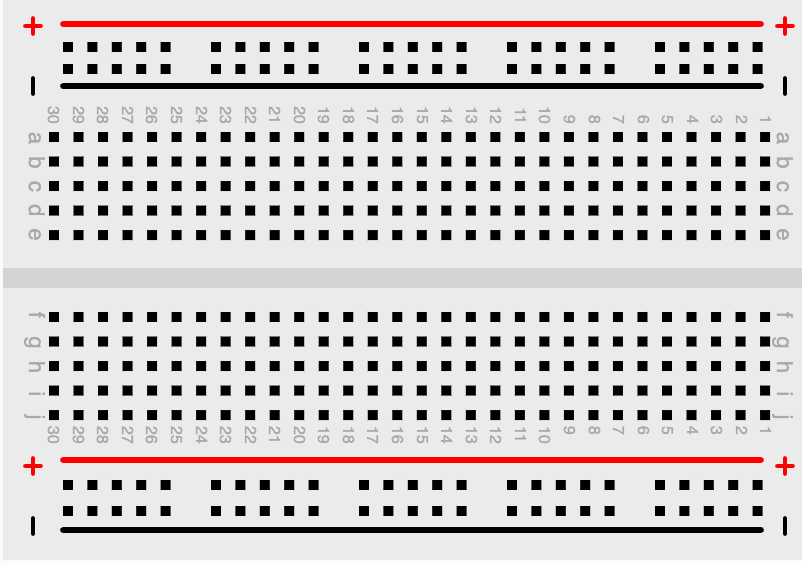

    Learn how a breadboard's hidden rows and rails connect underneath the holes.

-   **[Power](./09-power.md)**

    

    Compare ways to bring 5 volts safely to your breadboard's power rails.

-   **[Your First LED Circuit](./10-led-circuit/index.md)**

    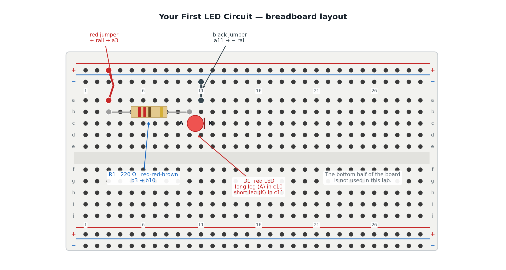

    Light an LED on a breadboard with a current-limiting resistor, and learn
    to spot the four mistakes that keep an LED dark.

-   **[LED Button Circuit](./11-buttons.md)**

    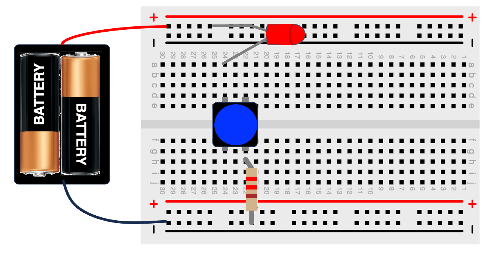

    Add a push button in series with your LED so you decide when it lights.

-   **[And Buttons](./12-and-buttons.md)**

    Wire two buttons in series so pressing both — and only both — lights the LED.

-   **[Or Buttons](./13-or-buttons.md)**

    Wire two buttons in parallel so pressing either one lights the LED.

-   **[RGB LED Circuit](./14-rgb-led/index.md)**

    

    Wire a common-cathode RGB LED and mix red, green, and blue with three resistors.

-   **[555 Timer LED Blinker](./45-555-led-blinker/index.md)**

    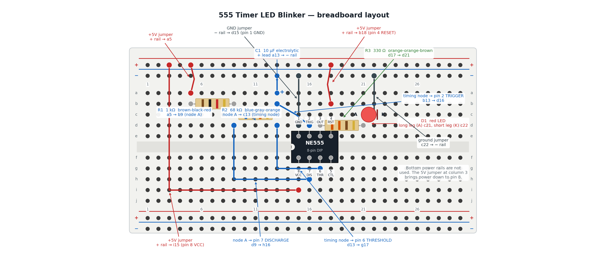

    Wire a classic NE555 astable circuit that blinks an LED on its own
    forever, and calculate exactly how fast it blinks.

-   **[555 Timer Buzzer and Siren](./46-555-buzzer-siren/index.md)**

    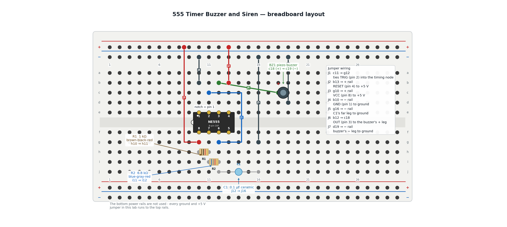

    Drive a piezo buzzer straight from a 555 timer, then swap in a trim pot
    to turn the pitch into a rising-and-falling siren.

-   **[555-Driven LED Bar Graph](./47-555-led-chaser/index.md)**

    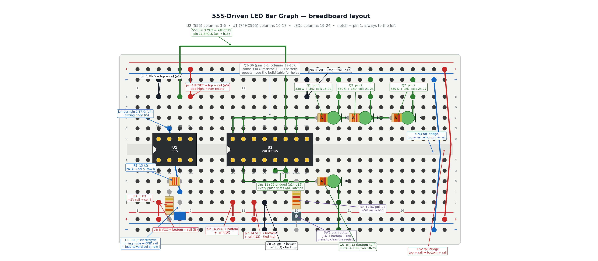

    Wire a 555 clock into a 74HC595 shift register so eight LEDs fill up one
    at a time, then press a button to clear the bar and watch it fill again.

-   **[Dark Detector](./20-dark-detector/index.md)**

    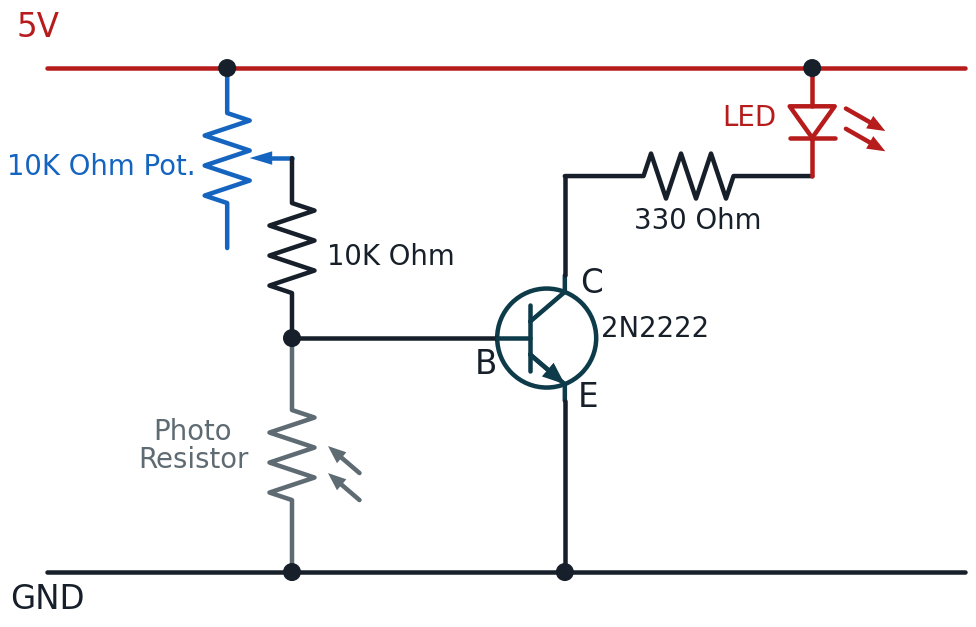

    Build a light-sensing circuit that switches an LED on automatically when
    it gets dark.

-   **[Transistors](./30-transistors.md)**

    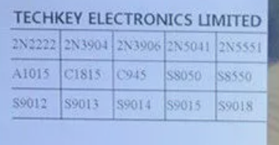

    A reference tour of common transistor types and what their datasheets mean.

-   **[Comparing the BC547 vs. the 2N2222 Transistors](./31-bc547-vs-2n2222.md)**

    Compare two popular NPN transistors side by side.

-   **[Boolean Logic Gates From Transistors](./35-boolean-logic.md)**

    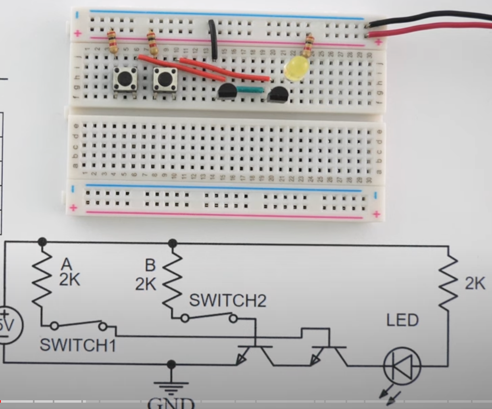

    Build AND, OR, NAND, NOR, XOR, and XNOR gates from individual transistors.

-   **[LED Noodle Circuit](./40-noodle-led-circuit.md)**

    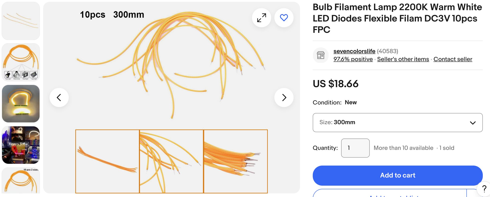

    Drive a high-current LED strip safely using a transistor as a switch.

-   **[Driving a Motor and a Buzzer Safely](./55-motors-and-buzzers/index.md)**

    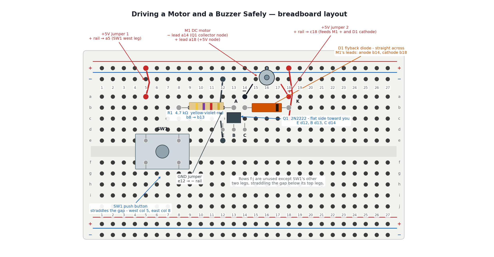

    Build a button-controlled transistor motor driver protected by a flyback
    diode, then swap the motor for a buzzer.

-   **[Meet Your Multimeter](./60-multimeter-basics/index.md)**

    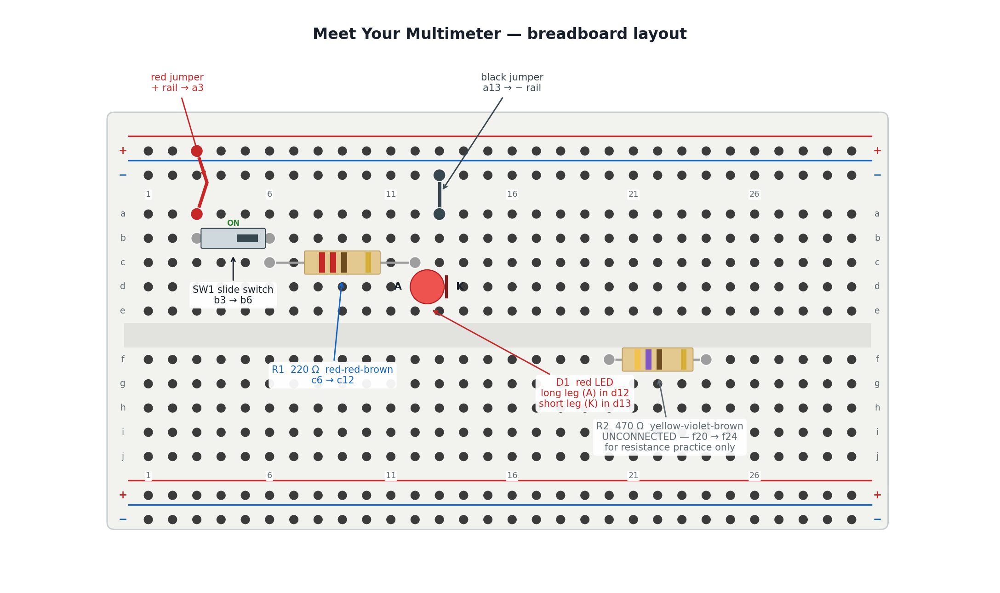

    Put a multimeter on a circuit you already trust and turn four of this
    book's promises into numbers you measured yourself.

-   **[Hunt Down a Hidden Fault](./65-troubleshooting-fault-finder/index.md)**

    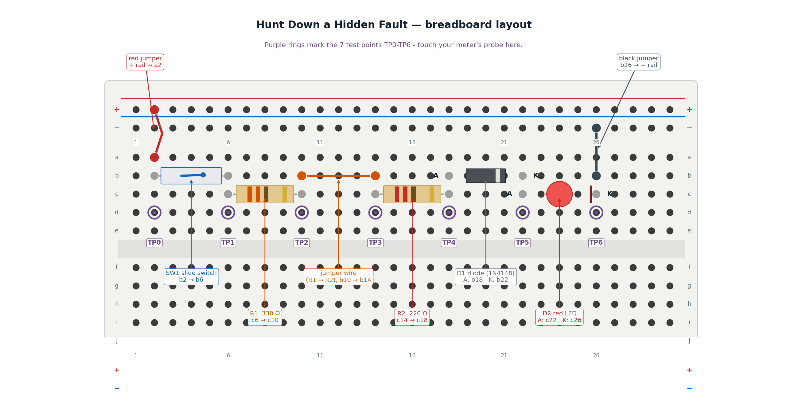

    Measure a healthy circuit's baseline, then use half-split testing to find
    a hidden fault in three measurements or fewer.

-   **[Using Perf Boards](./70-using-perf-boards.md)**

    An optional, beyond-the-kit guide to transferring a circuit from
    breadboard to solder.

-   **[RC Circuit](./80-rc-circuit.md)**

    Time a resistor-capacitor circuit's charge and discharge curve.

