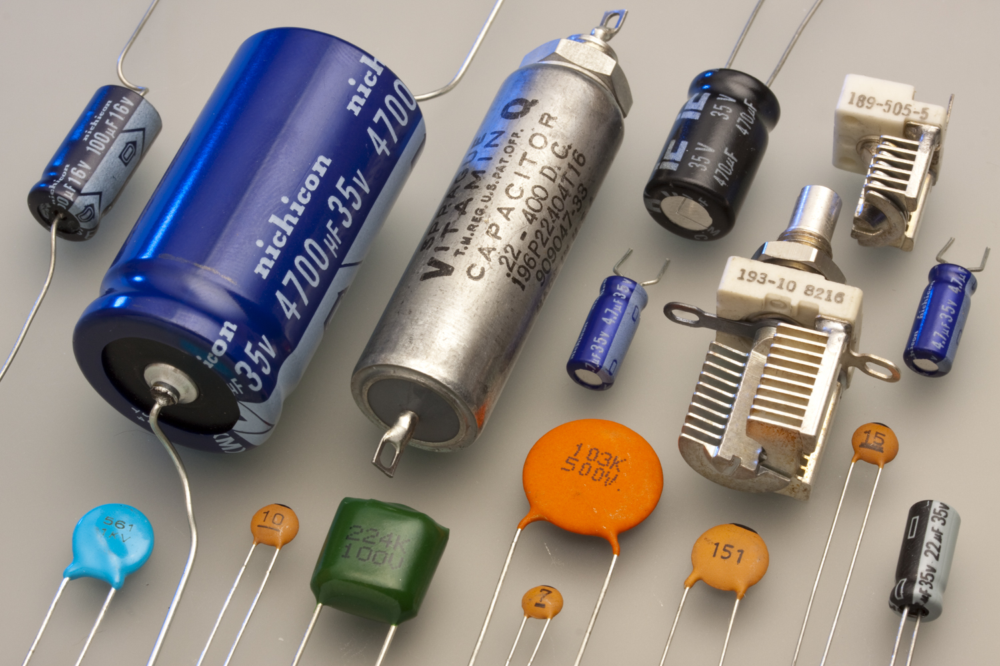

# Identification of Parts

In this lesson, we will learn to identify various parts in our beginning electronics kit.
Knowing the names of various parts is important so we know how to find
the right parts for each project.

**Lesson Goal:**

* Learn to identify the parts in your kit.
* To help students understand the basic components of electronics by identifying and learning about different electrical parts, their functions, and applications.

## Introduction

- Begin with a brief introduction to electronics and its importance in daily life.
- Explain that understanding basic electronic components is key to grasping how electronic devices work.

## Main Activity

### Breadboard

We use 400-tie breadboards in our classes.  They look like this:

The breadboards have two columns of terminal strips that have
five points connected internally:

We use the following names:

1.  **Terminal Strip**: This is the main area of the breadboard. It's divided into two sections, each containing rows of interconnected tie points. Each row usually contains five tie points, and these rows are typically numbered for convenience.

2.  **Bus Strip (or Distribution Strips)**: These are usually two long columns on either side of the terminal strips. They are used for providing power to the circuits built on the breadboard. The bus strips are often marked with a red line (for positive voltage) and a blue or black line (for ground).

3.  **Divider**: A central spine that separates the two halves of the terminal strip. This divider often has a notch or a clear gap to prevent accidental connections between the two halves.

4.  **Binding Posts**: Some breadboards come with binding posts at the top or the bottom. These posts allow you to connect external power sources, like batteries or power supplies, to the breadboard.

### Jumper Wires

Your kit should contain various male-to-male jumper wires of different colors and different lengths.

Jumper wires are short electrical wires with a solid tip at each end, which are used to establish a connection between different points on our breadboard. 
These wires are an essential tool in electronic circuit design and testing, 
particularly when using solderless breadboards.

Here are some key characteristics of jumper wires:

1.  **Conductivity**: Jumper wires are typically made of a conductive core material, often copper, which is known for its good electrical conductivity.

2.  **Insulation**: The conductive core is usually covered with insulation to prevent unintended electrical contacts and short circuits. This insulation is often color-coded, which helps in circuit organization and troubleshooting.

3.  **Flexibility**: Jumper wires are flexible, which makes them easy to insert, bend, and position on a breadboard or other device.

4.  **Variety of Sizes**: They come in various lengths and diameters, suitable for different types of connections and components.

5.  **Connector Ends**: The ends of jumper wires are typically either male or female connectors. Male connectors have a pin that fits into the holes on a breadboard, while female connectors are designed to grip onto male pins or terminals.

6.  **Reusable**: Jumper wires can be reused multiple times, making them practical for prototyping and experimenting with different circuit designs.

7.  **Application**: They are commonly used to connect components on a breadboard, link different parts of a circuit, or attach a circuit to input/output devices or power sources.

Jumper wires are fundamental in electronic prototyping due to their ease of use and versatility in connecting components in temporary circuit setups.

### Resistors

- **Description:** A resistor is a small component that controls the flow of electricity in a circuit. It's typically a small, cylindrical part with colored bands that indicate its resistance value.
- **Use:** It's used to limit the amount of current passing through a part of a circuit.
- **Example:** In a simple LED circuit, a resistor is used to prevent too much current from passing through and damaging the LED.

Resistors don't care what direction the current flows through them.  They work
in exactly the same way if you reverse their direction.

### LEDs (Light Emitting Diodes)

- **Description:** An LED is a small light source that emits light when electricity passes through it.
- **Use:** LEDs are used for indicators, displays, and lighting.
- **Example:** The power indicator light on many electronic devices is an LED.

LEDs have connections from two wires:

1. A long lead is connected to the positive side of our circuit.  This is called the Anode.
2. A short lead that is connected to the negative side of our circuit.  This
is called the Cathode.

You can remember this by thinking of a short black cat next to a tall girl who loves the color red.

Unlike resistors where you can reverse the orientation and still get the same result, LEDs are like one-way streets.  They only allow current to flow in a single direction.
That means if you get the wires reversed the circuit may not work.

### Push Buttons

- **Description:** A button is a switch that can control whether electricity flows through a circuit.
- **Use:** Buttons are used to start or stop the flow of electricity in a device.
- **Example:** The power button on a computer is a type of button that controls the device's power circuit.

Our buttons have four pins.  The switch connects two pins on one side to two pins on the other side.

### Capacitors

- **Description:** A capacitor is a component that stores electrical energy in an electric field.
- **Use:** Capacitors are used to maintain a steady power supply, filter signals, and perform timing functions.
- **Example:** In a camera flash, a capacitor stores energy and then releases it quickly to produce a bright flash of light.

### Transistors

- **Description:** A transistor is a semiconductor device used to amplify or switch electronic signals.
- **Use:** Transistors are fundamental to modern electronic devices, used in amplifiers, switches, and for signal modulation.
- **Example:** In a radio, transistors are used to amplify the audio signal.

## Conclusion
- Recap the main points.
- Open the floor for any questions.
- Discuss how these components come together in everyday electronic devices.

## Follow-Up Activity
Encourage students to bring a simple electronic device from home and identify the parts they learned about in class.

[Video Basic Electronic Components - Introduction to Electronics for Kids](https://www.youtube.com/watch?v=rQkE38HTQzw)