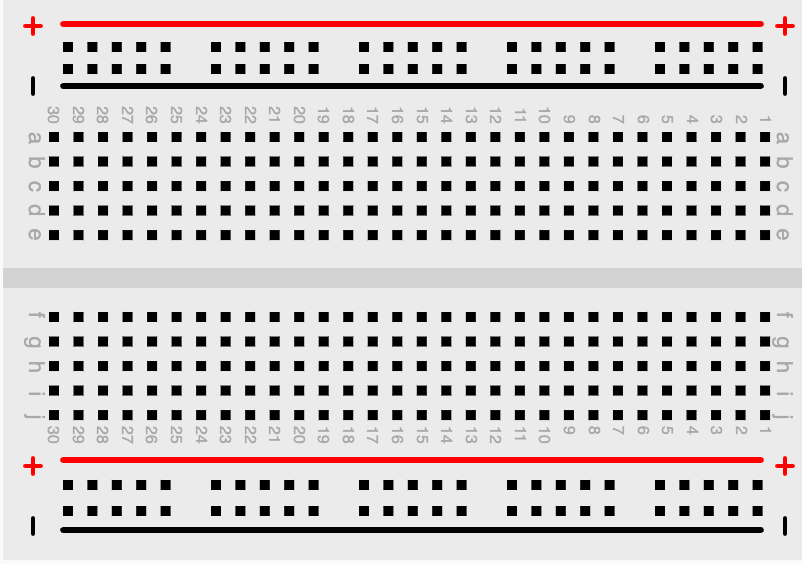

# Breadboarding Basics

In this lesson, we will cover the basics of using a breadboard including
hooking up power to the power rails and connecting components such
as LEDs and motors.

## Step 1: Connect Battery Power Rails

[Breadboarding Tips and Tricks](https://www.youtube.com/watch?v=PE-_rJqvDhQ)

[James Sharman Video Solderless Breadboard, Test & Review](https://www.youtube.com/watch?v=9mYU4_bRx8g)

Zhong Yi
ZY White
Connfly