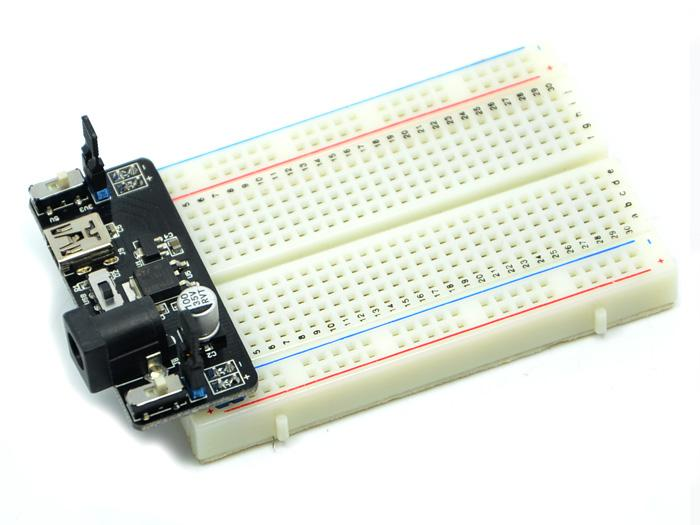
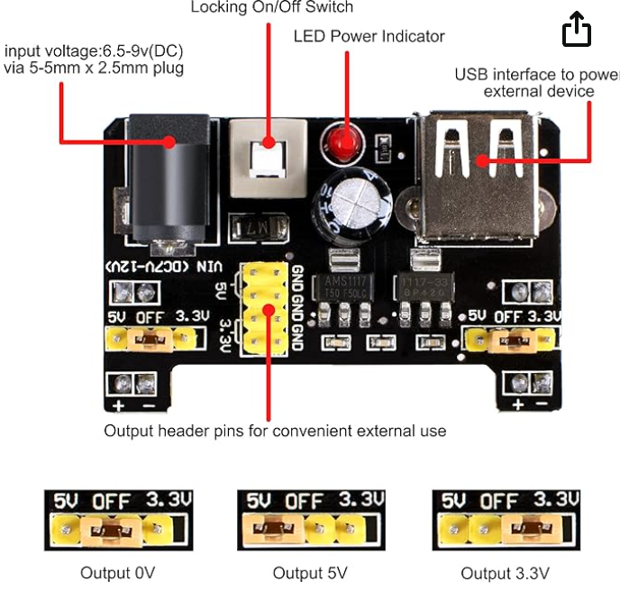
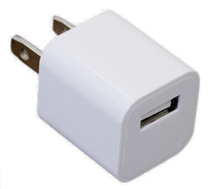

# Power

There are several methods to supply power to your
breadboard.

## Option 1: Batteries

The first is to use a battery pack with 2 or 3 AA or AAA batteries.  These battery
packs can then be connected to 

## Option 2: Breadboard Power Connectors

## Option 3: USB Wall Adaptors

## Option 4: Professional Bench Power Supply

