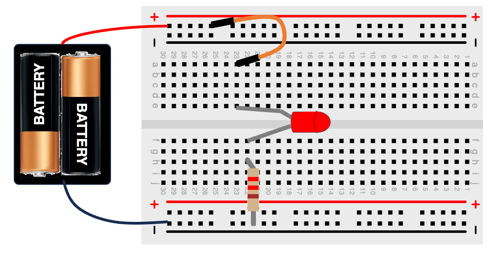

# LED Circuit

## On Breadboard

[LED Tutorial at Sparkfun](https://learn.sparkfun.com/tutorials/light-emitting-diodes-leds)

## MicroSims

[LED Sim](../sims/led/index.md)

[LED Resistor Calculator](../sims/led-resistor-calc/)