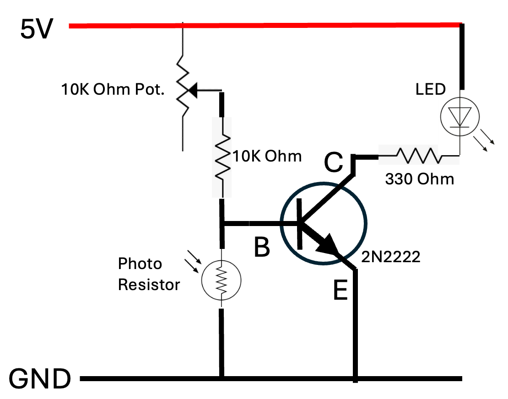
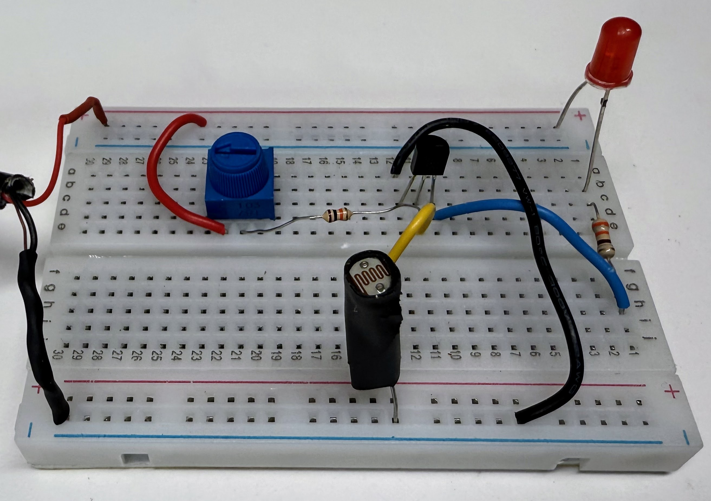

# Dark Detector

<iframe width="560" height="315" src="https://www.youtube.com/embed/toMRH3D9Gwk?si=MiJ7ZA_ZMp56QQcn" title="YouTube video player" frameborder="0" allow="accelerometer; autoplay; clipboard-write; encrypted-media; gyroscope; picture-in-picture; web-share" referrerpolicy="strict-origin-when-cross-origin" allowfullscreen></iframe>

In this lesson we will create a "dark detector" which turns on an LED
when a photodetector (Light Dependant Resistor) detects lack of light. 
This function is similar to a "night light".  We will use
a small adjustable potentiometer called a "trim pot" to adjust
the sensitivity of the circuit.

## Component List

1. 1/2 size breadboard
2. 5 volt power supply (100 milliamps is all we need)
3. Light Emitting Diode (LED)
4. Photodetector (Light Dependant Resistor or LDR)
5. 2N2222 NPN transistor (max current 800 milliamps)
6. 10K resistor
7. 10K trim potentiometer
8. 220 ohm current limiting resistor for LED

## Circuit Diagram

The diagram below shows us the full dark detector circuit.



## Breadboard Layout

We will use a 1/2 size breadboard to lay out the circuit.
The +5 volt power is on the top red bus and the ground
is on the bottom bus.



**Lesson Plan: Building a Dark Detector Circuit**

**Grade Level**: 9th Grade Science

**Duration**: 90 minutes

### **Objectives**

By the end of the lesson, students will be able to:

- Understand the function of a dark detector circuit and its real-world applications.
- Identify and explain the roles of the circuit components: LED, LDR, transistor, potentiometer, and resistors.
- Safely construct a dark detector circuit on a breadboard.
- Analyze how changes in light affect the circuit's behavior.
- Adjust the circuit's sensitivity using a potentiometer.


### **Materials Needed** (per group of 2-3 students)

1.  1/2 size breadboard
2.  5V DC power supply (minimum 100 mA)
3.  Light Emitting Diode (LED)
4.  Light Dependent Resistor (LDR)
5.  2N2222 NPN transistor
6.  10K ohm fixed resistor
7.  10K ohm trim potentiometer
8.  220 ohm resistor (for LED current limiting)
9.  Connecting jumper wires
10.  Multimeter (for measuring resistance and voltage)
11.  Printed circuit diagram
12.  Printed photo of the breadboard circuit
13.  Access to the circuit demonstration video (via projector)

### **Lesson Outline**

#### Step 1: Introduction (10 minutes)

**a. Engage Students**

- **Show the Video**: Begin by playing the short video demonstrating the dark detector circuit in action. Ensure students observe how the LED turns on when the LDR is covered.

**b. Ask Open-Ended Questions**

- "What did you notice about the LED when the LDR was covered?"
- "Why do you think the LED responded to the change in light?"

**c. Relate to Real-World Applications**

- Discuss devices that use similar technology, such as automatic night lights, street lamps, and security systems.


#### **2. Safety Discussion (5 minutes)**

**a. Electrical Safety**

- **Avoid Short Circuits**: Emphasize the importance of correctly connecting components to prevent short circuits, which can damage equipment or cause injury.
- **Disconnect Power When Modifying Circuits**: Always unplug the power supply before making changes to the circuit.

**b. Component Handling**

- Handle all components gently, especially the transistor and LED, which can be damaged by static electricity or excessive current.

**c. Personal Protective Equipment**

- While not necessary for low-voltage circuits, encourage good habits like keeping the workspace organized and dry.


#### **3. Component Exploration (15 minutes)**

**a. Light Emitting Diode (LED) and Current Limiting Resistor**

- **Explanation**: An LED emits light when current flows through it in the correct direction. It requires a resistor to limit the current and prevent damage.

- **Activity**: Examine the LED's anode (long leg) and cathode (short leg). Discuss the importance of polarity.

- **Ohm's Law Review**: Introduce the formula 

$$V=IR$$

where:

V = voltage
I = current
R = voltage

to explain how to choose the appropriate resistor value.  Note that a typical
LED uses 20 milliamps and that 330 ohms
is a good choice for a 5 volt power supply.

**b. Measuring the LDR**

- **Explanation**: An LDR's resistance decreases with more light and increases with less light.

- **Activity**: Use the multimeter to measure the resistance of the LDR in bright light and then when covered. Record and compare the values.

**c. Understanding the Potentiometer**

- **Explanation**: A potentiometer is a variable resistor that can adjust voltage and current in a circuit.

- **Activity**: Connect the potentiometer to the multimeter and observe how turning the knob changes the resistance.

**d. Introduction to the Transistor**

- **Explanation**: The 2N2222 NPN transistor acts as a switch or amplifier. It has three pins: collector (C), base (B), and emitter (E).

- **Activity**: Identify the pins using a datasheet or diagram. Discuss how a small current at the base controls a larger current between the collector and emitter.


#### **4. Building and Testing Circuits (40 minutes)**

**Step 1: Test the Power Supply, LED, and Resistor (10 minutes)**

- **Instructions**:
    - Connect the 220 ohm resistor to the anode of the LED.
    - Connect the other end of the resistor to the positive (+) rail of the breadboard.
    - Connect the cathode of the LED to the negative (-) rail.
    - Connect the power supply to the breadboard rails (+ to +, - to -).
- **Discussion**: Explain that the resistor limits current to protect the LED. Verify that the LED lights up.

**Step 2: Measure LDR Resistance (5 minutes)**

- **Instructions**:
    - Disconnect the power supply.
    - Connect the multimeter probes across the LDR.
    - Measure the resistance with the LDR exposed to light and then covered.
- **Observation**: Note the change in resistance and discuss how light affects the LDR.

**Step 3: Experiment with the Potentiometer (10 minutes)**

- **Instructions**:
    - Connect the outer pins of the potentiometer to the positive and negative rails.
    - Connect the center pin (wiper) to the multimeter's positive probe; connect the negative probe to ground.
    - Turn the potentiometer knob and observe voltage changes.
- **Discussion**: Explain how the potentiometer divides voltage and can control components like the LED.

**Step 4: Create an LED Dimmer with the Potentiometer (10 minutes)**

- **Instructions**:
    - Connect the wiper of the potentiometer to the anode of the LED (through the 220 ohm resistor).
    - Reconnect the power supply.
    - Adjust the potentiometer and observe changes in LED brightness.
- **Discussion**: Relate changes in voltage to LED brightness.

**Step 5: Introduce the Transistor into the Circuit (10 minutes)**

- **Instructions**:

    - Remove the potentiometer from the LED circuit.
    - Connect the collector (C) of the transistor to the negative side of the LED.
    - Connect the emitter (E) of the transistor to the negative rail.
    - Connect the positive side of the LED (through the 220 ohm resistor) to the positive rail.
    - Connect the base (B) of the transistor to the wiper of the potentiometer through a 10K ohm resistor.
- **Observation**: Adjusting the potentiometer should turn the LED on and off.

- **Discussion**: Explain how the transistor acts as a switch controlled by the base voltage.


#### **5. Building the Dark Detector Circuit (20 minutes)**

**a. Assemble the Voltage Divider with LDR and Potentiometer**

- **Instructions**:
    - Disconnect the potentiometer from the transistor's base.
    - Connect one end of the LDR to the positive rail.
    - Connect the other end of the LDR to the wiper of the potentiometer.
    - Connect one outer pin of the potentiometer to the negative rail.
    - Connect the junction of the LDR and potentiometer (voltage divider output) to the base of the transistor through the 10K ohm resistor.
- **Diagram Reference**: Use the printed circuit diagram and breadboard photo to guide assembly.

**b. Test the Dark Detector Circuit**

- **Instructions**:
    - Power the circuit.
    - Observe the LED in ambient light; it should be off.
    - Cover the LDR; the LED should turn on.
- **Adjustment**: If the LED doesn't respond as expected, adjust the potentiometer to change sensitivity.

**c. Discussion**

- **Voltage Divider Concept**: Explain how the LDR and potentiometer create a voltage divider that controls the base voltage of the transistor.

- **Transistor Operation**: Discuss how increasing resistance (covering the LDR) raises the base voltage, turning on the transistor and LED.


#### **6. Real-World Applications and Extensions (10 minutes)**

**a. Applications**

- **Night Lights**: Discuss how similar circuits are used in automatic night lights that turn on in the dark.

- **Street Lighting**: Explain how street lamps use sensors to operate at night.

**b. Circuit Enhancements**

- **Sensitivity Adjustment**: Experiment with different resistor values to see how they affect sensitivity.

- **Alternative Outputs**: Discuss replacing the LED with other devices like buzzers or relays for different applications.


#### **7. Review and Assessment (10 minutes)**

**a. Recap Key Concepts**

- **Components and Functions**: Summarize the role of each component in the circuit.

- **Circuit Operation**: Review how the circuit responds to changes in light.

**b. Questions for Understanding**

- "What happens to the voltage at the transistor's base when the LDR is covered?"
- "How does the potentiometer affect the circuit's sensitivity?"

**c. Exit Ticket**

- **Prompt**: Write a brief explanation of how the dark detector circuit works and one real-world application.

- **Collect Responses**: Use these to assess understanding and address any misconceptions in the next class.

### **Additional Notes**

#### **Safety Reminders**

- Continuously monitor students to ensure they follow safety protocols.
- Encourage students to ask questions if unsure about any steps.

#### **Troubleshooting Tips**

- **Non-Functioning LED**: Check for correct LED orientation and secure connections.

- **Transistor Issues**: Ensure correct identification of transistor pins (consult datasheet if necessary).

#### **Differentiation Strategies**

- **Advanced Students**: Challenge them to modify the circuit to respond to light instead of darkness.

- **Students Needing Support**: Pair them with peers or provide additional diagrams and one-on-one assistance.

#### **Homework Extension**

- **Research Assignment**: Investigate another type of sensor (e.g., temperature sensor) and explain how it could be integrated into a circuit.

- **Creative Project**: Design a schematic for an automatic plant watering system using similar principles.

### Wrap Up

Thank the students for their participation and enthusiasm. Encourage them to think about how the principles learned today apply to everyday technology and to consider the possibilities of creating their own electronic projects in the future.

**Note to the Teacher**: Ensure all materials are prepared and tested before the lesson. Familiarize yourself with the circuit to confidently guide students and address any issues that may arise.

## Prompt

```linenums="0"
Create a detailed lesson plan for a dark detector circuit.
Assume your audience is a 9th grade science class
that is already familiar with how a breadboard works.
Assume you have a short video of the circuit working
and the LED turns on and off as you put your finger
over the LDR.  Assume you have a circuit diagram
of the dark detector and a photo of the breadboard
circuit.

I suggest the following parts:

## Component List

1. 1/2 size breadboard
2. 5 volt power supply (100 milliamps is all we need)
3. Light Emitting Diode (LED)
4. Photodetector (Light Dependant Resistor or LDR)
5. 2N2222 NPN transistor (max current 800 milliamps)
6. 10K resistor
7. 10K trim potentiometer
8. 220 ohm current limiting resistor for LED

1. First discuss safety and short circuits.
2. Next test the power supply, LED and resistor.
Discuss the LED parts and why we need a current
limiting resistor.
3. Measure the resistance across the LDR using an ohm
meter with the LDR covered and uncovered.
4. Next, explain what a potentiometer is and how
it works.  Connect the center tap of the pot
and measure the voltage as you vary the pot.
5. Create a LED dimmer with the pot.
Make the LED change brightness as you adjust
the trim pot.
6. Explain what a voltage divider circuit
is and the need to limit current for safety.
7. Explain what the part of a transistor is
and connect it into a circuit with the pot
at the base.
8. Create a dark detector circuit.  Use
the pot to adust the sensitivity of the circuit.
9. Discuss how the circuit can be used
in a night light.
10.  Discuss how bright the LED can be
and the limits of the current in the
transistor.
```

## ChatGPT o1-preview Plan

ChatGPT thought for 45 seconds

#### Constructing lesson plans

OK, let me see. A 9th-grade science class is working with a dark detector circuit. They have a breadboard, a circuit diagram, and a working circuit video. Let's break this down step by step.

#### Charting the course

I’m mapping out a detailed lesson plan for 9th graders on building and testing a circuit. The plan includes explaining safety, circuit components, and a step-by-step guide.

#### Structuring the plan

I’m planning to outline the lesson with objectives, materials, introduction, step-by-step activities, discussion/wrap-up, and assessment. This will cover topics, ensure safety, explain components, and guide through building and understanding the dark detector circuit.

#### Building and analyzing

I’m gathering info on building a dark detector circuit, focusing on components, safety, and real-world uses. This involves constructing, testing, and analyzing the circuit step-by-step.

#### Understanding components

First, it's interesting to see how LEDs and LDRs interplay with current and light. Then, potentiometers dynamically adjust voltage. Finally, I explore transistors as essential current amplifiers or switches.

#### Testing and modifying

I’m piecing together a voltage divider circuit with a potentiometer, using it to dim an LED. Then, I introduce a transistor to control the LED, leveraging the potentiometer for its base current.

#### Analyzing and Discussing
I examined how the voltage divider affects the transistor's base voltage, the potentiometer's control over light sensitivity, and the transistor's role in current amplification to drive the LED, ensuring proper current limits.

#### Piloting comprehension

Gathering material and engaging students, I'll familiarize them with the circuit components, focusing on hands-on learning and collaboration. This approach should foster understanding and active participation.

#### Constructing a dark detector

I’m piecing together a lesson plan for 9th graders, focusing on building a dark detector circuit. They’ll learn about circuit components, voltage dividers, and transistors, and relate it to real-world uses like night lights.

#### Setting the stage

Greeting students, outlining the lesson, showing a dark detector circuit video, and discussing real-world applications like night lights and security systems.

#### Reviewing safety measures

I always disconnect power when assembling circuits. Handling components gently ensures their longevity.

#### Exploring electronic control

I’m assembling a plan to investigate LED current limiting, LDR changes in light, potentiometer voltage adjustment, and transistor current control. Each component serves a specific function, demonstrating the interplay between them.

#### Integrating components

I’m outlining the process of integrating an LDR with a potentiometer and a transistor to control an LED's brightness based on light levels. Adjusting the potentiometer sensitivity refines this control.

#### Understanding transistor action

I’m piecing together how the voltage divider circuit influences the transistor's base voltage, determining its state between saturation and cutoff.

#### Consideration of applications

I’m thinking about real-world devices like automatic garden lights and alarm systems, and imagining circuit modifications like using a buzzer or adding a relay for controlling larger loads.

## References

* [Link to full original ChatGPT transcript](https://chatgpt.com/share/6734a24b-5798-8001-8299-eb9057613166)
* [Dark Detector Video by Educ8s.tv](https://www.youtube.com/watch?v=eEBMTpxdPiE)