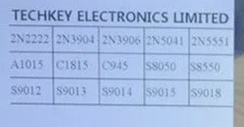

# Transistors

### **Transistors: A Beginner's Guide**

#### **What is a Transistor?**

A transistor is a tiny electronic component that can control the flow of electricity in a circuit. Think of it like a switch that can turn things on or off, or a valve that controls how much water flows through a pipe. In electronics, transistors are used to amplify signals or switch electronic signals on and off.

#### **Parts of a Transistor**

A transistor has three main parts:

1.  **Collector (C):** This is where the electric current enters the transistor.
2.  **Emitter (E):** This is where the current exits the transistor.
3.  **Base (B):** The base controls the flow of current from the collector to the emitter. It's like the handle of a faucet that controls the water flow.

#### **How Does a Transistor Work?**

Let's imagine the transistor as a faucet:

-   **Base:** The handle of the faucet. When you turn the handle (apply a small current to the base), you control the flow of water (electric current) from the collector to the emitter.
-   **Collector:** This is where the water (electric current) comes from. It's connected to the main power source.
-   **Emitter:** This is where the water (electric current) flows out. It's connected to the part of the circuit that needs power.

When a small amount of current flows into the base, it allows a larger current to flow from the collector to the emitter. This makes the transistor a powerful tool in electronic circuits because it can control large currents with very small signals.

#### **Types of Transistors**

There are two main types of transistors:

-   **NPN Transistor:** The current flows from the collector to the emitter when the base gets a small positive voltage.
-   **PNP Transistor:** The current flows from the emitter to the collector when the base gets a small negative voltage.

### **Sample Projects Using Transistors**

Now that you understand the basics of transistors, here are some fun projects you can build using them:

1.  **Simple LED Flasher**

    -   **What You Need:** An NPN transistor (like 2N2222), a resistor, an LED, and a power source (like a 9V battery).
    -   **How It Works:** The transistor will control the blinking of the LED. By adding a capacitor, you can make the LED flash on and off at a regular interval.
2.  **Light-Sensitive Switch**

    -   **What You Need:** An NPN transistor, a photoresistor (light-dependent resistor), an LED, and a resistor.
    -   **How It Works:** The photoresistor detects light levels. When it gets dark, the transistor allows current to flow and turns on the LED.
3.  **Touch Sensor Lamp**

    -   **What You Need:** A PNP transistor, a resistor, an LED, and two pieces of metal (like aluminum foil).
    -   **How It Works:** When you touch the two pieces of metal together, it completes the circuit and the transistor turns on the LED.
4.  **Simple Amplifier**

    -   **What You Need:** An NPN transistor, a small speaker, a microphone, and a power source.
    -   **How It Works:** The transistor amplifies the small sound signals from the microphone so that they are loud enough to be heard through the speaker.
5.  **Transistor Logic Gate**

    -   **What You Need:** Multiple NPN transistors, resistors, LEDs, and switches.
    -   **How It Works:** You can use transistors to create basic logic gates (AND, OR, NOT) which are the building blocks of computers. This project is great for understanding how computers process information.

### **Conclusion**

Transistors are like the magic wands of electronics. They can control big currents with tiny signals, which makes them incredibly useful for creating all sorts of cool gadgets. Start with these simple projects, and who knows---maybe you'll be building robots or your own computer someday!

Happy building!

4o

## Common Transistor Types

Here's a list of the transistor part numbers from the image:

1.  2N2222
2.  2N3904
3.  2N3906
4.  2N5041
5.  2N5551
6.  A1015
7.  C1815
8.  C945
9.  S8050
10.  S8550
11.  S9012
12.  S9013
13.  S9014
14.  S9015
15.  S9018

These are common transistors used in various electronic applications.

4o

##### You said:

For each transistor, give a summary of it's specification and typical use compared to the other transistors.

###### ChatGPT said:

ChatGPT

Here's a summary of each transistor's specifications and typical use, with comparisons to the others in the list:

### 1\. **2N2222 (NPN)**

-   **Specifications:**
    -   **Max Collector Current (Ic):** 800 mA
    -   **Max Collector-Emitter Voltage (Vce):** 40V
    -   **Power Dissipation (Ptot):** 500 mW
-   **Typical Use:** General-purpose low-power switching and amplification. It can handle moderate currents, making it versatile for many applications, including driving loads like LEDs and relays.

### 2\. **2N3904 (NPN)**

-   **Specifications:**
    -   **Max Collector Current (Ic):** 200 mA
    -   **Max Collector-Emitter Voltage (Vce):** 40V
    -   **Power Dissipation (Ptot):** 625 mW
-   **Typical Use:** Similar to the 2N2222 but with a lower current capacity. Common in signal amplification, low-power switching, and general-purpose low-frequency applications.

### 3\. **2N3906 (PNP)**

-   **Specifications:**
    -   **Max Collector Current (Ic):** 200 mA
    -   **Max Collector-Emitter Voltage (Vce):** 40V
    -   **Power Dissipation (Ptot):** 625 mW
-   **Typical Use:** The PNP complement to the 2N3904, often used in push-pull amplifier circuits and low-power switching applications.

### 4\. **2N5041 (NPN)**

-   **Specifications:**
    -   **Max Collector Current (Ic):** 100 mA
    -   **Max Collector-Emitter Voltage (Vce):** 50V
    -   **Power Dissipation (Ptot):** 250 mW
-   **Typical Use:** Less common than the others, used in low-current switching and amplification applications. Suitable for small-signal tasks.

### 5\. **2N5551 (NPN)**

-   **Specifications:**
    -   **Max Collector Current (Ic):** 600 mA
    -   **Max Collector-Emitter Voltage (Vce):** 160V
    -   **Power Dissipation (Ptot):** 625 mW
-   **Typical Use:** High-voltage, low-current applications. Commonly used in amplifier stages where higher voltage ratings are needed.

### 6\. **A1015 (PNP)**

-   **Specifications:**
    -   **Max Collector Current (Ic):** 150 mA
    -   **Max Collector-Emitter Voltage (Vce):** 50V
    -   **Power Dissipation (Ptot):** 400 mW
-   **Typical Use:** Low-power audio amplification and switching applications. Suitable for low-noise stages in audio circuits.

### 7\. **C1815 (NPN)**

-   **Specifications:**
    -   **Max Collector Current (Ic):** 150 mA
    -   **Max Collector-Emitter Voltage (Vce):** 50V
    -   **Power Dissipation (Ptot):** 400 mW
-   **Typical Use:** Low-power, low-noise signal amplification in audio and radio frequency circuits. Comparable to A1015 but in NPN configuration.

### 8\. **C945 (NPN)**

-   **Specifications:**
    -   **Max Collector Current (Ic):** 150 mA
    -   **Max Collector-Emitter Voltage (Vce):** 50V
    -   **Power Dissipation (Ptot):** 400 mW
-   **Typical Use:** General-purpose signal amplification and switching. It is similar in use to C1815 but is more commonly used in various hobbyist projects and consumer electronics.

### 9\. **S8050 (NPN)**

-   **Specifications:**
    -   **Max Collector Current (Ic):** 1.5 A
    -   **Max Collector-Emitter Voltage (Vce):** 40V
    -   **Power Dissipation (Ptot):** 1W
-   **Typical Use:** Higher current switching applications than the 2N2222. Suitable for driving motors and other medium-power loads.

### 10\. **S8550 (PNP)**

-   **Specifications:**
    -   **Max Collector Current (Ic):** 1.5 A
    -   **Max Collector-Emitter Voltage (Vce):** 25V
    -   **Power Dissipation (Ptot):** 1W
-   **Typical Use:** The PNP counterpart to the S8050, used in higher current switching applications where PNP transistors are required.

### 11\. **S9012 (PNP)**

-   **Specifications:**
    -   **Max Collector Current (Ic):** 500 mA
    -   **Max Collector-Emitter Voltage (Vce):** 30V
    -   **Power Dissipation (Ptot):** 400 mW
-   **Typical Use:** General-purpose low-power switching and amplification, comparable to the 2N3906 but with slightly different specifications.

### 12\. **S9013 (NPN)**

-   **Specifications:**
    -   **Max Collector Current (Ic):** 800 mA
    -   **Max Collector-Emitter Voltage (Vce):** 30V
    -   **Power Dissipation (Ptot):** 400 mW
-   **Typical Use:** Similar to the 2N2222, used in general-purpose switching and amplification but with a different maximum voltage rating.

### 13\. **S9014 (NPN)**

-   **Specifications:**
    -   **Max Collector Current (Ic):** 500 mA
    -   **Max Collector-Emitter Voltage (Vce):** 50V
    -   **Power Dissipation (Ptot):** 400 mW
-   **Typical Use:** Low-power signal amplification, similar to the BC547 but with slightly different current and voltage ratings.

### 14\. **S9015 (PNP)**

-   **Specifications:**
    -   **Max Collector Current (Ic):** 500 mA
    -   **Max Collector-Emitter Voltage (Vce):** 50V
    -   **Power Dissipation (Ptot):** 400 mW
-   **Typical Use:** Complementary to the S9014, used in low-power signal amplification and switching in PNP configurations.

### 15\. **S9018 (NPN)**

-   **Specifications:**
    -   **Max Collector Current (Ic):** 50 mA
    -   **Max Collector-Emitter Voltage (Vce):** 15V
    -   **Power Dissipation (Ptot):** 400 mW
-   **Typical Use:** High-frequency, low-power applications such as RF amplification. It's designed for higher frequencies and lower power applications compared to the other transistors on the list.

### **Comparison Summary:**

-   **Higher Current Handling:** S8050, S8550
-   **Higher Voltage Handling:** 2N5551
-   **General-Purpose:** 2N2222, 2N3904, 2N3906, S9012, S9013, S9014, S9015
-   **Low-Noise Amplification:** A1015, C1815, C945
-   **High-Frequency Applications:** S9018

These transistors cover a broad range of applications from general-purpose switching and amplification to specialized tasks like RF amplification. Their selection in a circuit depends on the specific requirements of current, voltage, frequency, and polarity.