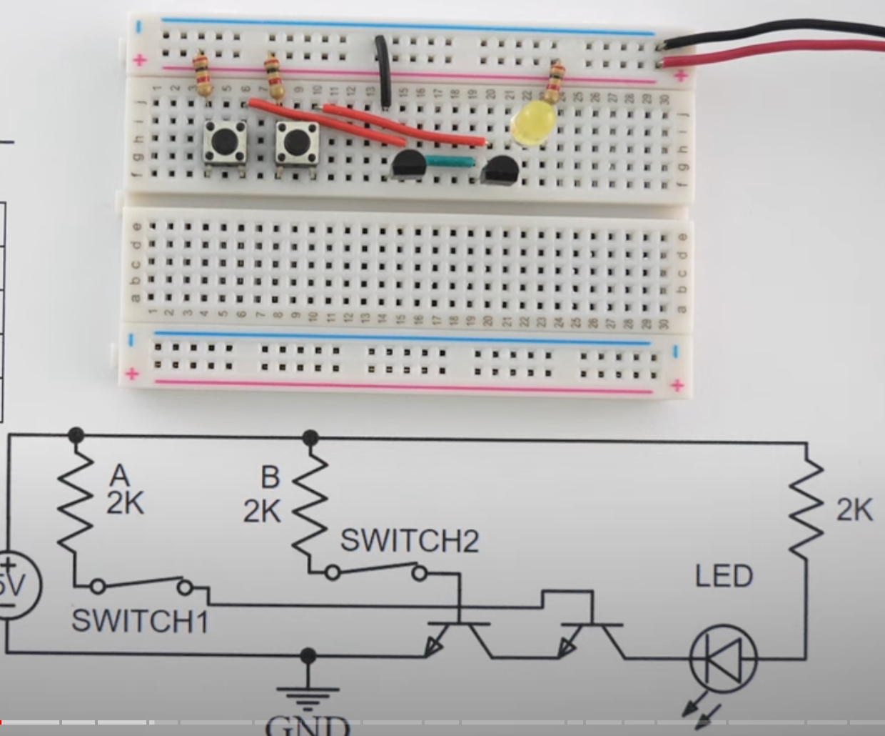

# Boolean Logic Gates From Transistors

In this lesson, we will learn how to build simple Boolean logic
gates using just buttons, resistors, wire and transistors.

We will learn how to create and understand the operation of fundamental digital logic gates using momentary push buttons, 2K resistors, 2N2222 transistors, and LEDs on a solderless breadboard.

### Materials:

-   Solderless breadboard
-   5V power supply
-   Momentary push buttons (for digital inputs)
-   2N2222 transistors
-   2K resistors
-   LEDs (for output)
-   Jumper wires

### Introduction:

1.  **Discuss Digital Logic**:

    -   Explain the concept of logic gates in digital circuits, introducing the gates they will build: Buffer, AND, OR, NAND, XOR, XNOR, and Inverter.
    -   Brief overview of how transistors can act as switches in digital circuits.

2.  **Components**:

    -   Describe the function of each component:
        -   **Momentary Push Buttons**: Used to represent binary inputs (1 when pressed, 0 when not pressed).
        -   **Resistors**: Provide current limiting.
        -   **2N2222 Transistors**: Used as switches in the circuit to implement logic gates.
        -   **LEDs**: Show the output of the logic gates.

### Logic Gate 1: **Buffer (Non-Inverting)**

#### Circuit:

-   Input: 1 momentary push button
-   Output: 1 LED that turns on when the button is pressed

#### Steps:

1.  Connect one leg of the push button to the 5V power supply and the other leg to the base of the 2N2222 transistor through a 2K resistor.
2.  The emitter of the transistor should be connected to ground.
3.  Connect the collector to the positive leg of the LED, and the negative leg of the LED to ground through a 2K resistor.
4.  Explain: When the button is pressed (input = 1), the transistor allows current to flow, turning the LED on (output = 1).

#### Explanation:

The Buffer gate passes the input directly to the output. When the button is pressed (high input), the LED lights up.

### Logic Gate 2: **AND Gate**

| Input A | Input B | Output (A AND B) |
|---------|---------|------------------|
|    0    |    0    |        0         |
|    0    |    1    |        0         |
|    1    |    0    |        0         |
|    1    |    1    |        1         |

#### Circuit:

-   Input: 2 momentary push buttons
-   Output: 1 LED that turns on ONLY when both buttons are pressed

#### Steps:

1.  Connect two push buttons. One leg of each button should be connected to the 5V power supply and the other to the base of separate 2N2222 transistors, both through 2K resistors.
2.  Connect the emitters of both transistors to ground.
3.  Connect the collectors to a common point. From this common point, connect to the positive leg of the LED, and connect the negative leg of the LED to ground through a 2K resistor.
4.  Explain: The LED will only light up when both buttons are pressed (input = 1 for both).

#### Explanation:

The AND gate only outputs a high signal (lights the LED) when both inputs are high (both buttons pressed).

### Logic Gate 3: **OR Gate**

| Input A | Input B | Output (A OR B) |
|---------|---------|-----------------|
|    0    |    0    |       0         |
|    0    |    1    |       1         |
|    1    |    0    |       1         |
|    1    |    1    |       1         |

#### Circuit:

-   Input: 2 momentary push buttons
-   Output: 1 LED

#### Steps:

1.  Set up two push buttons with one leg of each connected to the 5V power supply and the other to the base of separate 2N2222 transistors through 2K resistors.
2.  The emitters of both transistors should be connected to ground.
3.  Connect the collectors of both transistors to the positive leg of the LED, with the negative leg of the LED connected to ground through a 2K resistor.
4.  Explain: The LED will light up if either of the buttons is pressed.

#### Explanation:

-   The OR gate outputs a high signal when at least one input is high (either button pressed).

### Logic Gate 4: **NAND Gate**

| Input A | Input B | Output (A NAND B) |
|---------|---------|-------------------|
|    0    |    0    |        1          |
|    0    |    1    |        1          |
|    1    |    0    |        1          |
|    1    |    1    |        0          |

#### Circuit:

-   Input: 2 momentary push buttons
-   Output: The LED is on unless both buttons are pressed

#### Steps:

1.  Build the AND gate circuit, but add another 2N2222 transistor as an inverter at the output.
2.  Connect the collector of the AND gate output to the base of the inverter transistor through a 2K resistor.
3.  The collector of the inverter transistor goes to the positive leg of the LED, with the negative leg connected to ground through a 2K resistor.
4.  Explain: The LED will light up unless both buttons are pressed.

#### Explanation:

-   The NAND gate outputs a high signal when at least one input is low (opposite of AND).

### Logic 5: NOR

| Input A | Input B | Output (A NOR B) |
|---------|---------|------------------|
|    0    |    0    |        1         |
|    0    |    1    |        0         |
|    1    |    0    |        0         |
|    1    |    1    |        0         |

### Logic Gate 6: XOR Gate

#### Circuit:

-   Input: 2 momentary push buttons
-   Output: 1 LED

#### Steps:

1.  Use two 2N2222 transistors to form the XOR logic.
2.  Connect the base of each transistor to one of the push buttons through 2K resistors.
3.  The output of one transistor's collector is connected to the base of the second transistor and vice versa, creating a cross-coupled structure.
4.  Explain: The LED will light up only when the inputs are different.

#### Explanation:

-   The XOR gate outputs a high signal only when one input is high and the other is low.

### Logic Gate 7: XNOR Gate

#### Circuit:

-   Input: 2 momentary push buttons
-   Output: 1 LED

#### Steps:

1.  Build the XOR gate and then add an inverter at the output.
2.  Connect the output of the XOR gate to the base of another 2N2222 transistor through a 2K resistor.
3.  The collector of the inverter goes to the positive leg of the LED.
4.  Explain: The LED will light up only when the inputs are the same.

#### Explanation:

-   The XNOR gate outputs a high signal when both inputs are the same (both high or both low).

### Logic Gate 7: **Inverter (NOT Gate)**

#### Circuit:

-   Input: 1 momentary push button
-   Output: 1 LED

#### Steps:

1.  Connect one leg of the push button to the 5V power supply and the other leg to the base of a 2N2222 transistor through a 2K resistor.
2.  Connect the emitter of the transistor to ground.
3.  Connect the collector to the positive leg of the LED and ground the negative leg through a 2K resistor.
4.  Explain: When the button is not pressed (input = 0), the LED will be on. When the button is pressed (input = 1), the LED will turn off.

#### Explanation:

The Inverter outputs the opposite of the input. When the button is pressed, the LED turns off, and when the button is not pressed, the LED lights up.

### Conclusion:

-   Review the operation of each logic gate.
-   Discuss how these simple gates can be combined to create more complex digital systems.
-   Encourage students to experiment with different inputs and gates to see how the output changes.

## References

[Digital Logic Gates from Transistors, AND, NAND, OR, NOR, XOR, XNOR, Buffer, and Inverter](https://www.youtube.com/watch?v=nB6724G3b3E)