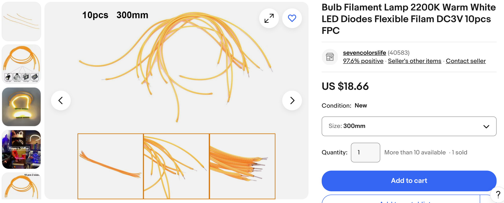
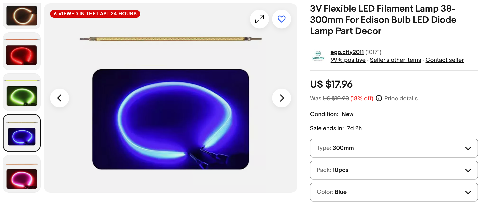
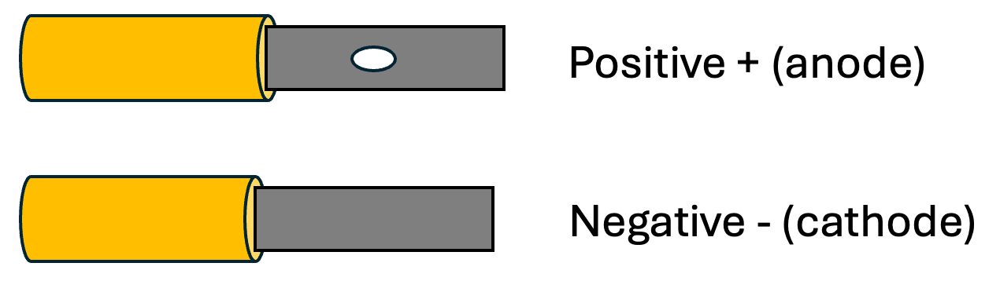
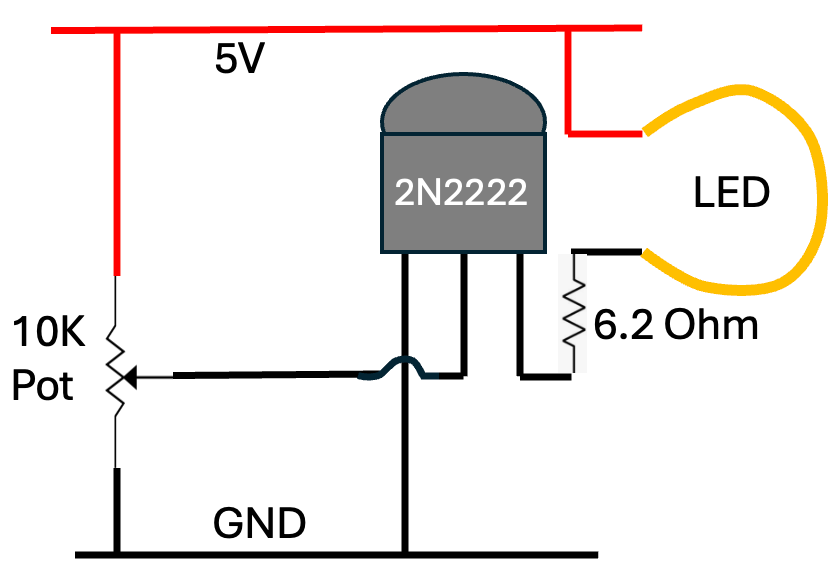

# LED Noodle Circuit

New flexible "LED noodles" are perfect for costumes.
They only cost 1-2 dollars.
They are powered by 3 volts DC and can take over 100 milliamps.

## Purchasing

[e-Bay Listing](https://www.ebay.com/itm/126264426037?var=427291554300)

[Blue Noodle LED](https://www.ebay.com/itm/186647016174)
## Connections

## Testing

Use 2 AA batteries in series.

Use 3 AA batteries with a 15K resistor.

Use a 9 volt battery with a 470 ohm resistor.

## Brightness Control Circuit

## Lesson Plan: Controlling a 100 mA Filament LED Using a 2N2222 Transistor

### Objective

Students will learn how to use a 2N2222 NPN transistor as a switch to control a 100 mA filament LED. They will understand the basic operation of transistors, how to calculate base resistance, and how to safely operate a circuit with a transistor controlling a higher current load.

### Materials

-   1 x 2N2222 NPN transistor
-   1 x 100 mA filament LED
-   1 x 10K ohm potentiometer
-   1 x 6.2 ohm resistor
-   1 x 5V power supply (e.g., a USB power bank or regulated DC supply)
-   Breadboard and jumper wires
-   Multimeter (optional)

**Duration:** 1 hour

### Prerequisites

-   Basic understanding how to use a battery and wire to make a circuit
-   Basic knowledge of polarity, positive and negative connections
-   Familiarity with breadboards and basic circuit connections

### Lesson Steps

#### **1 Introduction to Transistors (10 minutes)**

**Discussion:**
    -   Introduce the concept of a transistor as a switch or amplifier.
    -   Explain the function of the 2N2222 NPN transistor, emphasizing that it allows a small base current to control a larger current between the collector and emitter.
    -   Mention that the 2N2222 can handle up to 800 mA of collector current, making it suitable for switching applications in circuits.

#### 2 Circuit Diagram Explanation (10 minutes)**

**Activity:**
    -   Show the circuit diagram (the one provided) and explain each component's role:
        -   **Power Supply (5V):** Provides the necessary voltage for the circuit.
        -   **10K Potentiometer:** Used to vary the base current to the transistor.
        -   **2N2222 Transistor:** Acts as a switch to control the current through the LED.
        -   **6.2 Ohm Resistor:** Limits the current through the LED to protect it.
        -   **LED:** The load that will be controlled by the transistor.
    -   Explain how the potentiometer allows control over the base current and, therefore, the LED's brightness.

##### **3\. Circuit Assembly (15 minutes)**

**Activity:**
    -   Guide the students in assembling the circuit on a breadboard:
        -   Connect the 5V power supply to the circuit.
        -   Connect the potentiometer between the 5V supply and ground, with its wiper going to the transistor's base.
        -   Connect the 6.2-ohm resistor in series with the LED to the transistor's collector.
        -   Connect the emitter of the transistor to ground.
        -   Ensure all connections are secure and correct.

#### **4 Testing and Observations (15 minutes)**

**Activity:**

    -   Power on the circuit and use the potentiometer to vary the brightness of the LED.
    -   Use a multimeter to measure the base current and the current through the LED.
    -   Ask students to observe how changing the base current affects the LED brightness and discuss why this happens (relating to the transistor's operation as a current-controlled switch).

##### **5\. Calculations and Safety (10 minutes)**

-   **Discussion:**
    -   Discuss the importance of choosing the correct base resistor (or potentiometer setting) to avoid damaging the transistor or LED.
    -   Calculate the base resistor value using the formula: Rb\=Vin-VbeIbR\_b = \\frac{V\_{in} - V\_{be}}{I\_b}Rb​\=Ib​Vin​-Vbe​​, where VinV\_{in}Vin​ is the input voltage, VbeV\_{be}Vbe​ is typically 0.7V for the 2N2222, and IbI\_bIb​ is the desired base current.
    -   Emphasize the importance of not exceeding the maximum ratings of the transistor.

##### **6\. Conclusion and Q&A (10 minutes)**

-   **Summary:**
    -   Recap the key points: how a transistor works as a switch, the role of each component in the circuit, and how to safely control a high-current load using a small signal.
    -   Open the floor for any questions.
    -   Suggest some possible extensions of the lesson, such as controlling the LED with a microcontroller or integrating the circuit into a larger project.

#### **Assessment:**

-   Students should be able to explain how the 2N2222 transistor controls the LED.
-   They should be able to calculate the necessary base resistance for different load currents.
-   Students should demonstrate the ability to safely construct and test the circuit.

#### **Extensions:**

-   **Advanced:** Have students design a circuit where multiple LEDs are controlled by different transistors, all managed by a microcontroller like an Raspberry Pi Pico.
-   **Real-World Connection:** Discuss applications of transistors in everyday devices, such as in switching power supplies, amplifiers, and digital logic circuits.

This lesson will not only teach practical skills in electronics but also reinforce theoretical concepts in a hands-on manner, making it a comprehensive introduction to transistor-based circuits.