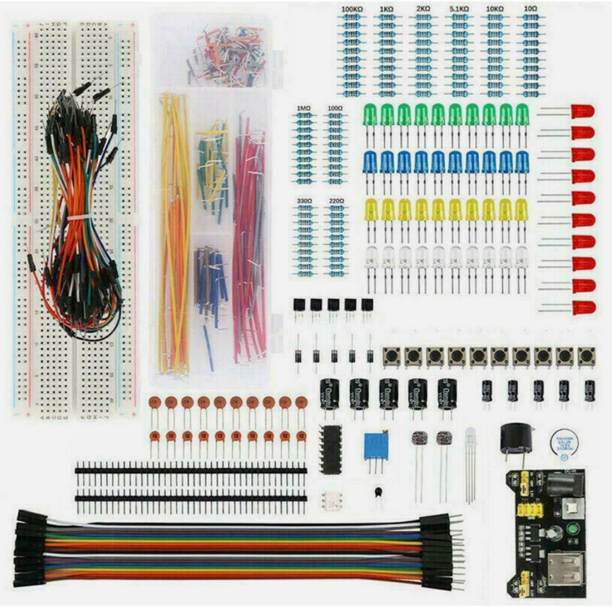

# Breadboard Kits and Power

If you search for "Electronic Component Starter Kit"
Target Price: $15

$11 for 4 or more kits

[eBay Listing](https://www.ebay.com/itm/314928530461)

## USB Power and USB Cable

Individuals at home can use any USB
wall charger.

We will be using under 300 milliamps in our labs and most wall chargers support 500 milliamps, 1 amp or 2.1 amps.  These can be [purchased on eBay](https://www.ebay.com/itm/394656358927) for a few dollars each.

The seller [uchoose-wireless](https://www.ebay.com/itm/312779428580) has sold more than 22,000 of these wall chargers.

## USB A Male-to-Male

To get power from your wall charger to the breadboard you will need the appropriate USB cable.  Here is an example of a male-to -male USB cable which you can purchase on eBay for a [few dollars](https://www.ebay.com/itm/404564011547).

## Components

[Starter Beginner DIY Electronics Basic Kit 830 Holes Breadboard Resistors Buzzer $20](https://www.ebay.com/itm/186074606580)