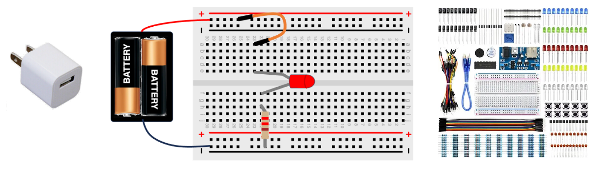

# Beginning Electronics Setup

One of the frist steps in getting started with electronics is
to get three things:

1. **A Source of Power** - like a battery or a 5-volt USB cable
2. **A Solderless Breadboard** - like the half-sized one above
3. **Some Electrical Parts** - we suggest purchasing a Beginning Electronics kit for under $20

This section will show you how to find and purchase these components.