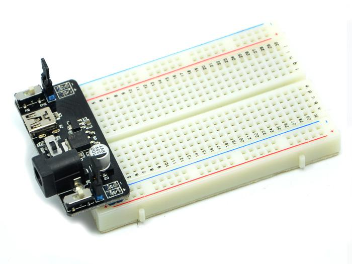
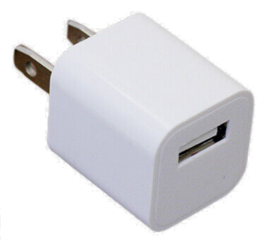

# Finding the Right Power Supplies

Our projects need some type of power. A 5V DC power supply is the most cost-effective way to provide power.  These power supplies usually use common and inexpensive components with built-in safety circuits.  Here are a few methods to try.

Since the power supply is often the most expensive part of the kit,
it is important to get this component correct.  We suggest
purchasing a single set of parts to test before you purchase in bulk.

For younger students who may be prone to short-circuiting their projects,
we suggest starting with easily replaceable 2x AA battery packs.
As students get more experience they can move to other power supply options.

## Battery-Based Power Supply

Standard batteries (like AA or AAA) and a battery holder is another good low-cost option.  We combine 2 or 3 batteries to achieve a total of 3 or 4.5 volts.  We like to purchase our batteries in bulk at stores like CostCo.

We can find battery cases on eBay for about $1.10 each in quantity 10.

[eBay Listing](https://www.ebay.com/itm/115975029782)

[eBay Search for 10PCS 3X AA Black Battery Holder Case](https://www.ebay.com/sch/i.html?_nkw=10PCS+3x+AA+Black+Battery+Holder+Case)

We avoid 9v batteries for beginning students.  If they short circuit the can
get hot and cause burns.

## Short Circuit and Thermal Protection

When selecting a power supply look for systems that provide short-circuit
and overload protection.  In breadboard power supplies that provide 5V or 3.3V outputs, several types of voltage regulators are commonly used. Here are a few examples:

### Linear Regulators

-   **LM7805**: For 5V output. It's a popular linear regulator providing a fixed output of 5 volts.
-   **LM317**: An adjustable linear regulator that can be set to output a range of voltages, including 5V and 3.3V, by using external resistors.
-   **LM1117**: Particularly used for 3.3V applications, it's a low-dropout linear regulator suitable for lower voltage differences between input and output.

### Switching Regulators

These are less common in simple breadboard power supplies due to their complexity but are used when efficiency is a key concern. Examples include the LM2576 (adjustable output) or specific switch-mode modules.

## Overload Protection

Most standard voltage regulators include some form of internal protection:

-   **Overcurrent Protection**: This shuts down the regulator if the current exceeds a certain threshold, protecting both the regulator and the circuit from damage due to short circuits or excessive load.

-   **Thermal Shutdown**: This protection mechanism turns off the regulator if it gets too hot, preventing damage from overheating.

-   **Overvoltage Protection**: Some regulators also include protection against input voltage spikes.

It's important to note that while these features provide a level of safety, they are not infallible, and additional external protection (like fuses or current limiting resistors) might be advisable in certain applications. Always refer to the specific regulator's datasheet for detailed information on its capabilities and limitations.

## USB-Breadboard Power Supply

Many Beginning Electronics kits come with a breadboard-ready power
supply that can be plugged into a USB power supply or a barrel connector.
If you are just getting started, this might be the best solution.

These boards have pins that are designed to fit directly into the power
rails of your breadboard.

[eBay Listing for MB-102 Breadboard Power Supply](https://www.ebay.com/itm/355249060296)

## DC Power Supply with Barrel Connector

To use these, you must have a USB power or a barrel connector that provides at least 6.5 volts of DC power and no more than 12 volts.  These
usually have a 5.5mm (outer) x 2.5mm (inner) barrel connector.

## USB-Based Power Supply and Wall Adapters

A 5V wall adapter, commonly used for charging phones or powering small electronics is a good way to get started.  These adapters are readily available and can be inexpensive, especially if you have an old one lying around.  We have found you can purchase 10 of these on eBay for about $12.

[eBay 10x 1A USB Wall Charger](https://www.ebay.com/itm/122611108256?var=423019868472)

We suggest getting the multi-color package.

Note that these are listed at 1A but my suggestion is to keep them
from being used over 750 milliamps to extend their life.

You must also remember to get USB cables for these.

[Sample eBay Listing for USB Cables](https://www.ebay.com/itm/221763962886)

Many schools have old USB connectors sitting around and these can be
used with some soldering and 22-gauge solid wire hookup cable.

## Using a Voltage Regulator

[Voltage regular Kit](https://www.ebay.com/itm/224688704456)

A basic LM7805 voltage regulator (very inexpensive), capacitors, and a power source greater than 5V.

The LM7805 takes an input voltage (up to 35V) and regulates it down to 5V. It's a bit more technical but very reliable.

## Buck Converters

[eBay listing for Adjustable Buck Converted With Voltage and Current Display](https://www.ebay.com/itm/164693457597)

A buck converter module converts a high-voltage DC power supply
to a lower DC voltage.  They are low-cost (usually a few dollars)
but can help you reuse old laptop power supplies or transformers
used for powering and charging devices.

Buck converters come in several types.

1. Fixed voltage output (typically 5 volts)
2. Adjustable output - where you change a potentiometer to adjust the output voltage
3. Adjustable output with voltage and current display

Some higher-end buck converters also have a display to show you what
the current output voltage setting. 

[$1.50 buck converter that converts 9, 12 or 18 volts down to 5 vold](https://www.ebay.com/itm/114531360139)

[Adjustable buck converter](https://www.ebay.com/itm/225810945034)

6.  **DIY Approach with Components**:

    -   **Materials**: Basic electronic components like resistors, diodes, capacitors, and a transformer.
    -   **Method**: This is more complex and involves creating a rectifier circuit to convert AC to DC and then regulate the voltage to 5V. It's suitable for those with electronics knowledge.

### Safety Note:

-   **Skill Level**: The complexity varies from beginner (USB-based) to advanced (DIY with components). Choose a method that matches your skill level.
-   **Safety**: Always be cautious when working with electricity. Make sure to use components within their rated specifications to avoid overheating or damage.

### Cost-Effective Tips:

-   **Reuse and Recycle**: Often, the cheapest option is to repurpose an old power supply or electronic components you already have.
-   **Bulk Purchases**: If you need multiple supplies, buying components in bulk can reduce the cost per unit.
-   **Online Marketplaces**: Websites like eBay, and AliExpress, often have very inexpensive components, especially if you're willing to wait for shipping from international sellers.

Each method has its own advantages and is suited for different levels of expertise and available resources. For most hobbyists or simple projects, using an old USB cable or a wall adapter is often the easiest and least expensive option. For more advanced projects, building a power supply using a voltage regulator or a buck converter might be more appropriate. Remember to prioritize safety and ensure that your power supply is capable of handling the required current for your application.