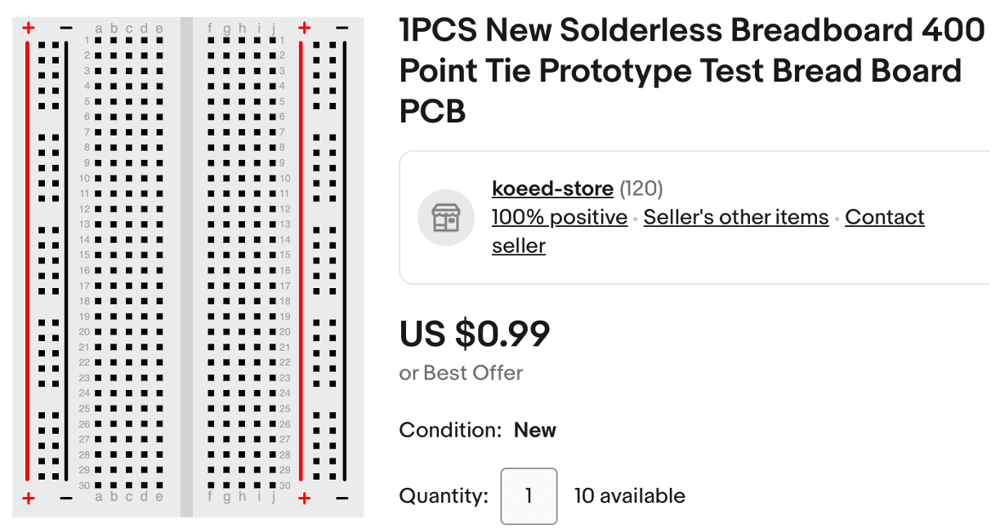
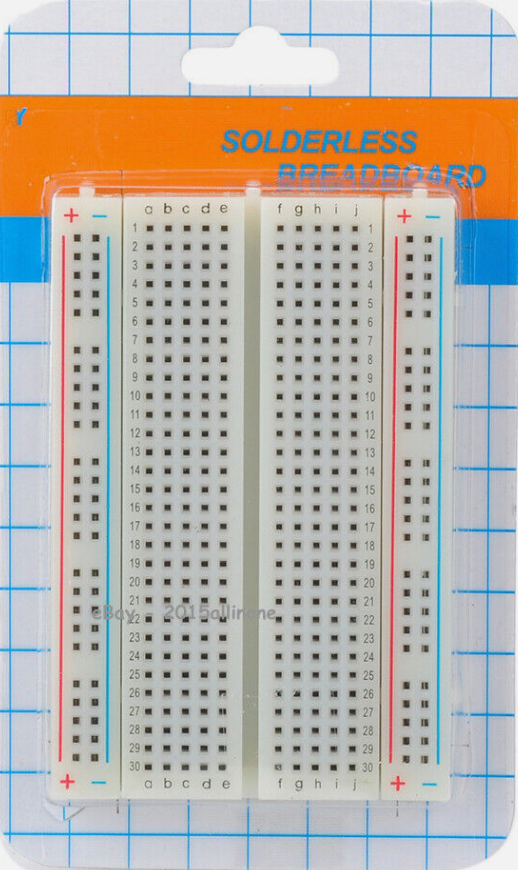
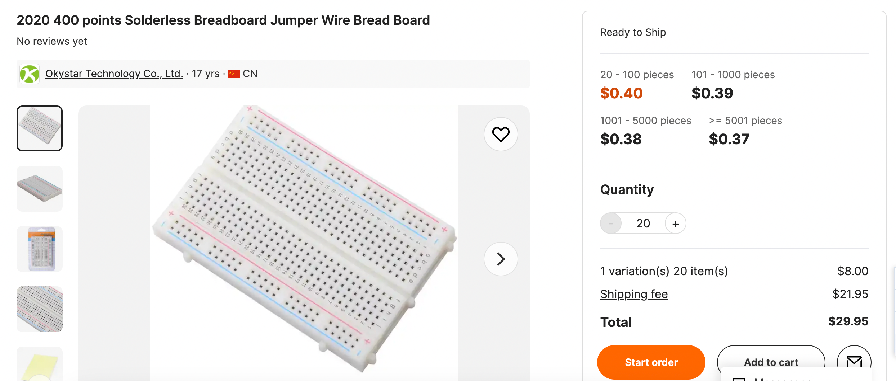

# Purchasing Breadboards

One rule of thumb, you can never have enough
breadboards for new projects. I always try to
have a few extra on hand.  There is nothing
more frustrating than having an excited student who wants
to start a new project and then
 telling them they have to wait two weeks
for a new shipment to arrive from China.

I recommend finding low-cost breadboards
on eBay.  The 1/2 size 400-tie breadboards are
usually fine for beginning projects.  
With a little searching, you can usually find them for under $2 each
and you can frequently find prices closer to $1 if you purchase 
in quantity 10.

[400 tie solderless breadboard search on eBay](https://www.ebay.com/sch/i.html?_nkw=400+tie+solderless+breadboard)

There are only a few manufacturers of these breadboards and the
package often looks like the following:

## Getting a Bad Batch

When you purchase low-price items, these
are sometimes "factory seconds" that don't pass
all the quality control steps in manufacturing.
I have purchased hundreds of breadboards, and
in the past, there have been some quality problems
with two or three individual boards.

For example, some of the tops of the "bus bar" pins don't
get bent correctly and as a result, it is hard
to get wires inserted correctly.

Image from [Julian Ilet's Video](https://www.youtube.com/watch?v=VerbEZtACwQ&t=390s)

What do you do?  Throw them out.  At $1.00 per
board, we can afford to lose a few in a large
classroom.  If you want, you can return them, but
the time and hassle to do this is often not
worth the effort.

I can assure you
that these are rare occurrences for me and
I have never got a large order that has more than
a single defective board.

## Bulk Purchases for a School District

If you are running a larger STEM program, you
might want to consider purchasing directly from
an electronic distributor such as Alibaba.  The
minimum quantity is 20 and you have to pay $20
for shipping, but the price per board is only 40 cents
each.

[Breadboard Listing on Alibaba](https://www.alibaba.com/product-detail/Breadboard-Breadboard-2020-400-Points-Solderless_62490468432.html?spm=a2700.galleryofferlist.p_offer.d_image.18f74118Vo9Hcm&s=p)