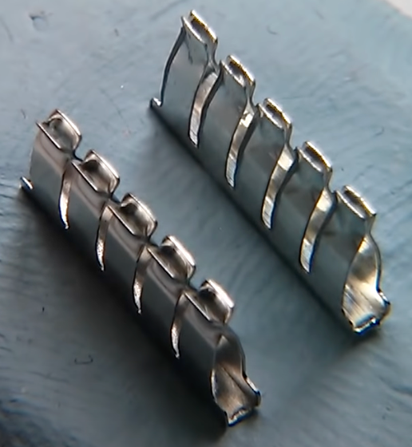

# Purchasing Breadboards

I recommend finding the lowest-cost breadboards
on eBay.  The 1/2 size 400-tie breadboards are
usually fine for beginning projects.

## Getting a Bad Batch

When you purchase the lowest price items, these
are sometimes "factory seconds" that don't pass
all the quality control steps in manufacturing.
I have purchased hundreds of breadboards, and
in the past, there have been some quality problems
with individual boards.

For example, some of the tops of the "bus bar" pins don't
get bent correctly and as a result, it is hard
to get wires inserted correctly.

Image from [Julian Ilet's Video](https://www.youtube.com/watch?v=VerbEZtACwQ&t=390s)

What do you do?  Throw them out.  At $1.50 per
board, we can afford to lose a few in a large
classroom.  If you want, you can return them, but
the time and hassle to do this is often not
worth the effort.

Some people might feel that ALL of the low-cost breadboards
that come from eBay have defects.  I can assure you
that these are rare occurrences for me and
I have never got a large order that have more than
a single defect.