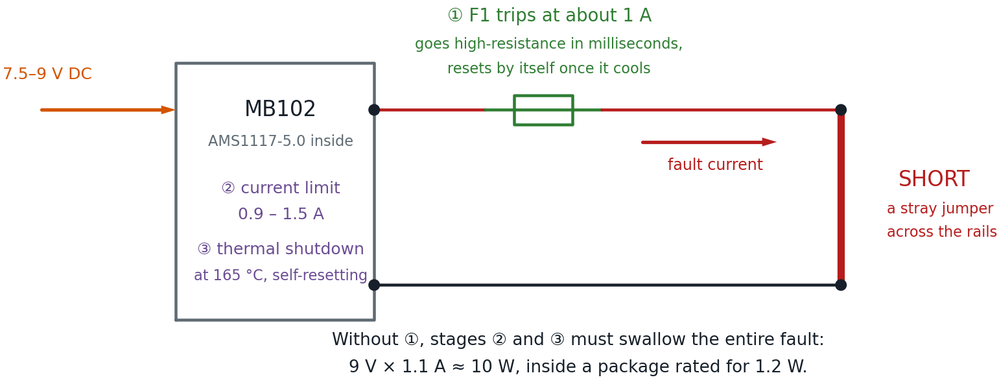

# Safe Power for Learning

Of everything in a beginning electronics kit, the power supply is the part
that decides whether a mistake is a *lesson* or a *loss*. A student who wires
an LED backwards learns something in three seconds. A student who shorts the
power rails should also learn something in three seconds — not lose the rest
of the class period while an adult hunts for a replacement supply.

This page is about setting things up so that shorts are boring.

!!! mascot-welcome "Mistakes Are Supposed to Be Cheap"
    { class="mascot-admonition-img" }
    Here's a secret every engineer learns eventually: the goal isn't to stop
    making mistakes. It's to make mistakes that cost you thirty seconds
    instead of thirty dollars. Set your power up right and you get to be as
    bold as you like. Let's light it up!

## The Three Rules

Everything below follows from three rules. If you remember nothing else,
remember these.

1. **Low-voltage DC only.** Every circuit in this course runs on 5 V or less
   from a module, a charger, or a battery pack. Nothing on a breadboard ever
   touches wall voltage.
2. **Something must limit the current.** Voltage does not hurt people or
   parts — *current* does. Every setup below has something in it whose job is
   to say "no further."
3. **The cheapest thing in the chain should break first.** If a fault has to
   destroy something, make it the two-dollar part you keep spares of.

Rule 3 is the one people skip, and it is the one this page spends the most
time on.

## Choosing a Power Source

Match the supply to how much experience the builders have, not to how
advanced the project is.

| Experience Level | Recommended Supply | Why |
|------------------|-------------------|-----|
| **First circuits, younger students** | 2 × AA battery holder (3 V) | Cannot deliver enough current to hurt anyone or melt anything. A short just flattens the cells. Costs about a dollar to replace. |
| **Comfortable on a breadboard** | 3 × AA battery holder (4.5 V) | Enough headroom for LEDs and transistors, still self-limiting. |
| **Most classroom work** | MB102 module + 7.5–9 V adapter | Steady 5 V, a power switch, and an indicator light. The recommended default — with the fuse described below. |
| **Bench work, older students** | Adjustable supply with a current limit | The current knob *is* the safety feature. |

!!! mascot-warning "Skip the 9 V Battery"
    { class="mascot-admonition-img" }
    Those rectangular 9 V batteries look perfect for beginners — small, snap
    connector, easy. They are not. Short one across its own terminals and it
    gets hot enough to burn a hand, because both terminals sit right next to
    each other where a stray wire can bridge them. AA cells in a holder keep
    their terminals apart and give up long before they get dangerous.

## The MB102 Power Module

The MB102 is the small black board that plugs straight onto a breadboard's
power rails and turns a wall adapter into clean 5 V and 3.3 V. It is the
recommended supply for most classroom work, and it is worth understanding
exactly what it does and does not do.

### What It Protects Against

The module's regulators are **AMS1117** parts, and that chip's protection is
real and documented. From the manufacturer's datasheet:

| Protection | Specification |
|------------|--------------|
| Short-circuit current limit | 900 mA minimum, 1100 mA typical, 1500 mA maximum |
| Thermal shutdown | Switches off above 165 °C junction temperature |
| Reset behavior | Self-resetting — the regulator comes back once it cools |
| Power dissipation | "Internally limited" |
| Reverse-polarity input | Blocked by a Schottky diode on the module's input |

That is a genuinely protected part. Short the 5 V rail and the regulator
limits the current and then switches itself off rather than failing.

### What It Does Not Protect Against

Now the other half, which matters just as much:

- **There is no fuse and no polyfuse on the board.** The only board-level
  protection is the reverse-polarity diode. Everything else comes from inside
  the regulator chip.
- **The regulator survives by overheating.** In the SOT-223 package these
  modules use, the AMS1117's maximum power dissipation is **1.2 W**. Short
  the 5 V rail while feeding the module 9 V and it attempts to dissipate
  roughly 9 V × 1.1 A ≈ **10 watts** — about eight times its rating. It
  survives by thermal-cycling on and off, which usually works, but it is far
  outside its comfort zone for every second the short is present.
- **Clone parts vary.** These modules are generic. Different sellers ship
  different board revisions, and inexpensive clone regulators do not reliably
  meet the genuine datasheet's protection numbers.

This is why these modules do sometimes die on a shorted breadboard — not
often, but often enough to be annoying with a full classroom.

!!! mascot-thinking "Protected Is Not the Same as Fused"
    { class="mascot-admonition-img" }
    This idea shows up everywhere in electronics, so it is worth sitting
    with. The regulator protects *itself* by getting hot and switching off —
    that is a survival reflex, not a guarantee. A chip cycling through 165 °C
    is not saying "all handled." It is saying "please find the short."

## Free Improvement: Use a Lower Input Voltage

Before spending anything, change one thing: **feed the module 7.5 V or 9 V,
not 12 V.**

The heat a regulator must survive during a short is the input voltage
multiplied by the current limit. The output is at zero volts — that is what a
short *means* — so the regulator drops the entire input across itself:

| Adapter | Power the Regulator Must Survive | Versus Its 1.2 W Rating |
|---------|----------------------------------|------------------------|
| 7.5 V | ≈ 8.3 W | 7× over |
| 9 V | ≈ 10 W | 8× over |
| 12 V | ≈ 13 W | 11× over |

Going from 12 V to 7.5 V cuts the fault heat by more than a third, and costs
nothing. The AMS1117-5.0 needs only about 6.5 V at its input to regulate
properly, so there is no benefit to the higher voltage — a 12 V adapter just
turns the extra volts into heat, both during faults and during normal use.

!!! mascot-tip "Lower Is Cooler, Literally"
    { class="mascot-admonition-img" }
    A linear regulator burns off every volt it doesn't pass along. Feed it
    12 V to make 5 V and those extra 7 volts leave as heat — even when
    nothing is wrong. Buy the 7.5 V adapter and the whole setup runs cooler
    all day long.

## Adding a PTC Resettable Fuse

This is the change that turns "replace the module" into "wait thirty
seconds."

### What a PTC Fuse Is

A **PTC resettable fuse** — also called a polyfuse or polyswitch — is a small
disc of conductive plastic that behaves like a wire until too much current
flows through it. The current heats it, the heat makes its resistance shoot
up by orders of magnitude, and it chokes the current down to a trickle. When
it cools, it goes back to being a wire. No replacing, no spare fuses, no
fuse holder.

"PTC" stands for **positive temperature coefficient**: resistance goes *up*
as temperature goes up. That is the opposite of the NTC thermistor in your
kit, whose resistance falls as it heats.

### Which One to Buy

| Specification | What to Get | Why |
|---------------|------------|-----|
| Hold current | 500 mA | The most current it will pass forever without tripping. Comfortably above what any lab circuit here draws. |
| Trip current | 1 A | The current at which it is guaranteed to trip. Below the regulator's 900 mA–1.5 A limit, so the fuse acts first. |
| Voltage rating | 30 V or higher | Anything rated for 30 V or more is fine on a 5 V rail. |
| Package | Radial leads, through-hole | Two straight legs so it plugs into a breadboard. |

Search for "**PTC resettable fuse 500mA radial**." Common part numbers are
the RXEF050, RUEF050, and MF-R050. They cost about ten cents each; buy ten.

The trade-off is small but real: a PTC has some resistance even when it is
behaving. At the 100–300 mA a breadboard circuit typically draws, expect to
lose well under a tenth of a volt across it — not enough to change any
circuit in this book.

### Where It Goes

In series with the **positive** rail only, between the module's 5 V output
and the breadboard's red power rail. Ground is left completely alone.

That is easy to say and slightly awkward to build, for a reason worth
understanding before you start.

### The Mechanical Problem

Here is the catch, and it is worth stating plainly: **the MB102's pins plug
straight into the power rails.** They bypass any fuse you try to add at the
top of those rails, because they inject 5 V into the rail *downstream* of
wherever you put the fuse. There is no gap to fuse.

You do not have to abandon the modules. You just have to stop letting those
pins feed the rails, and route the 5 V through the fuse yourself.

### Method 1: Use the Top Header Pins (Recommended)

Every MB102 has a cluster of male header pins in the middle of the board
carrying 5 V, 3.3 V, and GND, separate from the rail pins. Take power from
there instead.

Here is the whole method in one picture. The important part is on the left,
inside the module: the regulator's 5 V node reaches the header pin directly,
but reaches the + rail pin only *through the jumper cap* — so pulling that
cap leaves the rail pin dead while the header stays live.

![Schematic of the header-pin method: inside the MB102 the regulator's 5 V node runs straight to the middle header pin and separately toward the plus rail pin through the jumper-cap selector, drawn as an open switch because the cap has been removed, leaving that pin dead; outside, a female-to-male jumper carries 5 V from the header to a terminal row, a PTC fuse bridges to a second row, a male-to-male jumper runs up to the red rail, and ground returns unfused through the module's minus rail pin; an optional orange branch of a 1 kilohm resistor and an LED sits in parallel across the fuse as a fault lamp](ptc-fuse-schematic.png)

1. **Remove both jumper caps.** Each side of the board has a three-pin
   selector marked 5 V / OFF / 3.3 V. Pull the caps off entirely and put them
   somewhere safe. Removing the cap is unambiguous; "the OFF position" means
   different things on different board revisions. The module still seats
   normally, but its rail pins now feed nothing.
2. **Verify with a multimeter before wiring anything.** Power up and confirm
   three things: **0 V** on the red + rail, **5 V** on the middle header's
   5 V pin, and **continuity** between the blue − rail and the module's GND.
   Measure rather than assume — this is the step that catches a board whose
   header is wired differently.
3. **Run 5 V into the terminal strip.** Use a **female-to-male** jumper — the
   header pins are male — from the module's 5 V pin into any row of the main
   terminal strip.
4. **Bridge two rows with the PTC.** One lead into that row, the other into a
   different row. Direction does not matter; a PTC has no polarity.
5. **Run the fused 5 V to the red rail.** A male-to-male jumper from the
   second row into the breadboard's red + rail.
6. **Leave ground alone.** The jumper cap only ever controlled the *positive*
   rail, so the module's − rail pin still ties the blue rail to ground with
   no help from you — which is why step 2 checks for that continuity. If your
   board turns out to be the exception, add a female-to-male jumper from the
   GND header pin to the − rail. Either way, **ground never gets a fuse**: a
   fuse in the ground path can leave a circuit powered with no return, which
   is more dangerous than no fuse at all.

!!! mascot-tip "Check Your Jumper Wires First"
    { class="mascot-admonition-img" }
    This method needs female-to-male jumpers, which not every kit includes.
    The WayinTop kit ships a 20-pin F-M ribbon, so you are already set. If
    yours only has male-to-male wires, add a pack — they are a couple of
    dollars and useful forever.

### Method 2: A Fused Jumper (Needs Soldering)

Solder the PTC between two short lengths of 22 AWG solid wire and cover the
joints with heat shrink. You now have a reusable fused jumper that plugs in
anywhere, and the setup above collapses into a single part. Adult-supervised,
and it is the tidiest option for a cart you rebuild every term.

### Method 3: A Split Power Rail

Some full-size breadboards break each bus strip into two halves partway
along, marked by a gap in the printed red and blue stripe. If yours does,
plug the PTC straight across that gap. Nothing else changes — no jumper caps
to remove, no extra wires. Check your boards; this varies by manufacturer.

### A Method to Approach Carefully

You may see a suggestion to shift the module "backward" so its rail pins land
in the terminal strip's A–E rows instead of the power rails, leaving the
rails free. The idea is clever, but check one thing before you try it.

!!! mascot-warning "Two Pins in One Column Is a Dead Short"
    { class="mascot-admonition-img" }
    Holes A through E in a single column are **all the same node**. The
    MB102's + and − pins at each end sit about 0.1 inch apart — the same
    spacing as adjacent rows — so shifting them into the terminal strip can
    drop both into one column and short 5 V straight to ground the instant
    you switch on. Before powering anything, unplug the adapter and use a
    multimeter's continuity beep between the module's + and − pins. If it
    beeps, do not power it up.

Given that the failure mode is exactly the fault we are trying to protect
against, use Method 1 or 2 for anything a student will touch.

### Or Skip the Module Entirely

There is a simpler path worth knowing about. A **USB breakout board** — a
tiny PCB with a USB socket on one side and ordinary breadboard pins on the
other, about fifty cents — outputs onto normal terminal-strip pins rather
than dedicated rail pins. That means there is nothing to defeat: plug it in,
put the PTC inline between its 5 V pin and the red rail, and you are done.

The trade-off is that you give up the AMS1117's current limit and thermal
shutdown, so the PTC and whatever protection the USB charger has are the only
things standing between a short and the charger. With the fuse installed that
is a reasonable place to be, and for a class doing nothing but 5 V logic and
LEDs it is less to go wrong.

!!! note "The Module's Own USB Socket Is Not a Reliable Input"
    Do not confuse the breakout board with the USB-A socket on the MB102
    itself. That socket does different things on different board revisions —
    on some it feeds the regulator, on others it is an output for charging a
    phone. Even where USB input works, 5 V in for 5 V out leaves the
    regulator in dropout, barely regulating. Use the barrel jack.

### Making the Trip Visible: A Fault Lamp

A PTC has one weakness as a teaching tool: it is invisible. It looks the same
whether it is passing current or refusing to, and a rail that is dead because
the fuse tripped looks exactly like a rail that is dead because a jumper fell
out. Two parts you already have fix that.

Wire an **LED and a 1 kΩ resistor directly across the fuse** — in parallel
with it, both legs landing in the same two rows the fuse bridges. That is the
orange branch in the schematic above.

Here is the trick. **The voltage across the fuse tells you what the fuse is
doing:**

| Fuse State | Voltage Across It | Lamp |
|------------|------------------|------|
| Passing current normally | Under a tenth of a volt | **Dark** — nowhere near the ~2 V an LED needs |
| Tripped | Nearly the full 5 V | **Lit** |

So the lamp is dark all day long and lights up only when the fuse has
tripped. One indicator, one meaning, no interpretation required.

!!! mascot-thinking "Voltage Across a Part Tells You What It's Doing"
    { class="mascot-admonition-img" }
    This is one of the most useful habits in all of electronics, builder. A
    part that is conducting happily has almost no voltage across it. A part
    that is blocking has the whole supply across it. You are not measuring
    the fuse here — you are *asking it a question*, and the LED reads the
    answer out loud.

**Does the lamp defeat the fuse?** No — and it is worth working out why,
because a student will ask. With 1 kΩ in series, the branch passes roughly
(5 V − 2 V) ÷ 1000 Ω ≈ **3 mA** around the tripped fuse. That is a trickle:
far too little to run a circuit, and far too little to feed a short. The
protection still holds; you have just borrowed a few milliamps to light a
lamp.

### Auto-Reset or Manual Reset?

A reasonable instinct is to want a supply that **stays off after a fault
until somebody presses a reset button** — so a student has to acknowledge the
problem rather than let a rail quietly cycle on and off. Good news: **the
setup above already behaves that way.**

A tripped PTC does not clear while power is applied, so the module's own
power switch *is* the reset button. With the fault lamp fitted, the whole
cycle becomes legible from across the room:

> Lamp on → find the short → switch off → lamp goes out → switch on → back to work.

If you want to buy latching protection instead, the honest options are
narrower than they look:

| Option | Verdict |
|--------|---------|
| Push-button thermal circuit breaker | **Check the rating.** Almost everything sold is 5 A–30 A for automotive use. On a 700 mA supply a 5 A breaker will never trip — it is decorative. The 0.5–1 A ratings exist but come from specialist distributors, and thermal breakers are slow. |
| Bench supply with adjustable current limit | The best of the lot — the current knob *is* the protection, and OCP mode latches the output off until you press Output. At $50–100 it is a teacher's bench instrument, not a per-student item. Worth one for diagnosis: dialing the limit to 100 mA and watching a suspect circuit is the fastest fault-finding trick there is. |
| eFuse ICs (TPS25xx, STEF4S) | Fast, adjustable, and latch-off versions stay off until enable is toggled. All surface-mount, so they need a breakout board — not classroom-buildable. |

For a classroom, the fuse and the fault lamp get you the behavior you wanted
for about a quarter.

### Testing It — and Turning That Into a Lesson

Do not just install it and hope. Trip it deliberately, in front of the class:

1. Build any working circuit — one resistor and one LED is perfect.
2. Confirm the circuit's LED lights and the **fault lamp stays dark**. That
   is what healthy looks like.
3. Now short the rails on purpose with a single jumper wire.
4. Within a second or so the circuit's LED goes out and the **fault lamp
   comes on**. The module's own power light stays on the whole time — which
   is exactly why the fault lamp earns its two parts.
5. **Remove the short, then switch the module off.** Wait about thirty
   seconds. The fault lamp goes out with the power.
6. Switch back on. Everything works again, fault lamp dark.

Ask the class to predict step 4 before you do it. "The power light is still
on, so why is the circuit dead?" is a better question than most textbook
exercises, and they will have the answer in front of them.

!!! mascot-warning "A Tripped PTC Stays Tripped Until You Cut Power"
    { class="mascot-admonition-img" }
    This is the step everyone misses. Removing the short is not enough — the
    supply keeps feeding the fuse just enough current to hold it hot, so it
    stays switched off. You have to actually **remove power** and let it cool
    before it resets. If a rail seems dead after a short, this is almost
    always why.

Step 5 is the whole lesson. Students see a fault happen, see the circuit
protect itself, and see it recover — in under a minute, with nothing damaged
and nobody in trouble. That is a far better introduction to fault protection
than any explanation.

## Classroom Setup Checklist

- [ ] Every supply is 12 V or less, DC, and nothing touches wall voltage
- [ ] Adapters are 7.5 V or 9 V — no 12 V adapters in the bin
- [ ] Every module has a PTC fuse in its + rail, and its jumper caps removed
- [ ] Each board has a fault lamp across the fuse, verified dark when healthy
- [ ] Each board was checked with a multimeter before its first power-up
- [ ] Two spare modules are in the parts box
- [ ] No rectangular 9 V batteries in the room
- [ ] Students know to switch off, not just unplug the short, after a fault
- [ ] Youngest builders start on 2 × AA holders

## Troubleshooting a Dead Rail

| Symptom | Most Likely Cause |
|---------|------------------|
| Fault lamp lit | The PTC has tripped. There is a short — find it, then switch off and let the fuse cool. |
| Rail dead right after a short, module light still on | PTC is tripped and being held hot. Switch off, wait 30 seconds, switch on. |
| Rail dead but fault lamp also dark | Not a fuse trip. Look for a jumper that fell out, or check the module's power. |
| Rail dead, module light off | Adapter unplugged, module switch off, or the adapter is below 6.5 V. |
| Rail works but everything is dim | Module jumpers set to 3.3 V instead of 5 V. |
| Module hot to the touch | There is a short somewhere. Power down and find it before continuing. |
| Nothing works after reversing the adapter | The reverse-polarity diode did its job. Plug it in the right way. |

!!! mascot-celebration "You Just Made Failure Boring"
    { class="mascot-admonition-img" }
    Ten cents of fuse and a smaller adapter, and the worst thing that happens
    on your breadboard is a thirty-second pause. That's not just a safer
    bench — it's a braver one, because now you can try the risky idea. That's
    your superpower in action!

## Related Pages

- [Finding the Right Power Supplies](../power-supplies.md) — where to buy, and the other supply types
- [Parts List for a $50 Kit](../../appendices/parts-list/index.md) — quantities and costs, including the fuses
- [Power Lab](../../labs/09-power.md) — the hands-on version
- [Purchasing Component Kits](../breadboard-kits.md) — evaluating a kit before you buy

## Sources

The regulator figures on this page come from the AMS1117 datasheet published
by Advanced Monolithic Systems: current limit of 900/1100/1500 mA, thermal
shutdown above 165 °C at the sense point, "protected against short circuit
and thermal overloads," and a maximum dissipation of 1.2 W in the SOT-223
package. Board-level details of the MB102 — no fuse, a reverse-polarity
Schottky diode, roughly 700 mA rated output — come from published teardowns
rather than a manufacturer datasheet, because the MB102 is a generic module
with no single manufacturer. Verify your own board if the details matter.
