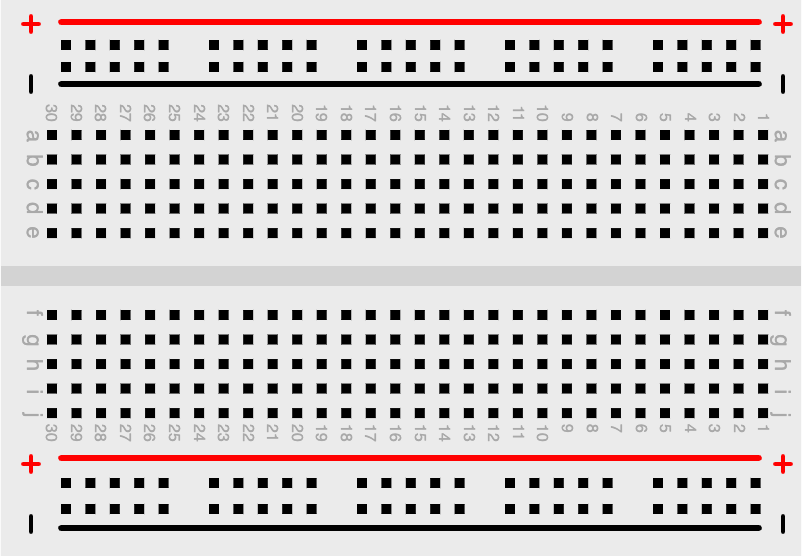

# Solderless Breadboard Layout

<figure markdown>
   { width="400" }
   <figcaption>400 tie 1/2 size breadboard (landscape)</figcaption>
</figure>

[Link to Demo](./template.html){ .md-button .md-button--primary }

## About this MicroSim

This MicroSim teaches us how to draw a breadboard using
p5.js.  We use this as a background for many of our
Beginning Electronics MicroSims.

## Components

**Prompt:**

```linenums="0"
What are the names of the various sections of a 400-tie solderless breadboard?
```

**Response:**

A 400-tie solderless breadboard typically consists of several distinct sections:

1.  **Terminal Strip**: This is the main area of the breadboard. It's divided into two sections, each containing rows of interconnected tie points. Each row usually contains five tie points, and these rows are typically numbered for convenience.

2.  **Bus Strip (or Distribution Strips)**: These are usually two long columns on either side of the terminal strips. They are used for providing power to the circuits built on the breadboard. The bus strips are often marked with a red line (for positive voltage) and a blue or black line (for ground).

3.  **Divider**: A central spine that separates the two halves of the terminal strip. This divider often has a notch or a clear gap to prevent accidental connections between the two halves.

4.  **Binding Posts**: Some breadboards come with binding posts at the top or the bottom. These posts allow you to connect external power sources, like batteries or power supplies, to the breadboard.

Two design our simulation, we took a photograph of a breadboard
and loaded it as an image using the following code:

```js
function preload() {
    breadboard_img = loadImage('./breadboard-horiz-small.png');
}

// in the setup() or draw()

    // Place the image at (0,0)
    image(breadboard_img, 0, 0);
```

Our breadboard simulator has the following components:

1. Top power rail (power and ground)
2. Bottom power rail
3. Power rail labels ("+" and "-")
4. Terminal Strips (top and bottom)
5. Row labels (a-f)
6. Column labels (1-35)

## Sample Prompt


Create a single file p5.js sketch.
Draw a green circle on a 600x400 canvas with a radius of 200.
```

## Sample Response

```javascript
let canvasHeight = 400;
let aspectRatio = 1.91; // Open Graph standard
let canvasWidth = canvasHeight * aspectRatio;
let radius = 200;
function setup() {
const canvas = createCanvas(canvasWidth, canvasHeight);
  canvas.parent('canvas-container');
  fill(245);
  rect(0,0, canvasWidth, canvasHeight);
  fill('green');
  circle(canvasWidth/2, canvasHeight/2, radius);
}
```

## Lesson Plan

### Grade Level, Subject and Topic

9th-grade geometry. Circle and radius.

### Activities

#### Fill Color

## References

[1/2 Size Breadboard Layout](https://editor.p5js.org/dmccreary/sketches/gZCJQoLdf) - note that the power rails, main section and labels are all rendered using vector graphics drawing

[Resistors, Buttons and LEDs on Breadboard](https://editor.p5js.org/dmccreary/sketches/6BlWx729A)