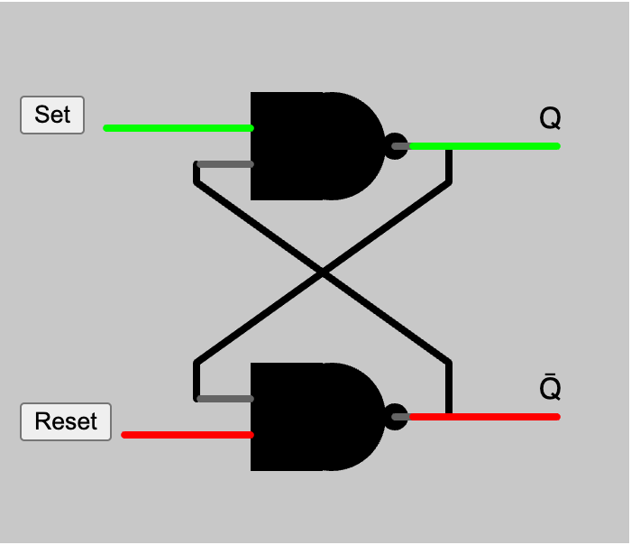

# Flip Flop

{ width="400"}

[Run Flip Flop MicroSim](./flip-flop.html)

[Edit the SR Flip Flop MicroSim](https://editor.p5js.org/dmccreary/sketches/vgBIFUw8Ge)


## Decomposition

We need a drawNAND function first:

### Draw NAND Prompt

```linenums="0"
Create a vector representation of a NAND gate using vertex points. Create a new function called drawNAND() with input parameters (x, y, w, h) that place the NAND gates's upper left
corner at point (x,y) and draw the NAND gate with a width of w and a height of h.  Draw two
input wires using line segments on the left 1/3 and 2/3 of the height.  Draw an output wire on the right at 1/2 height.

Create two tests of drawing the NAND of different sizes.
```

[Edit the NAND](https://editor.p5js.org/dmccreary/sketches/HmAhOuyob)

## Prompt

```linenums="0"
Create a p5.js sketch on a 400x400 canvas that is a simulation of a digital 
SR flip flop circuit or latch. 
Use the layout in the image above.
Add one button on the upper left called "Set" 
and another button on the lower left called "Reset".  
The simulation should change the colors of the wires.
Use a default text size of 16.
```