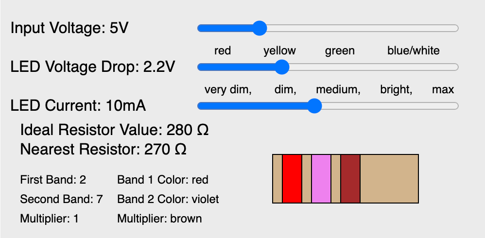
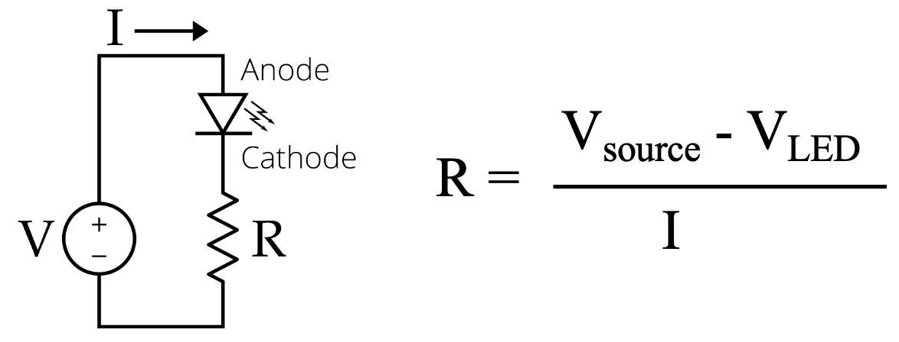

# LED Resistor Calculator

<figure markdown>
{ width="400" }
   <figcaption>LED Resistor Calculator</figcaption>
</figure>

[Run the LED Resistor Calculator MicroSim](./led-resistor-calc.html){ .md-button .md-button--primary }
[Edit this MicroSim](https://editor.p5js.org/dmccreary/sketches/IoMwFBIi2)

This MicroSim was written up [here](https://dmccreary.medium.com/building-better-ai-assistants-9fcfe6c6f769).

## About this MicroSim

This MicroSim will allow us to select the right resistor for an LED circuit.

The user will select:

1. The power supply voltage
2. The LED type
3. The brightness desired (very dim to max brightness)

The MicroSim will then suggest the correct resistor to use.

## Background



When we have an LED circuit, we frequently need to select a fixed resistor to
limit the flow of current through the LED.  Allowing too much current to flow through an LED will burn it out.  This is one of the first lessons we teach students in our Beginning Electronics course. Many of our projects use
a 3-volt battery or a 3.3-volt power supply.  Doing an approximate calculation
of the current needed to make a standard LED work in these conditions is pretty
simple.  If we use a standard red LED a 220-ohm resistor will work in most cases.

We can use Ohm's law to calculate the current.  Let's pick a 3.3-volt power supply and
a red LED.

## Generating a Basic HTML Form

GPT-4 can easily create HTML forms that take a set of inputs
and do a calculation.  This works the first time 99% of the time
with GPT-4.  Here is the prompt that I used.

```linenums="0"
Create an HTML form to calculate the LED resistance.  Title the form: "LED Resistor Calculator".
The HTML form has three input text fields.

1. "Source Voltage"
2. "LED Voltage Drop"
3. "Current"

Add a green button with the label "Calculate Resistance".  When the user clicks the button, calculate the correct resistance and display
the text on the web page.
```

This generates the following HTML form:

[Basic HTML Form for Calculating an LED Resistor](./basic-form-2.html)

Although this form does work, it has several areas
that could be improved:

1. We can replace the text input forms with sliders.
2. The sliders can show reasonable ranges for the values of our classroom.
3. The sliders can be labeled with values corresponding to the concepts we want to teach.
4. We can show the raw result of resistance and the nearest value of common resistors.
5. We can also draw the resistor and include an explanation of how the colors of the bands will match the value we need.

This MicroSim is somewhat complex.  GPT-4
can't create it in a single pass without some
help.  To create the MicroSim we need to break
it down into some smaller components.  We
call this process decomposition.  It is a
fundamental skill in computational thinking. Here
are two suggested subcontinents.

## Draw Resistor

We can create a GPT-4 prompt that will just focus
on building a function that draws a resistor
in the horizontal position.

### Sample Prompt

```linenums="0"
Create a p5.js sketch that draws a resistor with the correct band colors for any given resistor.
Create the sketch on a 200x300 canvas.
Use a text size of 16.
Create a function called drawHorizResistor() that
takes the following input parameters:

1. Resistance
2. X position of the upper left corner
3. Y position of the upper left corner
4. Width
5. Height

Draw a black wire under the resistor.

Make the color of the resistor be tan.

The function will draw the three color
bands.

1. Band for the first digit
2. Band for the second digit
3. Multiplier band

Draw a label for the resistance above
the resistor rectangle.
```

Here is the code it generated with some
minor tweaks:

[Run the MicroSim](https://editor.p5js.org/dmccreary/sketches/MyIycMQJe)

You can see our [dialog with GPT-4](https://chat.openai.com/share/00dec04f-f3d8-4149-9ebe-63fe12eb8856).

Reading the code, there are a few items we can adjust.
For example, the colors can be referenced by name
and the hex values are not really needed.

Let's do the same to generate a function
that will find the closest resistor from
a list of standard values.

```linenums="0"
Create a p5.js sketch that takes an input
resistance and then returns the closet resistor
value from a list of standard resistor values.

Create a function called findNearestResistor()
that takes a single input of resistance.  This
function will return the nearest resistor value.
```


