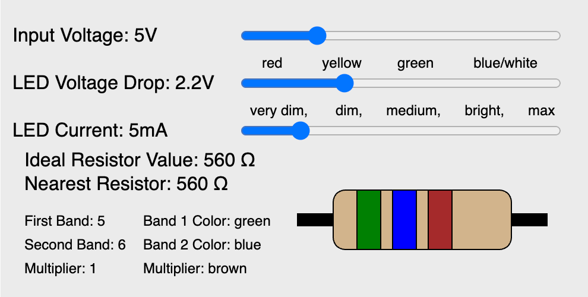

# LED Resistor Calculator

<figure markdown>
{ width="400" }
   <figcaption>LED Resistor Calculator</figcaption>
</figure>

[Run the LED Resistor Calculator MicroSim](./led-resistor-calc.html){ .md-button .md-button--primary }
[Edit this MicroSim](https://editor.p5js.org/dmccreary/sketches/IoMwFBIi2)


## About this MicroSim

This MicroSim will allow us to select the right resistor for an LED circuit.
The user will select:

1. The power supply voltage
2. The LED type
3. The brightness desired (very dim to max brightness)

The MicroSim will then suggest the correct resistor to use.

## Background


When we have an LED circuit, we frequently need to select a fixed resistor to
limit the flow of current through the LED.  Allowing too much current to flow through an LED will burn it out.  This is one of the first lessons we teach students in our Beginning Electronics course. Many of our projects use
a 3-volt battery or a 3.3-volt power supply.  Doing an approximate calculation
of the current needed to make a standard LED work in these conditions is pretty
simple.  If we use a standard red LED a 220-ohm resistor will work in most cases.

We can use Ohm's law to calculate the current.  Let's pick a 3.3-volt power supply and
a red LED.

## Generating a Basic HTML Form

GPT-4 can easily create HTML forms that take a set of inputs
and do a calculation.  This works the first time 99% of the time
with GPT-4.  Here is the prompt that I used.

```linenums="0"
Create an HTML form to calculate the LED resistance.  Title the form: "LED Resistor Calculator" with three text fields.

1.  "Source Voltage"
2. "LED Voltage Drop"
3. "Current"

Add a green button with the label "Calculate Resistance".  When the user clicks the button, calculate the correct resistance and display the text on the web page.
```

This generates the following HTML form:

[Basic HTML Form for Calculating an LED Resistor](./basic-form-2.html)

