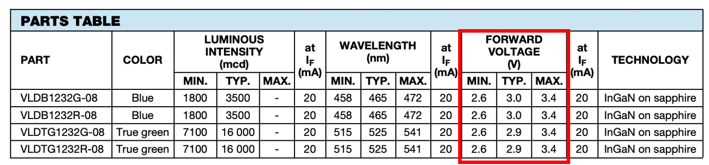

# LED Circuit Resistor Value Calculator


We often have an LED circuit we want to create and
we need to figure out what value of resistor to use.

We often know three facts:

1. The voltage of the circuit (source voltage)
2. The voltage drop across the LED (a property of the LED).  This is typically 1.7V for a red LED and 3.0V for a blue or white LED.
3. The amount of current we want to flow through the resistor - typically 2 to 20 milliamps depending on the brightness we want.

To calculate the resistor needed,  we subtract
the voltage drop across the LED from the source voltage
and apply Ohm's law.  So our formula is:

Resistance = (Vsource - VLED) / Current

Here are the voltage drops for different colors of LEDs:

| LED Color | Voltage Drop| Notes                                           |
|-----------|-------------|-------------------------------------------------|
| Red       | 1.8 - 2.2   | Used in indicator and alarm applications        |
| Amber     | 2.0 - 2.1   | Used in automotive and signal lighting          |
| Yellow    | 2.1 - 2.2   | Common in display panels and traffic lights     |
| Green     | 2.0 - 3.5   | Bright, used in displays and decorative lighting|
| Blue      | 2.5 - 3.5   | High-brightness, used in various applications   |
| White     | 3.0 - 3.5   | High brightness, used in general illumination   |

The electronic component manufacturer [Vishay](https://www.vishay.com/en/leds/) has detailed data sheets on individual LEDs.  Here is a web page of their [red LEDs](https://www.vishay.com/en/leds/red/).  Note that in the data sheets for any
given component, the voltage drops are not specified exactly.  Due to variations
in the manufacturing process, only a range of voltage drops is specified with a min, average and max value.



## Sample GenAI Prompt

```js
Create a single p5.js simulator of an LED circuit.  The circuit has a power source, an resistor, and an LED in series.  Allow the user to use a sliders to change three items in the circuit.

1. the input voltage which would range from 3 to 24 volts
2. the voltage drop across and LED ranging in values typical of red, yellow, green, blue and white LEDs (1.7V to 3V)
3. The desired current in the LED ranging from 2 to 20 milliamps

The simulator should display the correct value of a resistor and the resistor band colors.
```

## References

* [LED Circuit](https://en.wikipedia.org/wiki/LED_circuit)

* [LED Resistor Calculator](https://ohmslawcalculator.com/led-resistor-calculator)