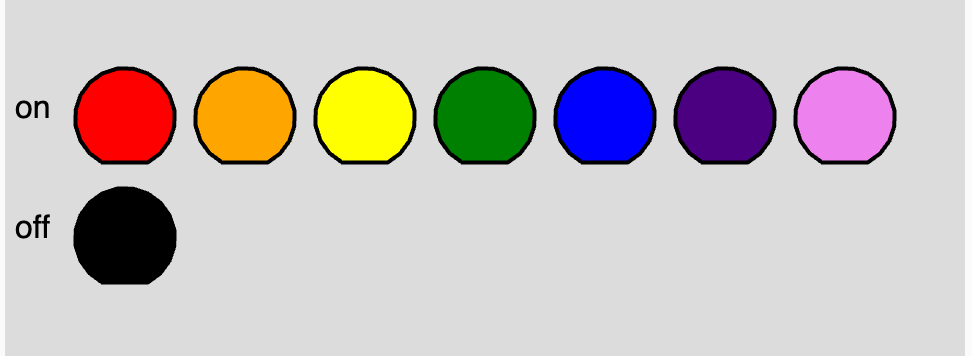

# Draw LEDs

<figure markdown>
   { width="400" }
   <figcaption>Draw LED top view test.</figcaption>
</figure>

[Run LED Top View Test MicroSim](./led.html)
[Link to Demo](./template.html){ .md-button .md-button--primary }

[Edit](https://editor.p5js.org/dmccreary/sketches/McnocOgc3)
We will simulate the top view of an LED by drawing
a circle with a flat edge on the negative (cathode) side.

The flat edge on a 5mm LED typically indicates the cathode side. In general, LEDs are polarized components with an anode (+) and a cathode (-). The cathode is usually marked with a flat edge on the side of the LED housing. Additionally, the cathode leg is often shorter than the anode leg. This design helps in identifying the polarity for the correct connection in a circuit.

```js
// 5mm LED top view
function drawLED(x, y, w, h, color, state) {
  // wire
  stroke('black');
  strokeWeight(5);
  line(x, y, x+w, y+h);
  // LED
  if (state)
     fill(color);
  else fill('black');
  strokeWeight(1);
  circle(x+(w/2), y+(h/2),20);
}
```