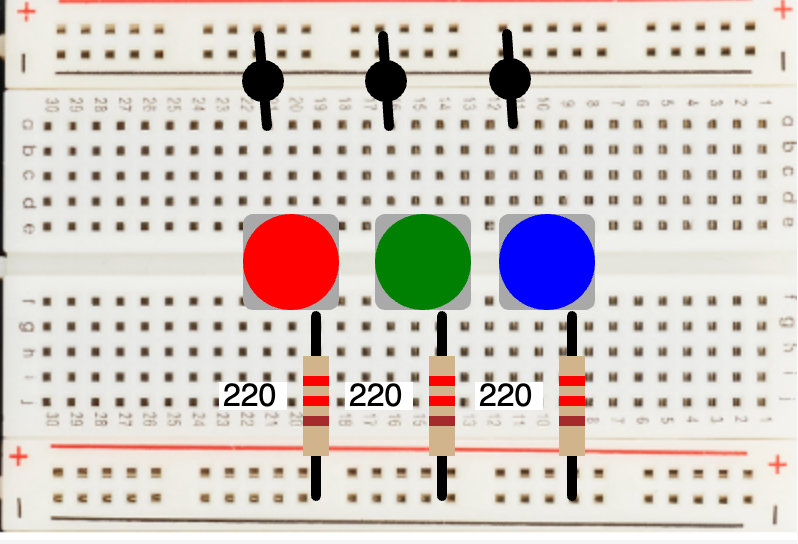

# Push Buttons



[Draw Push Buttons on a Breadboard](https://editor.p5js.org/dmccreary/sketches/6BlWx729A)

## Draw Push Button (No State)

```js
function drawPushButton(x, y, size, color) {
    // 12mm X 12mm button on breadboard with a width of 404
    bc = size / 2 // button center
  
    // Button style - use a rect with rounded corners
    fill('darkgray');
    noStroke();
    rect(x, y, size, size, 5);
  
    // Draw the circle red if we have a press in our circle
    if (dist(mouseX, mouseY, x+bc, y+bc) < bc && mouseIsPressed)
      fill('lightgray');
    else
      fill(color);
    
    // Draw the circle
    circle(x+bc, y+bc, size);
    
    if (dist(mouseX, mouseY, x+bc, y+bc) < bc && mouseIsPressed)
      return 1;
    else
      return 0;
  }
```

Here we place them at the center of our breadboard and
return the state of each pressed button.  We can
then pass this state to other parts on the breadboard
that are connected to the push button.

```ps
    rs = drawPushButton(123, 109, 48, 'red');
    gs = drawPushButton(189, 109, 48, 'green');
    bs = drawPushButton(251, 109, 48, 'blue');
```