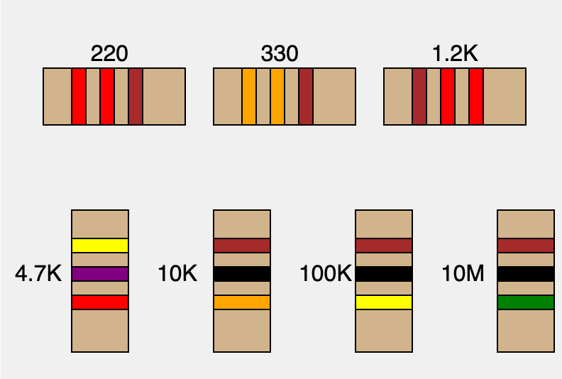

# Drawing Resistors in a MicroSim



[Draw Resistors MicroSim](./draw-resistors.html){ .md-button .md-button--primary }

[](./nearest-resistor.html)

## Drawing Resistors

To create any MicroSims that have resistors in them we need
to be able to draw representations of the resistors including
the bands and the labels that use the "K" and "M" notations.

In our labs, we are going to stick with the three bands and not include the fourth band that is used to show the tolerance of the resistor.

The ```drawResistor()``` function takes the following arguments.

1. The resistance in ohms as an integer
2. The x and y positions of the upper left corner
3. The width and height of the resistor
4. The letter h or v for horizontal or vertical

Here is a sample of this code including testing the
horizontal and vertical labeling of the resistors.

```js
function setup() {
  const canvas = createCanvas(400, 300);
  background(240);
  textSize(16);

  // Tests with a horizontal resistor
  drawResistor(220, 30, 50, 100, 40, 'h'); 
  drawResistor(330, 150, 50, 100, 40, 'h');
  drawResistor(1200, 270, 50, 100, 40, 'h');

  // Test with a vertical resistor
  drawResistor(4700, 50, 150, 40, 100, 'v'); 
  drawResistor(10000, 150, 150, 40, 100, 'v');
  drawResistor(100000, 250, 150, 40, 100, 'v');
  drawResistor(1000000, 350, 150, 40, 100, 'v'); 

}

function drawResistor(resistance, x, y, w, h, orientation) {
  // Color coding for the resistor bands
  const colors = {
    '0': 'black',
    '1': 'brown',
    '2': 'red',
    '3': 'orange',
    '4': 'yellow',
    '5': 'green',
    '6': 'blue',
    '7': 'purple',
    '8': 'gray',
    '9': 'white'
  };

  // Calculate the color bands from the resistance value
  let digits = ("" + resistance).split('').map(Number);
  let firstBand = colors[digits[0].toString()];
  let secondBand = colors[digits[1].toString()];
  // Calculate the multiplier based on the number of zeros after the first two digits
  let numberOfZeros = digits.length - 2;
  let multiplier = colors[numberOfZeros.toString()];

  // Draw the resistor body based on orientation
  fill('tan'); // brown color for the body
  rect(x, y, w, h);
  
  if (orientation === 'h') {
    drawBandsHorizontal(x, y, w, h, firstBand, secondBand, multiplier);
    xt = x+w/3; // x for text
    yt = y - 5;
  } else if (orientation === 'v') {
    drawBandsVertical(x, y, w, h, firstBand, secondBand, multiplier);
    xt = x - 40; // x for text
    yt = y + h/2;
  }
  
  fill(0);
  addPeriod = '';
  if (numberOfZeros == 1) {thirdSymbol = "0"};
  if (numberOfZeros == 2) {addPeriod = "."; thirdSymbol = "K";};
  if (numberOfZeros == 3) {thirdSymbol = "K"};
  if (numberOfZeros == 4) {thirdSymbol = "0K"};
  if (numberOfZeros == 5) {thirdSymbol = "M"};
  text(str(digits[0]) + addPeriod + str(digits[1]) + thirdSymbol, xt, yt);
}

function drawBandsHorizontal(x, y, w, h, firstBand, secondBand, multiplier) {
  let bandWidth = w / 10;
  fill(firstBand);
  rect(x + 2 * bandWidth, y, bandWidth, h);
  fill(secondBand);
  rect(x + 4 * bandWidth, y, bandWidth, h);
  fill(multiplier);
  rect(x + 6 * bandWidth, y, bandWidth, h);
}

function drawBandsVertical(x, y, w, h, firstBand, secondBand, multiplier) {
  let bandHeight = h / 10;
  fill(firstBand);
  rect(x, y + 2 * bandHeight, w, bandHeight);
  fill(secondBand);
  rect(x, y + 4 * bandHeight, w, bandHeight);
  fill(multiplier);
  rect(x, y + 6 * bandHeight, w, bandHeight);
}
```

## Selecting Resistors

```js
// find the nearest resistor
let slider;
let resistorValue;

function setup() {
  createCanvas(800, 100);
  // Create a slider from 10 ohms to 1M ohms, logarithmic scale
  slider = createSlider(1, 6, 2.38, 0.01); // Logarithmic scale: 10^1 to 10^6
  slider.position(10, 60);
  slider.style('width', '780px');
}

function draw() {
  background(220);

  // Convert the logarithmic slider value to actual resistance
  let actualValue = pow(10, slider.value());

  resistorValue = findClosestStandardResistor(actualValue);

  // Display the selected and closest standard resistor values
  fill(0);
  textSize(16);
  text("Selected Resistance: " + roundToSignificantDigits(actualValue, 2) + " Ω", 10, 30);
  text("Closest Standard Resistor: " + roundToSignificantDigits(resistorValue, 2) + " Ω", 10, 50);
}

function findClosestStandardResistor(inputOhms) {
  const e12 = [1.0, 1.2, 1.5, 1.8, 2.2, 2.7, 3.3, 3.9, 4.7, 5.6, 6.8, 8.2];

  let standardValues = [];
  for (let factor = 0.1; factor <= 1000000; factor *= 10) {
    e12.forEach(value => {
      standardValues.push(value * factor);
    });
  }

  let closest = standardValues[0];
  let minDiff = Math.abs(inputOhms - closest);

  for (let i = 1; i < standardValues.length; i++) {```

[Draw Resistors Library](https://editor.p5js.org/dmccreary/sketches/0-_CXuiVK) note these are done for both horizontal and vertical

[Draw Resistor Symbol](https://editor.p5js.org/dmccreary/sketches/8TKJ3s29E)